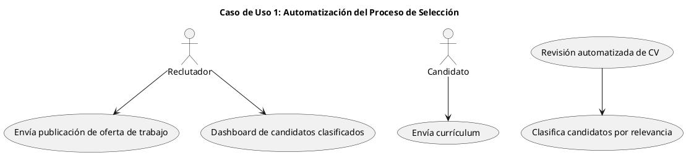
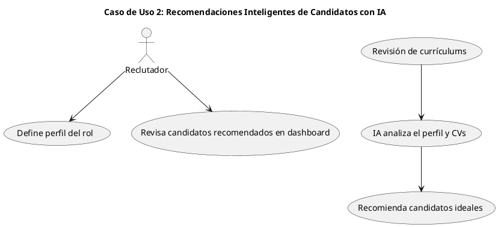
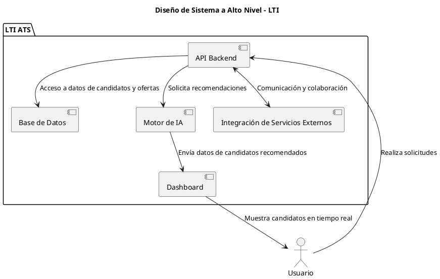
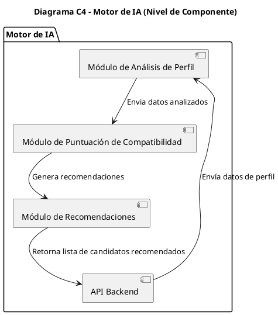

Aquí tienes el documento LTI ampliado con una descripción más detallada de la propuesta de valor y ventajas competitivas, además del diagrama de diseño del sistema a alto nivel.

---

# Documento de Diseño - LTI

## 1. Descripción del Producto

**Nombre del Producto**: LTI (Lean Talent Intelligence)  

**Descripción**: LTI es un sistema de seguimiento de candidatos (ATS) de última generación diseñado para medianas y pequeñas empresas, orientado a revolucionar los procesos de contratación. La plataforma se enfoca en optimizar la eficiencia en la selección de candidatos mediante automatización avanzada, IA predictiva, y un dashboard de colaboración en tiempo real. Esto permite a los departamentos de recursos humanos y managers enfocar sus esfuerzos en candidatos prometedores, reducir significativamente el tiempo de contratación, y mejorar la precisión en la selección.

**Propuesta de Valor**:  
LTI ayuda a las empresas a ser más competitivas y eficientes en su búsqueda de talento, permitiendo que los reclutadores y managers:

- **Optimicen los flujos de trabajo**: al reducir tareas manuales en la criba de candidatos y utilizar IA para identificar a los perfiles más relevantes, LTI agiliza el proceso de selección inicial.
- **Mejoren la toma de decisiones**: el sistema proporciona sugerencias predictivas basadas en la compatibilidad de los candidatos con el perfil del puesto.
- **Faciliten la colaboración** en tiempo real entre los equipos de RR. HH. y los managers de contratación mediante un dashboard centralizado con integración en herramientas de colaboración como Slack, Microsoft Teams, y Google Workspace.

**Ventajas Competitivas**:
- **Automatización inteligente del proceso de selección**: LTI no solo filtra y organiza automáticamente los currículums recibidos, sino que lo hace de forma inteligente, priorizando aquellos perfiles más alineados con los requisitos del puesto. Esto se traduce en una reducción significativa del esfuerzo manual.
- **Recomendaciones avanzadas impulsadas por IA**: LTI emplea algoritmos de IA que no solo revisan y ordenan perfiles, sino que también brindan recomendaciones predictivas, sugiriendo los candidatos más adecuados de acuerdo con el análisis de competencias y experiencia. Esto ofrece una ventaja única en comparación con ATS tradicionales.
- **Dashboard de colaboración en tiempo real**: diseñado para permitir a los equipos de contratación y managers de contratación trabajar de manera integrada. Gracias a la actualización en tiempo real y a la posibilidad de compartir comentarios instantáneamente, se mejora la velocidad y precisión en la toma de decisiones.
- **Integración profunda con herramientas de colaboración**: gracias a la integración directa con Slack, Microsoft Teams y Google, el sistema está alineado con el entorno de trabajo moderno, facilitando una experiencia de colaboración continua sin cambiar entre múltiples plataformas.

### Lean Canvas - LTI

```plantuml
@startuml
title Lean Canvas - LTI (Lean Talent Intelligence)

|#lightgrey| Problem |
* P1: Alta carga manual en selección de candidatos
* P2: Falta de colaboración fluida entre reclutadores y managers
* P3: Difícil identificar a los candidatos más adecuados

|#lightgrey| Customer Segments |
* Medianas empresas
* Pequeñas empresas
* Equipos de RR. HH. y managers de contratación

|#lightgrey| Unique Value Proposition |
* ATS con automatización y recomendaciones de IA personalizadas
* Colaboración en tiempo real con integración en Slack, Microsoft y Google
* Simplificación del proceso de selección con chatbots asistenciales

|#lightgrey| Solution |
* Filtración automatizada de candidatos
* Recomendaciones inteligentes basadas en IA
* Dashboard colaborativo en tiempo real

|#lightgrey| Revenue Streams |
* Suscripción mensual/anual
* Personalización avanzada y soporte premium

|#lightgrey| Channels |
* Plataforma Web de LTI
* Integraciones en herramientas de colaboración (Slack, Microsoft Teams)

|#lightgrey| Key Metrics |
* Tiempo de reducción en selección de candidatos
* Tasa de adopción del dashboard colaborativo
* Precisión de las recomendaciones de candidatos por IA

|#lightgrey| Cost Structure |
* Desarrollo y mantenimiento de software
* Infraestructura de IA y almacenamiento en la nube
* Marketing y ventas
@enduml
```

---

## 2. Casos de Uso Principales

A continuación, se describen los tres casos de uso principales de LTI.

### Caso de Uso 1: Automatización del Proceso de Selección

**Descripción**: El sistema filtra y clasifica automáticamente los currículums recibidos, identifica los perfiles que cumplen con los requisitos y los prioriza en el dashboard de los reclutadores.

**Objetivo**: Reducir la carga manual del equipo de RR. HH. en la selección inicial y permitir un enfoque más eficiente en los candidatos más prometedores.

**Diagrama de Caso de Uso 1**:



---

### Caso de Uso 2: Recomendaciones Inteligentes de Candidatos con IA

**Descripción**: Basado en la descripción del puesto y el perfil de los candidatos, LTI emplea algoritmos de IA para sugerir a los candidatos mejor alineados con el rol en cuestión.

**Objetivo**: Aumentar la precisión y rapidez en la identificación de talento relevante, brindando al equipo de contratación una herramienta de apoyo predictivo.

**Diagrama de Caso de Uso 2**:



---

### Caso de Uso 3: Dashboard de Colaboración en Tiempo Real

**Descripción**: Proveer un panel centralizado donde los reclutadores y managers puedan ver el estado actual de cada candidato, compartir comentarios y recibir actualizaciones automáticas.

**Objetivo**: Facilitar la colaboración en tiempo real entre los equipos de contratación y los gerentes, optimizando la toma de decisiones y la comunicación.

**Diagrama de Caso de Uso 3**:

```plantuml
@startuml
title Caso de Uso 3: Dashboard de Colaboración en Tiempo Real

actor Reclutador
actor Manager de Contratación

Reclutador --> (Accede al dashboard)
(Actualización de estado en tiempo real) --> (Dashboard muestra estado de candidatos)
Manager de Contratación --> (Accede a comentarios y estado de candidatos)
Reclutador <--> Manager de Contratación : Colaboración en la toma de decisiones

@enduml
```

---

## 3. Modelo de Datos

El modelo de datos de LTI cubre las entidades principales del sistema, los atributos esenciales y las relaciones. A continuación se muestra una tabla con las principales entidades.

| Entidad          | Atributos                                                        | Relaciones                     |
|------------------|------------------------------------------------------------------|--------------------------------|
| **Usuario**      | id (int), nombre (string), rol (enum: Reclutador/Manager), email (string) | Relación con Candidatos |
| **Candidato**    | id (int), nombre (string), experiencia (string), competencias (string) | Relación con Ofertas y Usuario |
| **Oferta**       | id (int), puesto (string), departamento (string), requisitos (string) | Relación con Candidato |
| **Recomendación**| id (int), candidato_id (int), oferta_id (int), puntuación (float) | Relación con Usuario y Candidato |

---

## 4. Diseño de Sistema a Alto Nivel

El diseño de alto nivel de LTI se organiza en cinco componentes principales:

1. **API Backend**: Procesa las solicitudes de datos y ejecuta lógica de negocio.
2. **Base de Datos**: Almacena datos de usuarios, candidatos y ofertas.
3. **Motor de IA**: Genera recomendaciones de candidatos y analiza perfiles para proporcionar puntuaciones predictivas.
4. **Dashboard**: Interfaz de usuario interactiva, que muestra la información en tiempo real de los candidatos y facilita la colaboración.
5. **Integración de Servicios Externos**: Conecta LTI con Slack, Microsoft Teams y Google para comunicación y colaboración.

**Diagrama de Sistema a Alto Nivel**:



---

## 5. Diagrama C4 de Profundidad: Motor de IA

El componente elegido para

 mayor profundización es el **Motor de IA** debido a su papel central en la generación de recomendaciones y análisis de compatibilidad entre candidatos y ofertas.



---
