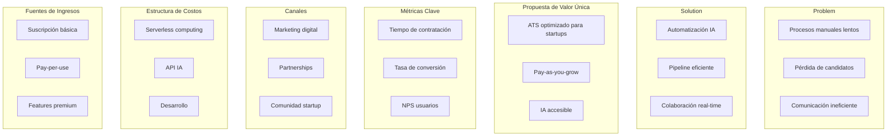
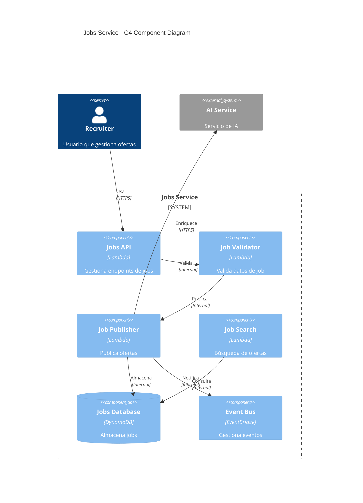

# LTI-AMS: Sistema de Gestión de Candidatos
## Documentación Técnica v1.0

### 1. Descripción del Software

LTI-ATS es un sistema de gestión de candidatos (ATS) diseñado específicamente para startups, con un enfoque en la simplicidad, eficiencia y optimización de costos. El sistema se distingue por:

**Valor Añadido:**
- Arquitectura cloud-native optimizada para costos
- Integración de IA para automatización de tareas repetitivas
- Interfaz intuitiva diseñada para equipos pequeños
- Escalabilidad bajo demanda

**Ventajas Competitivas:**
- Precio competitivo mediante arquitectura serverless
- Sin costos de infraestructura inicial
- Implementación rápida (time-to-market)
- Automatización inteligente con IA para equipos pequeños

### 2. Funciones Principales

1. **Gestión de Candidatos**
   - Portal de empleo personalizable
   - Recepción y organización automática de CVs
   - Seguimiento del pipeline de contratación
   - Evaluación automática de candidatos mediante IA

2. **Automatización de Procesos**
   - Screening inicial automatizado con IA
   - Programación automática de entrevistas
   - Notificaciones automatizadas
   - Templates personalizables

3. **Colaboración en Tiempo Real**
   - Dashboard compartido para el equipo
   - Comentarios y feedback en tiempo real
   - Evaluaciones compartidas
   - Sistema de votación para candidatos

4. **Analytics e Informes**
   - Métricas de contratación
   - Análisis de fuentes de candidatos
   - Tiempo promedio de contratación
   - Reportes personalizables

### 3. Lean Canvas



### 4. Casos de Uso Principales

```python
from diagrams import Diagram, Cluster
from diagrams.programming.framework import React
from diagrams.onprem.client import Users
from diagrams.saas.chat import Discord
from diagrams.aws.compute import Lambda
from diagrams.aws.database import DynamoDB
from diagrams.aws.integration import EventBridge
from diagrams.aws.security import Cognito

# Caso de uso 1: Publicación de Trabajo
with Diagram("UC1 - Publicación de Trabajo", show=False):
    with Cluster("Actores"):
        recruiter = Users("Recruiter")
    
    with Cluster("Sistema"):
        web = React("Web App")
        job_service = Lambda("Job Service")
        db = DynamoDB("Jobs DB")
        
    recruiter >> web >> job_service >> db

# Caso de uso 2: Screening de Candidatos
with Diagram("UC2 - Screening Automático", show=False):
    with Cluster("Actores"):
        candidate = Users("Candidato")
    
    with Cluster("Sistema"):
        portal = React("Portal")
        ai_screening = Lambda("AI Screening")
        db = DynamoDB("Candidates DB")
        
    candidate >> portal >> ai_screening >> db

# Caso de uso 3: Gestión de Entrevistas
with Diagram("UC3 - Gestión de Entrevistas", show=False):
    with Cluster("Actores"):
        interviewer = Users("Entrevistador")
        candidate = Users("Candidato")
    
    with Cluster("Sistema"):
        calendar = React("Calendario")
        scheduler = Lambda("Scheduler")
        notifier = EventBridge("Notificador")
        
    interviewer >> calendar >> scheduler
    scheduler >> notifier >> candidate
```

#### Descripción de Casos de Uso:

1. **Publicación de Trabajo**
   - Actor: Recruiter
   - Flujo:
     1. Recruiter accede al sistema
     2. Crea nueva oferta de trabajo
     3. Sistema valida y almacena
     4. Publica en portal de empleo

2. **Screening Automático**
   - Actor: Candidato
   - Flujo:
     1. Candidato aplica a posición
     2. Sistema procesa CV con IA
     3. Evalúa match con requisitos
     4. Notifica resultado

3. **Gestión de Entrevistas**
   - Actores: Entrevistador, Candidato
   - Flujo:
     1. Sistema propone slots disponibles
     2. Candidato selecciona horario
     3. Sistema confirma y notifica
     4. Genera link de videollamada

### 5. Modelo de Datos

#### 5.1 Modelo SQL
```sql
-- Candidatos
CREATE TABLE candidates (
    id UUID PRIMARY KEY,
    name VARCHAR(100),
    email VARCHAR(100),
    phone VARCHAR(20),
    resume_url TEXT,
    status VARCHAR(50),
    created_at TIMESTAMP,
    updated_at TIMESTAMP
);

-- Trabajos
CREATE TABLE jobs (
    id UUID PRIMARY KEY,
    title VARCHAR(100),
    description TEXT,
    requirements TEXT[],
    status VARCHAR(50),
    created_at TIMESTAMP,
    updated_at TIMESTAMP
);

-- Aplicaciones
CREATE TABLE applications (
    id UUID PRIMARY KEY,
    candidate_id UUID REFERENCES candidates(id),
    job_id UUID REFERENCES jobs(id),
    status VARCHAR(50),
    ai_score FLOAT,
    created_at TIMESTAMP,
    updated_at TIMESTAMP
);

-- Entrevistas
CREATE TABLE interviews (
    id UUID PRIMARY KEY,
    application_id UUID REFERENCES applications(id),
    interviewer_id UUID,
    scheduled_at TIMESTAMP,
    status VARCHAR(50),
    feedback TEXT,
    created_at TIMESTAMP,
    updated_at TIMESTAMP
);
```

#### 5.2 Modelo DBML (para dbdiagram.io)
```dbml
Table candidates {
  id uuid [pk]
  name varchar
  email varchar
  phone varchar
  resume_url text
  status varchar
  created_at timestamp
  updated_at timestamp
}

Table jobs {
  id uuid [pk]
  title varchar
  description text
  requirements text[]
  status varchar
  created_at timestamp
  updated_at timestamp
}

Table applications {
  id uuid [pk]
  candidate_id uuid [ref: > candidates.id]
  job_id uuid [ref: > jobs.id]
  status varchar
  ai_score float
  created_at timestamp
  updated_at timestamp
}

Table interviews {
  id uuid [pk]
  application_id uuid [ref: > applications.id]
  interviewer_id uuid
  scheduled_at timestamp
  status varchar
  feedback text
  created_at timestamp
  updated_at timestamp
}
```

*Nota: Para visualizar el diagrama ER, copiar el código DBML en https://dbdiagram.io/*

### 6. Diseño de Alto Nivel

```python
from diagrams import Diagram, Cluster
from diagrams.aws.compute import Lambda
from diagrams.aws.database import DynamoDB
from diagrams.aws.security import Cognito
from diagrams.aws.integration import EventBridge
from diagrams.aws.network import APIGateway
from diagrams.programming.framework import React

with Diagram("LTI-ATS Architecture", show=False):
    # Frontend
    with Cluster("Frontend"):
        web = React("Web App")
    
    # API Layer
    with Cluster("API Layer"):
        api = APIGateway("API Gateway")
        auth = Cognito("Auth")
    
    # Backend Services
    with Cluster("Microservicios"):
        candidates = Lambda("Candidates Service")
        jobs = Lambda("Jobs Service")
        interviews = Lambda("Interviews Service")
        ai = Lambda("AI Service")
    
    # Data Layer
    with Cluster("Data Layer"):
        db = DynamoDB("Database")
        events = EventBridge("Event Bus")
    
    # Conexiones
    web >> api >> auth
    api >> [candidates, jobs, interviews, ai]
    [candidates, jobs, interviews, ai] >> db
    [candidates, jobs, interviews, ai] >> events
```

El sistema utiliza una arquitectura serverless basada en AWS para minimizar costos y maximizar la escalabilidad. Los componentes principales son:

1. **Frontend**: SPA React con Typescript
2. **API Layer**: API Gateway + Cognito
3. **Backend**: Lambdas para cada dominio
4. **Data Layer**: DynamoDB + EventBridge

### 7. Diagrama C4 (Componente Jobs Service)

