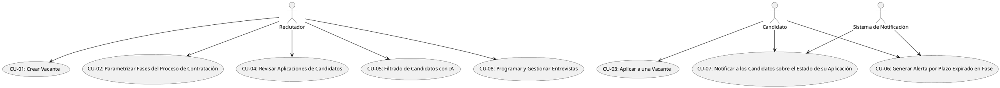
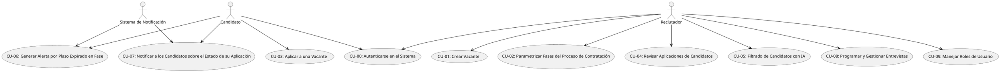
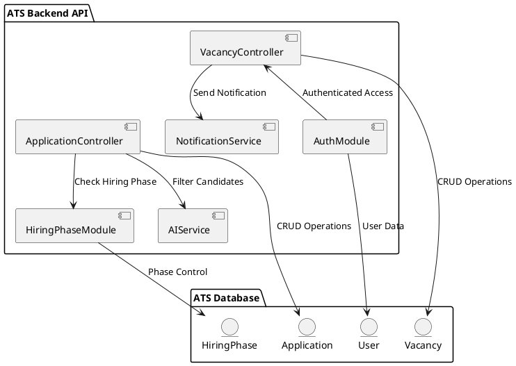

### Diseño para un sistema de ATS (Applicant-Tracking System)

**PROMPT:**
Siendo un experto en producto, quiero que diseñes y documentes un sistema LTI que es una startup que quiere desarrollar el ATS (Applicant-Tracking System) simplificada en la imagen adjunta. Esto se debe lograr siguiendo las fases claves del desarrollo de software:

1. Investigación y análisis.
2. Casos de uso.
3. Modelado de datos.
4. Diseño de alto nivel.

Quiero que primero me digas si hace falta algún paso clave para el diseño y documentación para la implementación de este software para que luego trabajemos en cada uno de los puntos enumerados, uno por uno.

**RESPUESTA CHAT GPT**
Para diseñar y documentar un sistema de ATS (Applicant-Tracking System) como el de la imagen adjunta, los pasos clave que mencionas son un excelente punto de partida. Sin embargo, podría ser útil añadir un par de etapas adicionales para asegurar una implementación más completa:

1. **Definición de requisitos (incluyendo requisitos funcionales y no funcionales)**: Aunque podríamos incluir esto dentro de "Investigación y análisis", tener una lista clara y estructurada de requisitos ayuda a que los desarrolladores y el equipo de producto comprendan bien el alcance del proyecto.

2. **Pruebas y validación de requisitos**: Esto implica el diseño de pruebas preliminares y de aceptación para verificar que el sistema cumpla con los casos de uso, una vez implementado.

3. **Consideraciones de seguridad y privacidad de datos**: Dado que este sistema manejará datos personales, es importante definir medidas de seguridad y políticas de privacidad desde la fase de diseño.

Entonces, los pasos completos sugeridos serían:

1. Investigación y análisis.
2. Definición de requisitos (funcionales y no funcionales).
3. Casos de uso.
4. Modelado de datos.
5. Diseño de alto nivel.
6. Pruebas y validación de requisitos.
7. Consideraciones de seguridad y privacidad de datos.

¿Quieres que empecemos con el primer punto, "Investigación y análisis"?

----------------------------------------------------------------------------------------------------------------------------------

**PROMPT:**
Quiero que incluyas el numero 1 "Definición de requisitos (incluyendo requisitos funcionales y no funcionales)" dentro de "Investigación y análisis", haremos el numero 2 que mencionas de "Pruebas y validación de requisitos" y el numero 3 "Consideraciones de seguridad y privacidad de datos" no lo vamos a trabajar

**RESPUESTA CHAT GPT**
Perfecto, entonces trabajaremos con los siguientes pasos:

1. **Investigación y análisis** (incluyendo la definición de requisitos funcionales y no funcionales).
2. **Casos de uso.**
3. **Modelado de datos.**
4. **Diseño de alto nivel.**
5. **Pruebas y validación de requisitos.**

¿Te parece bien que empecemos con el primer punto, "Investigación y análisis"?

----------------------------------------------------------------------------------------------------------------------------------

**PROMPT:**
Empecemos con el punto 1, eres experto y tienes muchas experiencia en sistemas de ATS (Applicant-Tracking System). Antes de definir este punto vamos a ver ¿Qué funcionalidades básicas tiene un ATS (Applicant-Tracking System)? Descríbemelas en un listado, ordenado de mayor a menor prioridad.

**RESPUESTA CHAT GPT**
Claro, aquí tienes un listado de las funcionalidades básicas de un sistema ATS (Applicant-Tracking System), ordenadas de mayor a menor prioridad:

1. **Gestión de ofertas de trabajo (creación y publicación)**: Permite crear y gestionar descripciones de puestos, requisitos y detalles sobre la posición. Las ofertas se publican automáticamente en plataformas de empleo, redes sociales y el sitio web de la empresa.

2. **Recepción y almacenamiento de solicitudes**: Registra todas las aplicaciones de candidatos, almacenando la información personal, currículum, cartas de presentación y datos adicionales en un formato estructurado.

3. **Revisión y filtrado de aplicaciones**: Proporciona herramientas para que los reclutadores revisen, filtren y clasifiquen las solicitudes de acuerdo con criterios como habilidades, experiencia, ubicación y más, agilizando la selección inicial.

4. **Evaluaciones en línea (pruebas)**: Permite configurar y administrar pruebas técnicas o de aptitud en línea, que los candidatos pueden completar como parte del proceso de selección.

5. **Programación de entrevistas**: Facilita la programación de entrevistas, integrándose con calendarios y enviando notificaciones tanto a los candidatos como a los entrevistadores, reduciendo los tiempos de coordinación.

6. **Seguimiento de estado de los candidatos**: Proporciona una vista de cada candidato dentro del proceso, mostrando si están en revisión, en entrevistas, en espera de pruebas, o si han sido rechazados o seleccionados.

7. **Comunicación con los candidatos**: Incluye herramientas de comunicación para enviar correos electrónicos o notificaciones automáticas a los candidatos, manteniéndolos informados sobre el estado de su aplicación y los próximos pasos.

8. **Gestión de documentos**: Almacena y organiza los documentos asociados a cada candidato, como currículums, resultados de evaluaciones, referencias y contratos.

9. **Generación de reportes**: Ofrece reportes y análisis sobre métricas de reclutamiento, como el número de aplicaciones, el tiempo promedio de contratación, las fuentes de reclutamiento más efectivas, etc.

10. **Integración con otros sistemas (ERP, CRM, HRM)**: Permite conectar el ATS con otros sistemas de la empresa para sincronizar datos de empleados y simplificar el traspaso de información entre los diferentes departamentos.

11. **Portal de auto-servicio para candidatos**: Brinda un portal para que los candidatos creen un perfil, actualicen su información y verifiquen el estado de su aplicación de forma autónoma.

12. **Automatización de flujos de trabajo**: Configura reglas automáticas para avanzar candidatos en el proceso (por ejemplo, pasar a una entrevista automáticamente después de aprobar una prueba), eliminando tareas manuales repetitivas.

Estas funcionalidades básicas forman la estructura de un ATS eficiente, cubriendo desde la publicación de puestos hasta la selección final del candidato. ¿Te gustaría profundizar en alguna funcionalidad específica para el análisis o seguimos con la investigación y análisis del sistema?

----------------------------------------------------------------------------------------------------------------------------------

**PROMPT:**
Quiero que añadas una funcionalidad en la que se pueda parametrizar cada proceso de contratación según las necesidades del reclutador, en caso tal que no se haya completado una de las fases del proceso, que pueda enviar una alerta al reclutador indicando que se esta agotando el tiempo, así mismo, otra notificación para los aplicantes a la vacante cuando ya expiró el proceso.

Algo adicional que se quiere implementar es el uso de la inteligencia artificial para filtrar candidatos de una vacante según las habilidades/skills que tenga en el perfil.

Que te se ocurre  para esto en esta fase de "Investigación y análisis" ?

**RESPUESTA CHAT GPT**
Para incorporar estas dos funcionalidades adicionales (parametrización del proceso de contratación con alertas y uso de inteligencia artificial para filtrado de candidatos) en la fase de **Investigación y Análisis**, podemos estructurar un enfoque claro para definir los requisitos y evaluar la viabilidad de su implementación. A continuación, detallo los pasos y consideraciones clave:

### 1. **Definir Requisitos Funcionales**
   Los requisitos funcionales para las nuevas funcionalidades incluyen los siguientes puntos:

   **A. Parametrización del Proceso de Contratación con Alertas**
   - **Configuración de Fases**: El sistema debe permitir a los reclutadores configurar las fases del proceso de contratación según el tipo de vacante (por ejemplo: pruebas, entrevistas, revisiones de antecedentes).
   - **Asignación de Plazos**: Cada fase debe tener una fecha límite ajustable para completarse.
   - **Alertas para Reclutadores**: Cuando se esté cerca del plazo de una fase, el sistema debe enviar una alerta al reclutador (por correo electrónico o notificación en la plataforma) recordándole la fase pendiente.
   - **Notificación para los Candidatos**: En caso de que expire el proceso de selección, los candidatos deben recibir una notificación automática informándoles sobre el cierre de su aplicación.

   **B. Filtrado Inteligente con Inteligencia Artificial**
   - **Evaluación de Skills**: El sistema debe analizar las habilidades de cada candidato en su perfil, ya sea mediante la extracción de palabras clave en sus currículums o mediante la información ingresada en el formulario de solicitud.
   - **Filtrado Basado en Relevancia**: La IA debe calificar y ordenar a los candidatos en función de qué tan bien se ajustan a las habilidades requeridas para la vacante.
   - **Aprendizaje Automático**: El sistema debe mejorar sus recomendaciones con el tiempo, aprendiendo de patrones en contrataciones anteriores y afinando el proceso de filtrado.

### 2. **Requisitos No Funcionales**
   Estos requisitos garantizarán el rendimiento y la usabilidad del sistema:

   - **Rendimiento**: La IA debe procesar los datos de los candidatos en un tiempo razonable para que el reclutador obtenga resultados rápidos.
   - **Escalabilidad**: Dado que un ATS puede tener miles de candidatos, el sistema debe ser capaz de manejar grandes volúmenes de datos sin perder eficiencia.
   - **Usabilidad y Flexibilidad**: La interfaz debe ser intuitiva para que los reclutadores puedan ajustar fácilmente los parámetros del proceso de contratación.
   - **Notificaciones en Tiempo Real**: Las alertas deben llegar a los reclutadores y candidatos de inmediato cuando se alcance o exceda una fecha límite.

### 3. **Estudio de Viabilidad**
   - **Evaluación de Recursos**: Definir si el equipo cuenta con los conocimientos necesarios para implementar una solución de IA, o si será necesario utilizar una API de terceros para el filtrado basado en habilidades (por ejemplo, IBM Watson, Google AI, o servicios de análisis de texto).
   - **Herramientas de Notificación**: Evaluar la integración de sistemas de notificaciones en tiempo real (como Firebase o Twilio) para el envío de alertas y mensajes a los candidatos y reclutadores.
   - **Desarrollo de Algoritmos de IA**: Considerar si el modelo de IA será una solución pre-entrenada o si se requiere un modelo personalizado basado en datos históricos de contrataciones.

### 4. **Benchmarking y Estándares de la Industria**
   - Revisar las funcionalidades de ATS líderes en el mercado (por ejemplo, Greenhouse, Lever) para identificar cómo abordan el filtrado de candidatos y la configuración de procesos de selección personalizados.
   - Recopilar comentarios de reclutadores para entender sus expectativas y qué tan importante es la precisión en el filtrado de candidatos.

### 5. **Evaluación de los Desafíos Potenciales**
   - **Precisión de la IA**: La precisión en el filtrado de habilidades dependerá en gran medida de la calidad de los datos de los candidatos. Es necesario definir criterios para manejar casos en los que las habilidades no están claramente definidas.
   - **Adaptabilidad de la Notificación**: Definir cómo el sistema manejará cambios en los plazos o fases del proceso, asegurando que las notificaciones se envíen correctamente si hay modificaciones de última hora.
   - **Privacidad y Ética de la IA**: Asegurarse de que el sistema de IA no discrimine inadvertidamente, y garantizar que los candidatos estén informados sobre el uso de IA en su proceso de selección.

### 6. **Documentación de Requisitos para las Nuevas Funcionalidades**
   Documentar los requisitos funcionales y no funcionales, considerando ejemplos específicos:

   - **Ejemplo de Configuración de Fases**: “Para una vacante de Desarrollador Full Stack, el proceso tiene cinco fases: revisión inicial, prueba técnica, entrevista técnica, entrevista con el equipo y oferta final. Cada fase debe completarse en un máximo de 5 días hábiles. Si no se ha avanzado a la siguiente fase en 4 días, el sistema enviará una alerta.”
   
   - **Ejemplo de Filtrado con IA**: “Para una vacante de Diseñador UX, la IA debe buscar habilidades relacionadas con diseño de interfaces, experiencia de usuario, Figma, y Adobe XD en el perfil del candidato, asignando una calificación de relevancia. Solo los candidatos con una calificación del 80% o superior se mostrarán en la primera revisión.”

### Conclusión
En esta fase de **Investigación y Análisis**, hemos definido las funcionalidades clave adicionales y establecido un marco para su implementación efectiva. Hemos también identificado las prioridades y los posibles desafíos que se deben tener en cuenta para asegurar que el sistema sea flexible, eficiente y funcional. Con esta información, podemos proceder a los **Casos de Uso** para detallar cómo los usuarios interactuarán con estas funcionalidades y así perfilar el desarrollo. 

¿Continuamos con los Casos de Uso?


----------------------------------------------------------------------------------------------------------------------------------

**PROMPT:**
Teniendo en cuanta el primer listado de las funcionalidades básicas de un sistema ATS (Applicant-Tracking System) y las que me acabas de mencionar, sigamos con los casos de uso.

**RESPUESTA CHAT GPT**
Para detallar los **Casos de Uso** de este sistema ATS, primero nos aseguraremos de cubrir tanto las funcionalidades básicas del sistema como las características adicionales que discutimos (parametrización del proceso y filtrado con IA). Un caso de uso describe una interacción específica entre un usuario y el sistema para lograr un objetivo particular. Aquí, los actores principales serán **Reclutador**, **Candidato** y **Sistema de Notificación**.

---

### Casos de Uso Principales

1. **CU-01: Crear Vacante**
   - **Actor Principal**: Reclutador
   - **Precondición**: El reclutador ha iniciado sesión en el sistema.
   - **Descripción**: El reclutador crea una nueva vacante especificando el título, descripción, ubicación, tipo de trabajo (remoto o presencial), salario, y los requisitos necesarios para el puesto.
   - **Flujo Principal**:
     1. El reclutador selecciona la opción "Crear Vacante".
     2. El sistema muestra un formulario de creación de vacante.
     3. El reclutador llena los detalles de la vacante.
     4. El reclutador configura las fases del proceso de contratación y asigna fechas límite para cada fase.
     5. El reclutador guarda la vacante, y el sistema la publica en los portales seleccionados.
   - **Postcondición**: La vacante se ha creado y está disponible en los portales designados.

2. **CU-02: Parametrizar Fases del Proceso de Contratación**
   - **Actor Principal**: Reclutador
   - **Precondición**: La vacante ha sido creada y está en proceso de publicación.
   - **Descripción**: El reclutador configura las fases de contratación específicas para cada vacante, estableciendo plazos y activando alertas para el reclutador y los candidatos.
   - **Flujo Principal**:
     1. El reclutador accede a la configuración de fases del proceso.
     2. El sistema muestra una lista de fases estándar (pruebas, entrevistas, revisión final).
     3. El reclutador ajusta las fases necesarias y asigna plazos para cada una.
     4. El sistema permite al reclutador activar alertas para recibir notificaciones si se acerca el plazo de una fase sin completarse.
     5. El reclutador guarda la configuración.
   - **Postcondición**: La vacante tiene un proceso de contratación parametrizado con plazos y alertas activadas.

3. **CU-03: Aplicar a una Vacante**
   - **Actor Principal**: Candidato
   - **Precondición**: La vacante está publicada y abierta a aplicaciones.
   - **Descripción**: El candidato selecciona una vacante de interés y aplica mediante un formulario en el sistema.
   - **Flujo Principal**:
     1. El candidato visualiza las vacantes disponibles.
     2. El candidato selecciona una vacante y revisa la descripción.
     3. El candidato llena el formulario de aplicación y sube su currículum.
     4. El sistema recibe y guarda la aplicación.
   - **Postcondición**: La aplicación se ha registrado y queda en estado de “Pendiente de revisión”.

4. **CU-04: Revisar Aplicaciones de Candidatos**
   - **Actor Principal**: Reclutador
   - **Precondición**: La vacante tiene candidatos en estado “Pendiente de revisión”.
   - **Descripción**: El reclutador revisa las aplicaciones, puede clasificarlas, añadir notas, y mover a los candidatos a la siguiente fase.
   - **Flujo Principal**:
     1. El reclutador accede a la lista de aplicaciones para una vacante específica.
     2. El sistema muestra una lista de candidatos con su información.
     3. El reclutador revisa el perfil de cada candidato y decide si lo mueve a la siguiente fase o lo rechaza.
     4. Si el candidato avanza, el sistema actualiza su estado a la siguiente fase del proceso.
   - **Postcondición**: El estado de cada candidato es actualizado de acuerdo a la revisión.

5. **CU-05: Filtrado de Candidatos con Inteligencia Artificial**
   - **Actor Principal**: Reclutador, Sistema de IA
   - **Precondición**: La vacante ha recibido aplicaciones con currículums y habilidades especificadas.
   - **Descripción**: La IA filtra los candidatos según las habilidades requeridas en la vacante y genera una lista clasificada de candidatos.
   - **Flujo Principal**:
     1. El reclutador solicita el filtrado de candidatos.
     2. El sistema de IA analiza las habilidades de cada candidato en comparación con las requeridas para la vacante.
     3. La IA clasifica a los candidatos en función de su adecuación al puesto.
     4. El sistema presenta una lista ordenada para que el reclutador la revise.
   - **Postcondición**: Los candidatos han sido clasificados de acuerdo con la relevancia de sus habilidades.

6. **CU-06: Generar Alerta por Plazo Expirado en Fase de Contratación**
   - **Actor Principal**: Sistema de Notificación
   - **Precondición**: Una fase de contratación ha alcanzado su fecha límite sin completarse.
   - **Descripción**: El sistema envía una alerta al reclutador informando que una fase está próxima a expirar o ya ha expirado.
   - **Flujo Principal**:
     1. El sistema verifica el estado y plazo de cada fase de las vacantes activas.
     2. Si una fase está por expirar (por ejemplo, faltan 24 horas), el sistema envía una notificación al reclutador.
     3. Si la fase ya expiró, el sistema envía una notificación tanto al reclutador como al candidato (si aplica) informando sobre el estatus.
   - **Postcondición**: El reclutador y el candidato son notificados sobre el vencimiento de una fase de contratación.

7. **CU-07: Notificar a los Candidatos sobre el Estado de su Aplicación**
   - **Actor Principal**: Sistema de Notificación
   - **Precondición**: El estado de la aplicación del candidato ha cambiado (por ejemplo, aceptado para entrevista, rechazado).
   - **Descripción**: El sistema envía notificaciones a los candidatos para mantenerlos informados sobre el estado de su aplicación.
   - **Flujo Principal**:
     1. El sistema detecta un cambio en el estado de la aplicación de un candidato.
     2. El sistema envía una notificación al candidato con la actualización de su estatus.
   - **Postcondición**: El candidato recibe una notificación que refleja el estado actual de su aplicación.

8. **CU-08: Programar y Gestionar Entrevistas**
   - **Actor Principal**: Reclutador
   - **Precondición**: El candidato ha sido aprobado para la fase de entrevista.
   - **Descripción**: El reclutador programa una entrevista para el candidato y coordina el horario.
   - **Flujo Principal**:
     1. El reclutador selecciona un candidato aprobado para la entrevista.
     2. El sistema permite al reclutador elegir una fecha y hora y enviar una invitación al candidato.
     3. El candidato recibe una notificación con la fecha de la entrevista.
   - **Postcondición**: La entrevista queda programada y registrada en el sistema.

---

### Diagramas de Caso de Uso

Podemos representar estos casos de uso en un **Diagrama de Casos de Uso** para visualizar la relación entre los actores y las funciones principales del sistema. Este diagrama ayuda a identificar las interacciones de los actores con el sistema y puede servir como referencia para el diseño y desarrollo posterior.

---

### Conclusión

Estos casos de uso detallan las interacciones clave que el sistema ATS permitirá, abarcando tanto las funciones básicas como las funcionalidades avanzadas. Cada caso de uso ayuda a identificar qué interfaces, algoritmos y componentes serán necesarios en el desarrollo. Con esta base, el próximo paso será crear un **Modelo de Datos** para diseñar la estructura de almacenamiento que soporte estas operaciones.

¿Quieres que avancemos con el Modelado de Datos?

----------------------------------------------------------------------------------------------------------------------------------

**PROMPT:**
Quiero que me des esos casos de uso en código para ponerlos en un archivo y con la extension PlantUML de visual studio code, poder ver los diagramas

**RESPUESTA CHAT GPT**
Aquí tienes el código en formato **PlantUML** para cada uno de los casos de uso que mencionamos. Puedes pegarlo en un archivo `.puml` y visualizar el diagrama de casos de uso en **Visual Studio Code** usando la extensión **PlantUML**.



### Explicación del Diagrama PlantUML

- **Actors**:
  - `Reclutador`: Interactúa principalmente con los casos de uso relacionados con la gestión de vacantes y candidatos.
  - `Candidato`: Inicia la aplicación a una vacante y recibe notificaciones de estado.
  - `Sistema de Notificación`: Responsable de enviar alertas y notificaciones según las reglas del proceso.

- **Casos de Uso**:
  - Cada caso de uso es una función específica del sistema ATS.
  - Las flechas indican la interacción de cada actor con los casos de uso correspondientes.

---

Al ejecutar este archivo `.puml` en Visual Studio Code con la extensión de PlantUML, deberías ver un diagrama de casos de uso que muestra cómo interactúan los actores con las distintas funcionalidades del sistema ATS. Esto te da una representación visual que será útil en la fase de análisis y diseño del sistema.

----------------------------------------------------------------------------------------------------------------------------------

**PROMPT:**
Se te esta olvidando algo muy importante que es la autenticación en el sistema y el manejo de roles, que tanto el reclutador, como los aplicantes deben ingresar al sistema, dame solo los casos de uso actualizados inclyendo esto y con el diagrama

**RESPUESTA CHAT GPT**
Tienes razón; la autenticación y el manejo de roles son esenciales para cualquier sistema de ATS. Aquí tienes los casos de uso actualizados, incluyendo la autenticación y los roles de acceso para el **Reclutador** y el **Candidato**.

### Casos de Uso Actualizados en PlantUML



### Descripción de los Nuevos Casos de Uso

1. **CU-00: Autenticarse en el Sistema**: Permite a los usuarios ingresar al sistema con sus credenciales. Aplica tanto para el **Reclutador** como para el **Candidato**.

2. **CU-09: Manejar Roles de Usuario**: Permite a los administradores configurar y gestionar roles de usuario, garantizando que solo los **Reclutadores** tengan acceso a funciones avanzadas como la creación de vacantes, configuración de fases, revisión de aplicaciones, y programación de entrevistas.

### Explicación del Diagrama

- **Actor "Reclutador"** y **"Candidato"**: Ambos interactúan con el caso de uso de autenticación, ya que deben autenticarse para acceder a las funciones del sistema.
- **Roles y Restricciones**: El caso de uso de manejo de roles asegura que cada usuario solo tenga acceso a las funcionalidades relevantes para su rol.
- **Conexión de Funciones**: Los casos de uso relacionados con la gestión de vacantes, parametrización, y entrevistas están restringidos a **Reclutadores**, mientras que el **Candidato** puede aplicar a vacantes y recibir notificaciones.

Al visualizar este archivo `.puml` en **Visual Studio Code**, podrás ver el diagrama de casos de uso actualizado, mostrando cómo la autenticación y el manejo de roles son integrados en el flujo del sistema ATS.

----------------------------------------------------------------------------------------------------------------------------------

**PROMPT:**
Eres un arquitecto de software experto. Quiero que me entregues el modelo de datos robusto y escalable para el sistema, teniendo en cuanta lo que se ha mencionado hasta ahora, ten en cuenta que probablemente en un futuro, el sistema debe estar en la capacidad de brindar reportería con grandes volúmenes de datos.

**RESPUESTA CHAT GPT**
Para diseñar un modelo de datos robusto y escalable para el ATS, tenemos en cuenta los requisitos actuales, la autenticación y roles, así como las posibles futuras necesidades de reportería y análisis. El diseño es modular y orientado a la escalabilidad, considerando las relaciones entre vacantes, candidatos, fases de contratación y notificaciones.

A continuación se describe el modelo de datos en detalle.

### Entidades Principales

1. **Usuarios (Users)**: Almacena información básica y credenciales de todos los usuarios (reclutadores y candidatos).
2. **Roles (Roles)**: Define los distintos roles del sistema, como **Reclutador** y **Candidato**.
3. **Permisos (Permissions)**: Almacena los permisos específicos para cada rol, facilitando una arquitectura de control de acceso basada en roles (RBAC).
4. **Vacantes (Jobs)**: Contiene la información de cada vacante creada por los reclutadores.
5. **Fases de Contratación (HiringPhases)**: Permite la parametrización de cada proceso de contratación para vacantes específicas.
6. **Aplicaciones (Applications)**: Almacena los datos de los candidatos que aplican a las vacantes.
7. **Entrevistas (Interviews)**: Gestiona las entrevistas programadas y su estado.
8. **Notificaciones (Notifications)**: Almacena alertas y recordatorios tanto para los reclutadores como para los candidatos.
9. **Logs (EventLogs)**: Permite la auditoría y seguimiento de eventos importantes para reportería y análisis.
10. **Habilidades (Skills)**: Almacena habilidades y es utilizada para el filtrado de candidatos mediante IA.

### Modelo de Datos (Diagrama Relacional)

Aquí tienes la descripción de cada tabla con sus campos clave y relaciones:

#### Tabla `Users`
- **user_id** (PK)
- **name**
- **email** (único)
- **password_hash**
- **role_id** (FK a `Roles.role_id`)
- **created_at**
- **updated_at**

#### Tabla `Roles`
- **role_id** (PK)
- **role_name** (Ej. "Reclutador", "Candidato")

#### Tabla `Permissions`
- **permission_id** (PK)
- **role_id** (FK a `Roles.role_id`)
- **permission_name**

#### Tabla `Jobs`
- **job_id** (PK)
- **title**
- **description**
- **created_by** (FK a `Users.user_id`)
- **created_at**
- **status** (Ej. "Open", "Closed", "Expired")

#### Tabla `HiringPhases`
- **phase_id** (PK)
- **job_id** (FK a `Jobs.job_id`)
- **phase_name** (Ej. "Review", "Interview")
- **deadline** (Fecha límite para completar la fase)
- **order** (Orden de la fase en el proceso de contratación)
- **created_at**
- **updated_at**

#### Tabla `Applications`
- **application_id** (PK)
- **job_id** (FK a `Jobs.job_id`)
- **candidate_id** (FK a `Users.user_id`)
- **status** (Ej. "Pending", "Under Review", "Selected", "Rejected")
- **applied_at**

#### Tabla `Interviews`
- **interview_id** (PK)
- **application_id** (FK a `Applications.application_id`)
- **scheduled_date**
- **status** (Ej. "Scheduled", "Completed", "Canceled")
- **created_at**

#### Tabla `Notifications`
- **notification_id** (PK)
- **user_id** (FK a `Users.user_id`)
- **message**
- **sent_at**
- **read_status** (Ej. "Unread", "Read")

#### Tabla `EventLogs`
- **log_id** (PK)
- **event_type** (Ej. "Application Status Update", "Phase Deadline Alert")
- **description**
- **created_at**
- **user_id** (FK a `Users.user_id`)

#### Tabla `Skills`
- **skill_id** (PK)
- **skill_name**

#### Tabla `ApplicationSkills`
- **application_skill_id** (PK)
- **application_id** (FK a `Applications.application_id`)
- **skill_id** (FK a `Skills.skill_id`)
- **level** (Ej. "Basic", "Intermediate", "Advanced")

### Relaciones entre Tablas

1. **Users y Roles**: Cada usuario tiene un rol específico. La relación es de uno a muchos (`Users.role_id -> Roles.role_id`).
2. **Roles y Permissions**: Cada rol puede tener múltiples permisos. Esto permite un control detallado de acceso.
3. **Jobs y Users**: Cada vacante es creada por un reclutador (`Jobs.created_by -> Users.user_id`).
4. **Jobs y HiringPhases**: Cada vacante puede tener múltiples fases de contratación (`HiringPhases.job_id -> Jobs.job_id`).
5. **Applications y Jobs**: Cada aplicación está asociada a una vacante específica (`Applications.job_id -> Jobs.job_id`).
6. **Applications y Users**: Cada aplicación pertenece a un candidato (`Applications.candidate_id -> Users.user_id`).
7. **Applications y Interviews**: Cada aplicación puede tener una o más entrevistas programadas (`Interviews.application_id -> Applications.application_id`).
8. **Notifications y Users**: Cada notificación es enviada a un usuario específico (`Notifications.user_id -> Users.user_id`).
9. **EventLogs y Users**: Los logs registran eventos asociados a un usuario (`EventLogs.user_id -> Users.user_id`).
10. **Skills y ApplicationSkills**: Cada habilidad está relacionada con una aplicación, permitiendo el filtrado basado en habilidades del candidato (`ApplicationSkills.skill_id -> Skills.skill_id`).

### Ejemplo de Esquema SQL

Aquí tienes un ejemplo de cómo podría verse el esquema SQL de algunas tablas clave para implementar esta estructura en PostgreSQL.

```sql
CREATE TABLE Roles (
    role_id SERIAL PRIMARY KEY,
    role_name VARCHAR(50) UNIQUE NOT NULL
);

CREATE TABLE Users (
    user_id SERIAL PRIMARY KEY,
    name VARCHAR(100) NOT NULL,
    email VARCHAR(100) UNIQUE NOT NULL,
    password_hash VARCHAR(255) NOT NULL,
    role_id INTEGER REFERENCES Roles(role_id),
    created_at TIMESTAMP DEFAULT CURRENT_TIMESTAMP,
    updated_at TIMESTAMP DEFAULT CURRENT_TIMESTAMP
);

CREATE TABLE Jobs (
    job_id SERIAL PRIMARY KEY,
    title VARCHAR(100) NOT NULL,
    description TEXT,
    created_by INTEGER REFERENCES Users(user_id),
    created_at TIMESTAMP DEFAULT CURRENT_TIMESTAMP,
    status VARCHAR(50) CHECK (status IN ('Open', 'Closed', 'Expired'))
);

CREATE TABLE HiringPhases (
    phase_id SERIAL PRIMARY KEY,
    job_id INTEGER REFERENCES Jobs(job_id),
    phase_name VARCHAR(100) NOT NULL,
    deadline DATE,
    order INTEGER NOT NULL,
    created_at TIMESTAMP DEFAULT CURRENT_TIMESTAMP,
    updated_at TIMESTAMP DEFAULT CURRENT_TIMESTAMP
);

CREATE TABLE Applications (
    application_id SERIAL PRIMARY KEY,
    job_id INTEGER REFERENCES Jobs(job_id),
    candidate_id INTEGER REFERENCES Users(user_id),
    status VARCHAR(50) CHECK (status IN ('Pending', 'Under Review', 'Selected', 'Rejected')),
    applied_at TIMESTAMP DEFAULT CURRENT_TIMESTAMP
);

CREATE TABLE Skills (
    skill_id SERIAL PRIMARY KEY,
    skill_name VARCHAR(100) UNIQUE NOT NULL
);

CREATE TABLE ApplicationSkills (
    application_skill_id SERIAL PRIMARY KEY,
    application_id INTEGER REFERENCES Applications(application_id),
    skill_id INTEGER REFERENCES Skills(skill_id),
    level VARCHAR(50) CHECK (level IN ('Basic', 'Intermediate', 'Advanced'))
);
```

### Consideraciones para Escalabilidad y Reportería

1. **Indexación de Claves Foráneas**: Asegúrate de indexar las columnas de claves foráneas para optimizar las consultas relacionales.
2. **Particionamiento de Tablas**: Usa particionamiento en las tablas de aplicaciones y logs para manejar grandes volúmenes de datos.
3. **Almacenamiento de Logs en Almacenamiento Externo**: Considera enviar los logs a un sistema de almacenamiento externo (ej. Elasticsearch) para análisis en tiempo real sin afectar el rendimiento de la base de datos.
4. **Optimización de Consultas**: Crea vistas materializadas para consultas frecuentes, como la generación de reportes, para reducir el tiempo de respuesta.

Este modelo de datos está pensado para escalar de forma modular a medida que el sistema crezca en usuarios y transacciones. También facilita el filtrado avanzado de candidatos, gracias a la tabla de habilidades, y permite un sistema de notificaciones y auditoría efectivo para brindar un seguimiento completo del proceso de contratación.

----------------------------------------------------------------------------------------------------------------------------------

**PROMPT:**
Ahora seguimos con el diseño y pruebas y validación de requisitos.

**RESPUESTA CHAT GPT**
Para abordar la fase de **Diseño y Pruebas de Validación de Requisitos** de este sistema ATS (Applicant-Tracking System), estructuraremos el proceso en dos etapas clave: el diseño de la arquitectura y la validación de los requisitos funcionales y no funcionales mediante pruebas específicas.

### 1. Diseño de la Arquitectura del Sistema

#### 1.1 Arquitectura General

El sistema ATS se diseñará siguiendo una arquitectura basada en servicios, aprovechando una separación clara entre los servicios de frontend, backend y base de datos. Esto facilitará la escalabilidad y el mantenimiento del sistema a medida que crezca.

- **Frontend**: Aplicación web responsiva construida con React o Next.js, que permite a los usuarios (reclutadores y candidatos) interactuar con el sistema.
- **Backend**: API RESTful construida en Node.js con NestJS, proporcionando los endpoints necesarios para gestionar autenticación, autorizaciones, gestión de usuarios, vacantes, aplicaciones y notificaciones.
- **Base de Datos**: PostgreSQL para almacenamiento estructurado y Redis para almacenamiento de caché y gestión de sesiones, mejorando el rendimiento de acceso a datos frecuentes.
- **Machine Learning Service**: Un microservicio separado para la inteligencia artificial que gestiona el filtrado de candidatos basado en habilidades, utilizando una biblioteca como TensorFlow o scikit-learn para ejecutar modelos de clasificación de habilidades.
- **Microservicio de Notificaciones**: Maneja las alertas y notificaciones del sistema y utiliza una cola de trabajos (como Bull o RabbitMQ) para administrar las notificaciones de fases próximas a vencer o procesos expirados.

#### 1.2 Diagrama de Arquitectura

La arquitectura del sistema sería algo así:

1. **Cliente (Front-End)** ↔ 2. **API Gateway** ↔ 3. **Backend (Node.js + NestJS)** ↔ 4. **Servicios Internos**:
    - Base de Datos PostgreSQL
    - Redis (Caché y Gestión de Sesiones)
    - Microservicio de IA (Filtrado de candidatos por habilidades)
    - Microservicio de Notificaciones

#### 1.3 Componentes y Responsabilidades

- **API Gateway**: Gestiona la entrada de solicitudes y redirige al backend adecuado. También maneja la autenticación y autorización.
- **Autenticación y Autorización**: Implementado en el backend con JWT para sesiones y roles basados en RBAC (control de acceso basado en roles).
- **Gestor de Candidaturas y Vacantes**: Gestiona CRUD de vacantes y aplicaciones, las fases de contratación y el estado de cada aplicación.
- **Microservicio de IA**: Realiza el filtrado de candidatos según habilidades. Entrena modelos para mejorar la precisión en la selección de candidatos.
- **Sistema de Notificaciones**: Envía alertas en función de los tiempos y fases de cada vacante.

### 2. Pruebas de Validación de Requisitos

Para garantizar que el sistema cumple con los requisitos funcionales y no funcionales, estructuramos el proceso de pruebas en varias categorías.

#### 2.1 Pruebas Funcionales

A continuación, algunos casos de pruebas funcionales clave para validar que el sistema cumple con sus requisitos:

1. **Autenticación y Autorización**:
   - **Caso de prueba**: Un usuario intenta iniciar sesión con credenciales válidas.
   - **Resultado esperado**: Acceso concedido y obtención de un token JWT.
   - **Caso de prueba**: Un usuario sin permisos intenta acceder a una funcionalidad restringida.
   - **Resultado esperado**: Acceso denegado, mensaje de error de permisos insuficientes.

2. **Gestión de Vacantes y Aplicaciones**:
   - **Caso de prueba**: Un reclutador crea una vacante.
   - **Resultado esperado**: La vacante se guarda en la base de datos y está disponible para visualización por los candidatos.
   - **Caso de prueba**: Un candidato aplica a una vacante existente.
   - **Resultado esperado**: La aplicación se guarda correctamente y el reclutador recibe una notificación de la nueva aplicación.

3. **Parametrización del Proceso de Contratación**:
   - **Caso de prueba**: El reclutador define fases de contratación personalizadas para una vacante.
   - **Resultado esperado**: Las fases se guardan en la base de datos y están disponibles para ser monitoreadas.

4. **Notificaciones de Plazo de Fase de Contratación**:
   - **Caso de prueba**: Una fase de contratación está cerca de su fecha límite y no ha sido completada.
   - **Resultado esperado**: El sistema envía una notificación al reclutador.

5. **Filtrado de Candidatos por IA**:
   - **Caso de prueba**: La IA analiza una lista de candidatos para una vacante específica.
   - **Resultado esperado**: La IA devuelve un ranking de candidatos que mejor cumplen con los requisitos de habilidades de la vacante.

#### 2.2 Pruebas de Rendimiento y Escalabilidad

Para asegurar que el sistema puede manejar grandes volúmenes de datos, se diseñan pruebas de carga y escalabilidad:

1. **Prueba de Carga en Gestión de Aplicaciones**:
   - **Caso de prueba**: Insertar masivamente aplicaciones en la base de datos.
   - **Resultado esperado**: El sistema puede manejar el volumen sin tiempos de respuesta inusualmente altos o fallos.

2. **Pruebas de Respuesta en Consulta de Vacantes**:
   - **Caso de prueba**: Realizar múltiples consultas simultáneas a la base de datos para ver vacantes.
   - **Resultado esperado**: La base de datos mantiene tiempos de respuesta dentro de límites aceptables.

3. **Pruebas de Rendimiento en Microservicio de IA**:
   - **Caso de prueba**: La IA filtra habilidades en una gran cantidad de candidatos.
   - **Resultado esperado**: La IA devuelve los resultados en tiempo real (o en el menor tiempo posible), sin afectar el rendimiento del sistema.

#### 2.3 Pruebas de Seguridad

Al ser un sistema que maneja datos sensibles, es esencial realizar pruebas de seguridad en los siguientes aspectos:

1. **Validación de Autenticación y Roles**:
   - **Caso de prueba**: Intento de acceso sin autenticación.
   - **Resultado esperado**: El sistema rechaza el acceso y redirige a la pantalla de inicio de sesión.

2. **Prueba de Exposición de Datos Sensibles**:
   - **Caso de prueba**: Un reclutador intenta acceder a datos de otro reclutador.
   - **Resultado esperado**: Acceso denegado; los datos no se exponen a usuarios no autorizados.

3. **Pruebas de Vulnerabilidades Comunes**:
   - **Caso de prueba**: Ejecutar ataques de inyección SQL o XSS en formularios.
   - **Resultado esperado**: El sistema debe prevenir ataques de inyección y no permitir scripts o datos inseguros.

#### 2.4 Pruebas de Experiencia de Usuario

Para asegurar una interfaz intuitiva y fácil de usar:

1. **Pruebas de Navegación en el Frontend**:
   - **Caso de prueba**: El usuario accede a la plataforma y navega entre diferentes secciones (Inicio, Vacantes, Perfil).
   - **Resultado esperado**: La navegación es fluida y las páginas cargan rápidamente.

2. **Prueba de Responsividad**:
   - **Caso de prueba**: El usuario accede desde diferentes dispositivos (móvil, tablet, escritorio).
   - **Resultado esperado**: La interfaz se adapta correctamente al tamaño de pantalla.

### Conclusión

En esta fase, se han definido tanto el diseño del sistema como los diferentes tipos de pruebas para asegurar que el ATS cumpla con sus requisitos de funcionalidad, rendimiento, seguridad y experiencia de usuario. 

Este enfoque nos permitirá validar cada componente y mantener la integridad y escalabilidad del sistema, preparándonos para una implementación exitosa y escalable en entornos reales.

----------------------------------------------------------------------------------------------------------------------------------

**PROMPT:**
Quiero que realices un Diagrama C4 que llegue en profundidad a uno de los componentes del sistema

**RESPUESTA CHAT GPT**
Aquí tienes un ejemplo de un diagrama C4 que describe la arquitectura del sistema ATS. Siguiendo el modelo C4, este diagrama se compone de varias vistas, cada una profundizando en diferentes niveles del sistema. Partiremos de una vista de contexto y profundizaremos en uno de los componentes más críticos, el **Componente de Gestión de Candidatos y Vacantes**, hasta llegar al nivel de código.

---

### Nivel 1: Diagrama de Contexto

El **Diagrama de Contexto** ilustra cómo el sistema ATS interactúa con los usuarios y otros sistemas externos.

#### Descripción del Contexto

1. **Usuarios**:
   - **Reclutador**: Interactúa con el sistema para crear y gestionar vacantes, evaluar candidatos y recibir notificaciones.
   - **Candidato**: Se registra en el sistema para aplicar a vacantes, gestionar su perfil y recibir actualizaciones del proceso.

2. **Sistemas Externos**:
   - **Servicio de Autenticación (Auth0 o similar)**: Provee autenticación segura con roles para reclutadores y candidatos.
   - **Servicio de IA para Filtrado de Candidatos**: Ayuda a priorizar candidatos basándose en sus habilidades.
   - **Servicio de Notificaciones (Twilio/SendGrid)**: Maneja las notificaciones enviadas a los reclutadores y candidatos sobre el estado del proceso.

---

### Nivel 2: Diagrama de Contenedores

El **Diagrama de Contenedores** describe los componentes principales del sistema ATS y sus relaciones.

#### Contenedores Principales

1. **Frontend Web (React/Next.js)**:
   - Interfaz de usuario accesible para reclutadores y candidatos.

2. **Backend API (Node.js + NestJS)**:
   - Expone los endpoints necesarios para gestionar usuarios, vacantes, aplicaciones y fases de contratación.
   - Controla la lógica de autenticación y autorización.

3. **Base de Datos (PostgreSQL)**:
   - Almacena información de usuarios, vacantes, aplicaciones, y logs de actividad.

4. **Microservicio de IA (Filtrado de Candidatos)**:
   - Realiza el filtrado de candidatos por habilidades.

5. **Microservicio de Notificaciones**:
   - Envía alertas y recordatorios en diferentes fases del proceso de contratación.

6. **Redis**:
   - Gestiona sesiones y almacenamiento en caché para mejorar el rendimiento.

---

### Nivel 3: Diagrama de Componentes

Profundicemos en el **Backend API**, específicamente en el **Componente de Gestión de Candidatos y Vacantes**.

#### Componentes dentro del Backend API

1. **Controlador de Vacantes**: Gestiona los endpoints de creación, actualización y eliminación de vacantes.
2. **Controlador de Aplicaciones**: Gestiona las postulaciones de candidatos y la actualización de estado de cada aplicación.
3. **Servicio de Notificaciones**: Envía notificaciones de eventos específicos, como fechas límite para fases de reclutamiento.
4. **Servicio de IA**: Llama al microservicio de IA para obtener una lista priorizada de candidatos según habilidades.
5. **Módulo de Fases de Contratación**: Controla el flujo de fases de cada vacante, parametrización y gestión de alertas por fase.
6. **Módulo de Autenticación**: Gestiona la autenticación y autorización de usuarios mediante tokens JWT y roles.

---

### Nivel 4: Diagrama de Código (Ejemplo de Componente de Gestión de Candidatos y Vacantes)

Para la **Gestión de Candidatos y Vacantes**, aquí se muestra cómo se estructuran las clases en el backend de NestJS.



---

### Explicación del Diagrama de Código

En este diagrama, cada componente tiene una función específica dentro del sistema:

- **VacancyController (VC)**: Proporciona los endpoints para gestionar vacantes. También interactúa con el `NotificationService` para alertas y el `AuthModule` para autenticación de acceso.
  
- **ApplicationController (AC)**: Gestiona las postulaciones de candidatos. Interactúa con `HiringPhaseModule` para verificar el estado de las fases de contratación y con `AIService` para filtrar candidatos según sus habilidades.

- **NotificationService (NS)**: Envía notificaciones a usuarios sobre el estado de las vacantes y aplicaciones, así como alertas cuando una fase está cerca de expirar.

- **HiringPhaseModule (HPM)**: Controla las fases de contratación y genera alertas cuando una fase está próxima a vencer.

- **AIService (AIS)**: Llama al microservicio de IA para clasificar candidatos según habilidades y otros criterios específicos de la vacante.

- **AuthModule (AM)**: Gestiona la autenticación y autorización de usuarios, asegurando que solo los usuarios autenticados accedan a sus respectivas áreas.

Este diagrama en PlantUML ilustra cómo estos componentes interactúan entre sí para cumplir con los casos de uso y proporcionar un sistema ATS robusto y escalable.