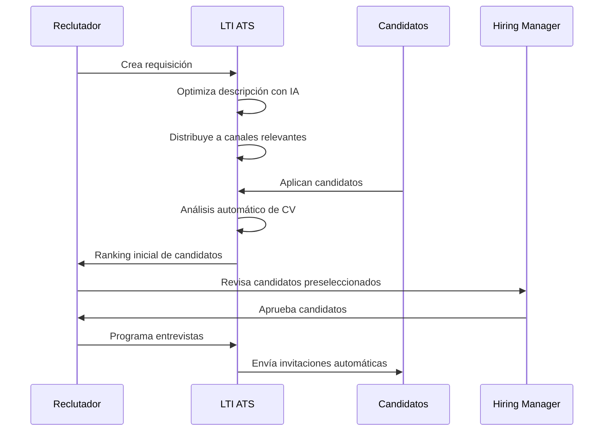
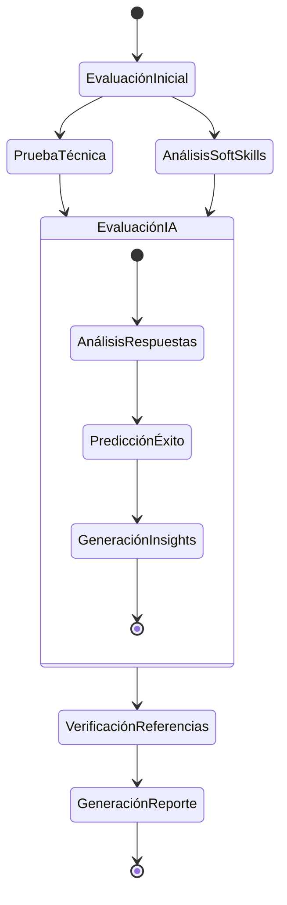
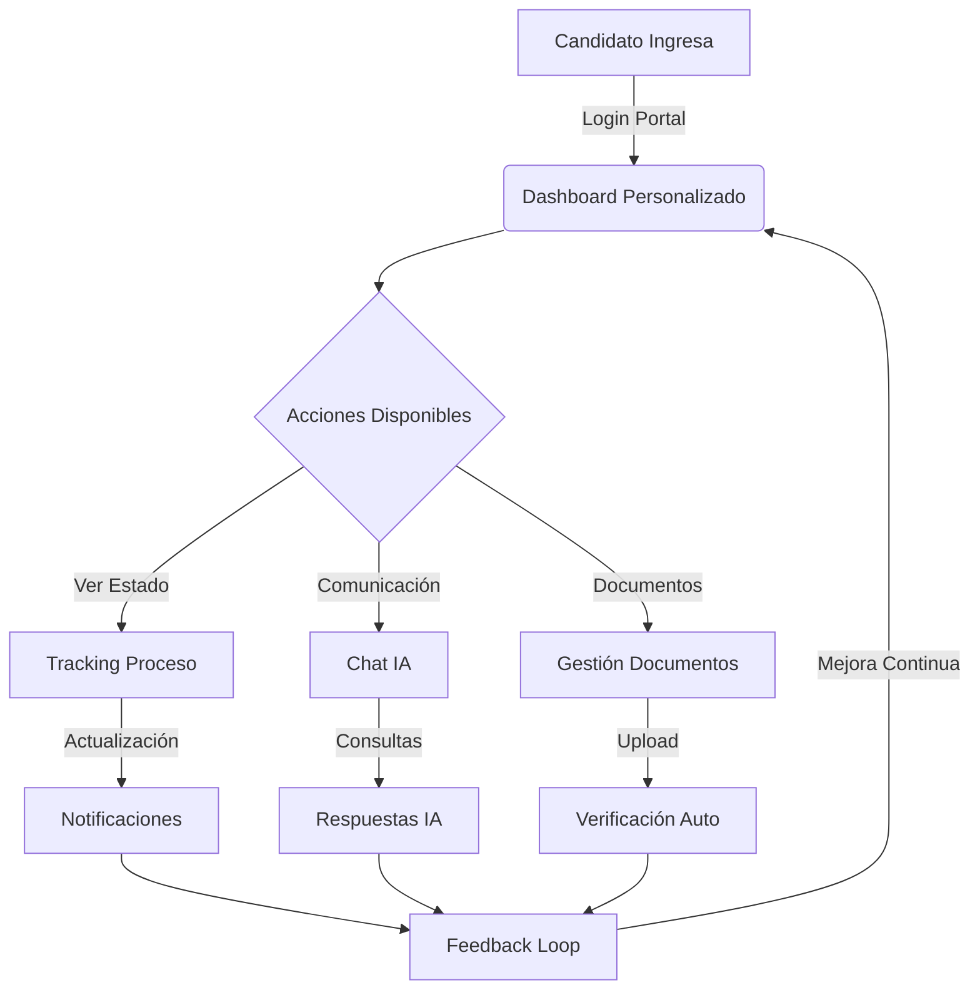

# Casos de Uso Principales - LTI ATS

## 1. Proceso de Reclutamiento Automatizado

### Descripción
El reclutador inicia un nuevo proceso de contratación para una posición de desarrollador senior. El sistema automatiza la publicación, filtrado y evaluación inicial de candidatos usando IA contextual.

### Actores
- Reclutador
- Sistema LTI ATS
- Candidatos
- Hiring Manager

### Flujo Principal

### Beneficios Clave
1. Reducción del 70% en tiempo de screening inicial
2. Mejora del 50% en calidad de candidatos preseleccionados
3. Optimización automática de descripciones de trabajo
4. Distribución inteligente en canales relevantes

## 2. Evaluación de Candidatos con IA

### Descripción
Sistema de evaluación integral que combina pruebas técnicas, análisis de soft skills y verificación automatizada de referencias usando IA contextual.

### Actores
- Candidato
- Sistema LTI ATS
- Evaluador Técnico
- Reclutador

### Flujo Principal

### Beneficios Clave
1. Evaluación objetiva y estandarizada
2. Predicción de éxito laboral con 85% de precisión
3. Reducción de sesgos en la evaluación
4. Identificación temprana de high-potentials

## 3. Experiencia del Candidato Personalizada

### Descripción
Portal personalizado para candidatos que ofrece transparencia en el proceso, comunicación proactiva y retroalimentación en tiempo real.

### Actores
- Candidato
- Sistema LTI ATS
- Reclutador
- Chatbot IA

### Flujo Principal

### Beneficios Clave
1. NPS de candidatos superior al 85%
2. Reducción del 60% en tiempo de respuesta
3. Aumento del 40% en tasa de aceptación de ofertas
4. Mejora en employer branding

## Métricas de Éxito Compartidas

### KPIs Operativos
- Time-to-hire
- Cost-per-hire
- Quality of hire
- Candidate satisfaction score

### KPIs de Negocio
- ROI del proceso de reclutamiento
- Tasa de retención de nuevas contrataciones
- Eficiencia del equipo de reclutamiento
- Reducción de costos operativos

## Requerimientos Técnicos

### Infraestructura
- Cloud-native architecture
- Microservicios escalables
- Base de datos distribuida
- Sistema de IA modular

### Seguridad
- Encriptación end-to-end
- Cumplimiento GDPR/CCPA
- Autenticación multinivel
- Auditoría automática

## Próximos Pasos

1. **Fase 1: MVP**
   - Implementación de flujos core
   - Testing con early adopters
   - Iteración basada en feedback

2. **Fase 2: Escalamiento**
   - Integración de IA avanzada
   - Expansión de funcionalidades
   - Optimización de procesos

3. **Fase 3: Mercado**
   - Lanzamiento comercial
   - Expansión de mercado
   - Desarrollo de partnerships

---
*Documento generado para LTI - Versión 1.0*
