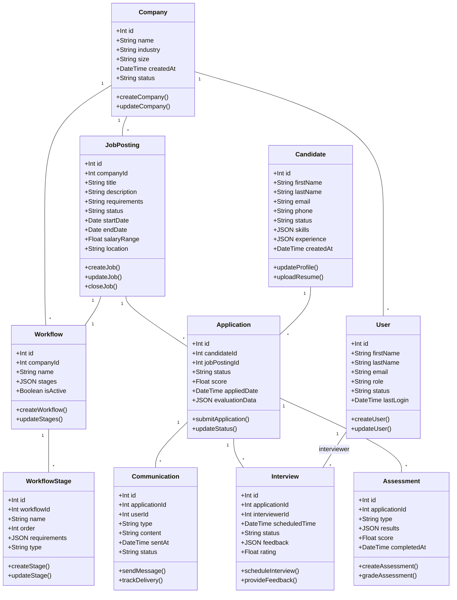

# Modelo de Datos LTI ATS

## Diagrama UML
 

## Descripción de Entidades

### 1. Company
Representa la empresa cliente que utiliza el sistema ATS.
- **Atributos Principales:**
  - id: Identificador único
  - name: Nombre de la empresa
  - industry: Sector industrial
  - size: Tamaño de la empresa
  - status: Estado de la cuenta

### 2. JobPosting
Representa una oferta de trabajo publicada.
- **Atributos Principales:**
  - id: Identificador único
  - companyId: Referencia a la empresa
  - title: Título del puesto
  - description: Descripción del trabajo
  - requirements: Requisitos del puesto
  - salaryRange: Rango salarial
  - location: Ubicación del trabajo

### 3. Candidate
Representa a un candidato en el sistema.
- **Atributos Principales:**
  - id: Identificador único
  - firstName: Nombre
  - lastName: Apellido
  - email: Correo electrónico
  - skills: JSON con habilidades
  - experience: JSON con experiencia laboral

### 4. Application
Representa una aplicación a un puesto específico.
- **Atributos Principales:**
  - id: Identificador único
  - candidateId: Referencia al candidato
  - jobPostingId: Referencia al puesto
  - status: Estado de la aplicación
  - score: Puntuación calculada
  - evaluationData: JSON con datos de evaluación

### 5. Assessment
Representa una evaluación realizada durante el proceso.
- **Atributos Principales:**
  - id: Identificador único
  - applicationId: Referencia a la aplicación
  - type: Tipo de evaluación
  - results: JSON con resultados
  - score: Puntuación obtenida

### 6. Interview
Representa una entrevista programada.
- **Atributos Principales:**
  - id: Identificador único
  - applicationId: Referencia a la aplicación
  - interviewerId: Referencia al entrevistador
  - scheduledTime: Fecha y hora programada
  - feedback: JSON con retroalimentación
  - rating: Calificación de la entrevista

### 7. User
Representa un usuario del sistema (reclutador, entrevistador, admin).
- **Atributos Principales:**
  - id: Identificador único
  - firstName: Nombre
  - lastName: Apellido
  - email: Correo electrónico
  - role: Rol en el sistema
  - status: Estado del usuario

### 8. Communication
Representa las comunicaciones durante el proceso.
- **Atributos Principales:**
  - id: Identificador único
  - applicationId: Referencia a la aplicación
  - userId: Referencia al usuario
  - type: Tipo de comunicación
  - content: Contenido del mensaje
  - status: Estado del mensaje

### 9. Workflow
Representa el flujo de trabajo del proceso de contratación.
- **Atributos Principales:**
  - id: Identificador único
  - companyId: Referencia a la empresa
  - name: Nombre del workflow
  - stages: JSON con etapas
  - isActive: Estado de activación

### 10. WorkflowStage
Representa una etapa específica en el workflow.
- **Atributos Principales:**
  - id: Identificador único
  - workflowId: Referencia al workflow
  - name: Nombre de la etapa
  - order: Orden en el workflow
  - requirements: JSON con requisitos
  - type: Tipo de etapa

## Relaciones Principales

1. Company -> JobPosting (1:N)
2. JobPosting -> Application (1:N)
3. Candidate -> Application (1:N)
4. Application -> Assessment (1:N)
5. Application -> Interview (1:N)
6. Application -> Communication (1:N)
7. Company -> Workflow (1:N)
8. Workflow -> WorkflowStage (1:N)
9. JobPosting -> Workflow (1:1)

## Consideraciones Técnicas

1. **Índices Recomendados:**
   - Índices compuestos en Application (candidateId, jobPostingId)
   - Índices en campos de búsqueda frecuente (email, status)
   - Índices temporales para queries de fecha

2. **Optimizaciones:**
   - Campos JSON para datos flexibles
   - Particionamiento por empresa
   - Cacheo de datos frecuentes

3. **Seguridad:**
   - Encriptación de datos sensibles
   - Auditoría de cambios
   - Control de acceso por nivel

---
*Documento generado para LTI - Versión 1.0*
