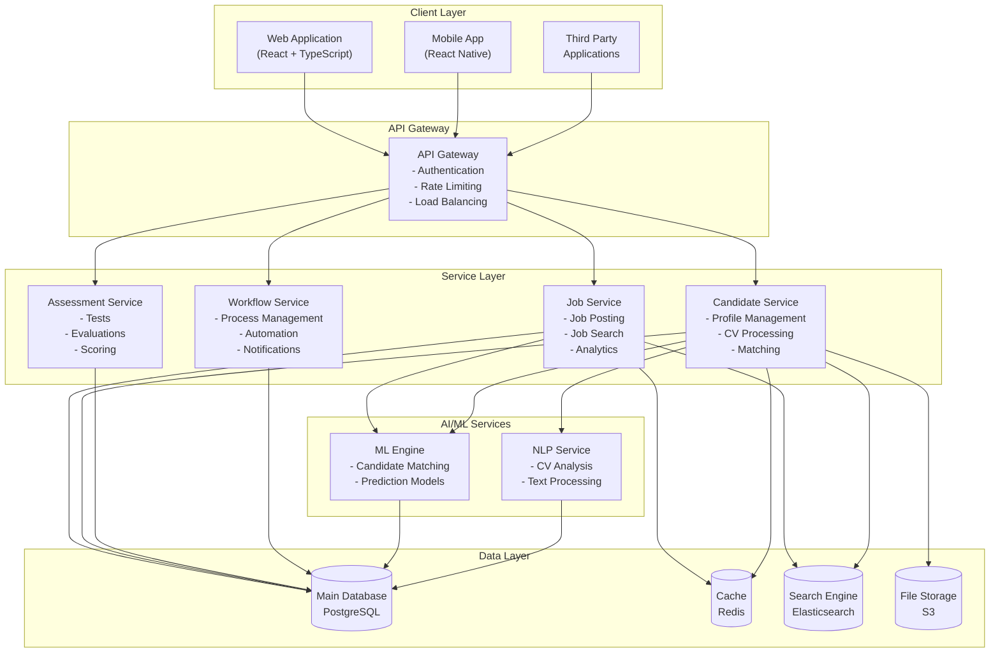

# LTI ATS - Diseño de Alto Nivel
 
## Diagrama de Arquitectura



## Componentes Principales del Sistema

### 1. Capa de Cliente
- **Web Application**
  - Frontend moderno en React con TypeScript
  - Diseño responsive y accesible
  - PWA capabilities

- **Mobile App**
  - Aplicación React Native
  - Funcionalidad offline
  - Notificaciones push

- **Third Party Applications**
  - API integrations
  - Webhooks
  - SDK para partners

### 2. API Gateway
- Gestión centralizada de:
  - Autenticación y autorización
  - Rate limiting y throttling
  - Load balancing
  - Request/response transformation
  - API documentation
  - Monitoring

### 3. Service Layer

#### Job Service
- Gestión de ofertas de trabajo
- Búsqueda avanzada
- Analytics y reporting
- Distribución multicanal

#### Candidate Service
- Gestión de perfiles
- Procesamiento de CV
- Matching de candidatos
- Tracking de aplicaciones

#### Assessment Service
- Gestión de evaluaciones
- Scoring automatizado
- Análisis de resultados
- Feedback personalizado

#### Workflow Service
- Automatización de procesos
- Gestión de estados
- Notificaciones
- Reglas de negocio

### 4. AI/ML Services

#### ML Engine
- Algoritmos de matching
- Modelos predictivos
- Scoring de candidatos
- Recomendaciones

#### NLP Service
- Análisis de CV
- Extracción de información
- Procesamiento de texto
- Análisis semántico

### 5. Data Layer

#### Main Database (PostgreSQL)
- Datos estructurados
- Transacciones ACID
- Relaciones complejas
- Alta consistencia

#### Cache (Redis)
- Caché de sesión
- Datos frecuentes
- Real-time features
- Colas de mensajes

#### Search Engine (Elasticsearch)
- Búsqueda full-text
- Indexación de CV
- Búsqueda facetada
- Analytics en tiempo real

#### File Storage (S3)
- Documentos
- CV
- Archivos multimedia
- Backups

## Flujos Principales

### 1. Postulación de Candidato
```
Cliente -> API Gateway -> Candidate Service -> NLP Service -> ML Engine -> Database
```

### 2. Búsqueda de Talento
```
Cliente -> API Gateway -> Job Service -> Search Engine -> ML Engine -> Database
```

### 3. Proceso de Evaluación
```
Cliente -> API Gateway -> Assessment Service -> Workflow Service -> Database
```

## Consideraciones Técnicas

### Escalabilidad
- Arquitectura de microservicios
- Containerización con Docker
- Orquestación con Kubernetes
- Auto-scaling

### Disponibilidad
- Multi-zone deployment
- Service redundancy
- Failover automático
- Backup strategy

### Seguridad
- JWT authentication
- HTTPS/TLS
- Data encryption
- Access control

### Performance
- Caching strategy
- Load balancing
- Database optimization
- CDN integration

## Tecnologías Clave

### Frontend
- React/React Native
- TypeScript
- Redux
- Material-UI

### Backend
- Node.js
- Python (ML/AI)
- NestJS
- FastAPI

### Bases de Datos
- PostgreSQL
- Redis
- Elasticsearch
- Amazon S3

### DevOps
- Docker
- Kubernetes
- AWS/GCP
- CI/CD pipelines

## Métricas y Monitoreo

### KPIs Técnicos
- Tiempo de respuesta
- Disponibilidad
- Error rates
- CPU/Memory usage

### KPIs de Negocio
- Tasa de conversión
- Time-to-hire
- Quality of hire
- Cost per hire

## Plan de Implementación

### Fase 1: MVP
1. Core services setup
2. Basic workflow
3. Essential features
4. Security implementation

### Fase 2: Escalamiento
1. AI/ML integration
2. Advanced features
3. Performance optimization
4. Integration capabilities

### Fase 3: Optimización
1. Advanced analytics
2. ML model refinement
3. UX improvements
4. Scaling infrastructure

---
*Documento generado para LTI - Versión 1.0*
