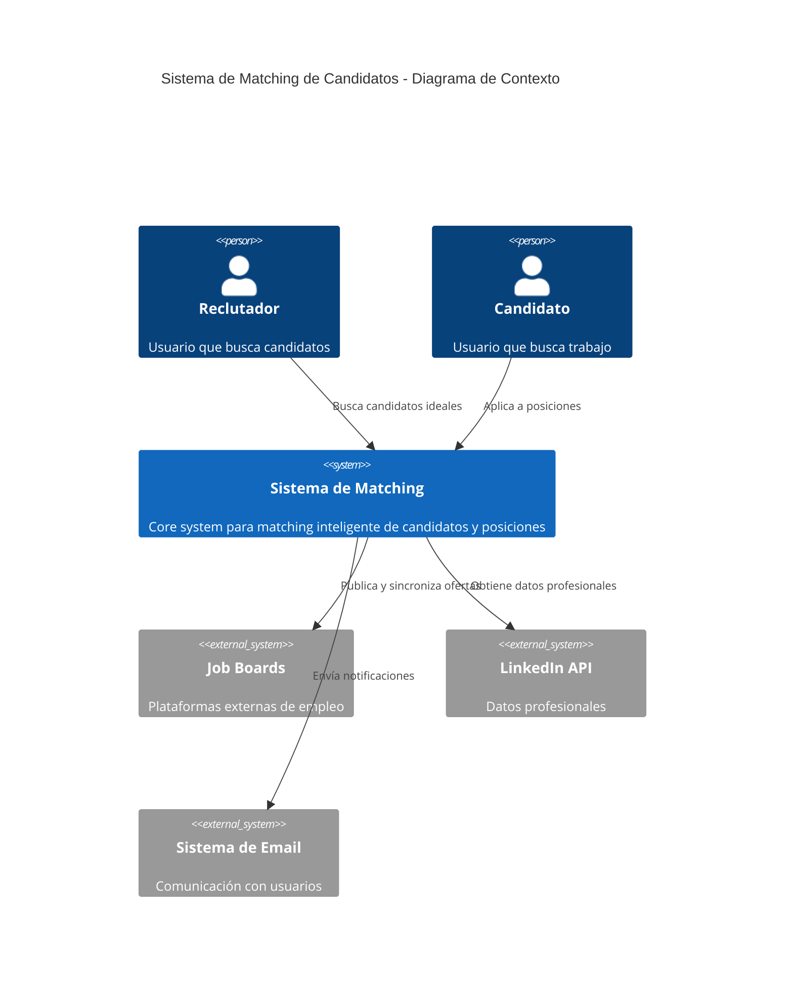
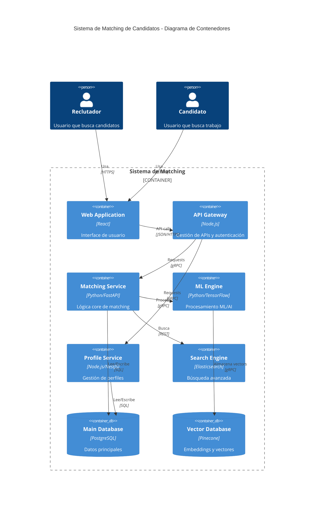
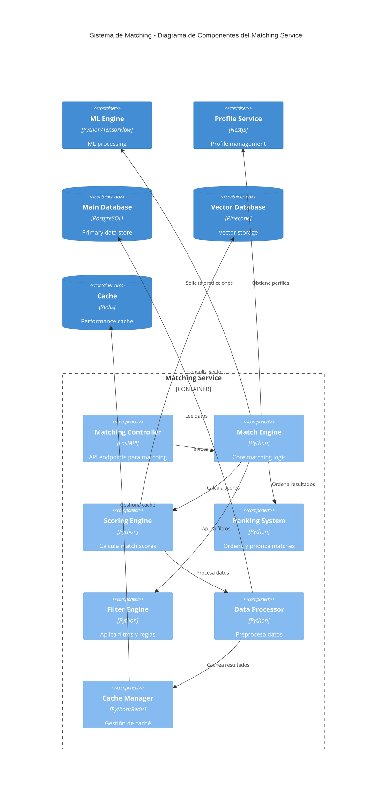
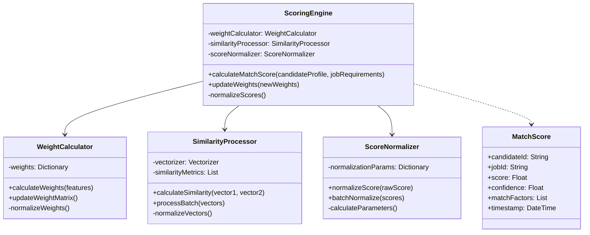

# Diagramas C4 - Sistema de Matching de Candidatos LTI ATS

## 1. Diagrama de Contexto (Nivel 1)

## 2. Diagrama de Contenedores (Nivel 2)

## 3. Diagrama de Componentes - Matching Service (Nivel 3)

## 4. Diagrama de Código - Scoring Engine (Nivel 4)

## Detalles Técnicos del Sistema de Matching

### 1. Componentes Principales

#### Matching Controller
- Gestión de endpoints REST
- Validación de requests
- Rate limiting
- Response formatting

#### Match Engine
- Orquestación del proceso
- Gestión de workflows
- Optimización de queries
- Distribución de carga

#### Scoring Engine
- Cálculo de match scores
- Ponderación de factores
- Normalización de resultados
- Calibración automática

#### Ranking System
- Ordenamiento multifactorial
- Priorización contextual
- Agrupamiento inteligente
- Personalización de rankings

#### Filter Engine
- Aplicación de reglas de negocio
- Filtros dinámicos
- Validación de requisitos
- Exclusiones automáticas

#### Data Processor
- Normalización de datos
- Transformación de formatos
- Validación de integridad
- Enriquecimiento de datos

#### Cache Manager
- Gestión de caché distribuida
- Invalidación inteligente
- Precarga predictiva
- Optimización de memoria

### 2. Flujos Principales

#### A. Matching Process Flow
1. Recepción de request
2. Validación de parámetros
3. Preprocesamiento de datos
4. Cálculo de scores
5. Aplicación de filtros
6. Ranking de resultados
7. Formateo de respuesta

#### B. Scoring Flow
1. Extracción de features
2. Vectorización de datos
3. Cálculo de similitud
4. Ponderación de factores
5. Normalización de scores
6. Agregación de resultados
7. Validación final

### 3. Consideraciones Técnicas

#### Escalabilidad
- Diseño stateless
- Procesamiento distribuido
- Caching multinivel
- Sharding de datos

#### Performance
- Optimización de queries
- Batch processing
- Async operations
- Index optimization

#### Resiliencia
- Circuit breakers
- Retry policies
- Fallback strategies
- Error handling

#### Monitoreo
- Métricas en tiempo real
- Logging distribuido
- Alerting inteligente
- Performance tracking

---
*Documento generado para LTI - Versión 1.0*
