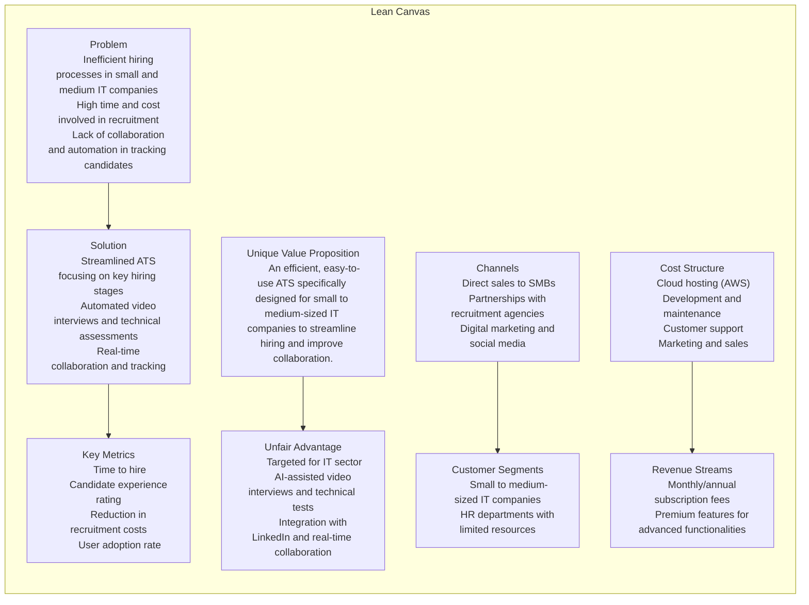
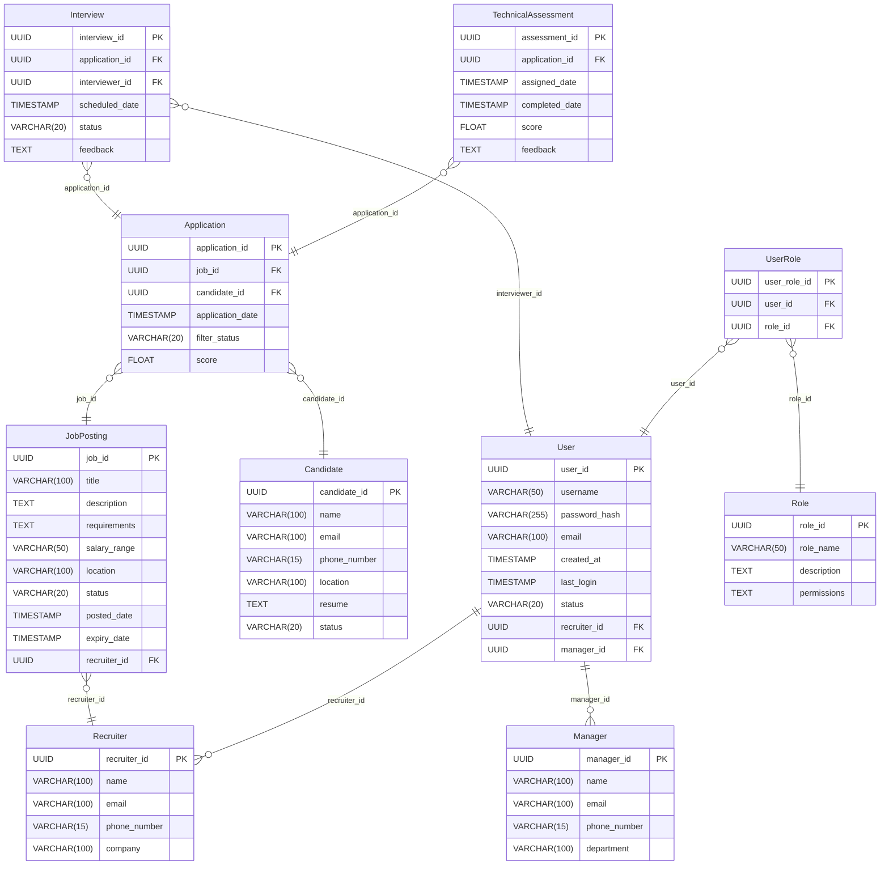
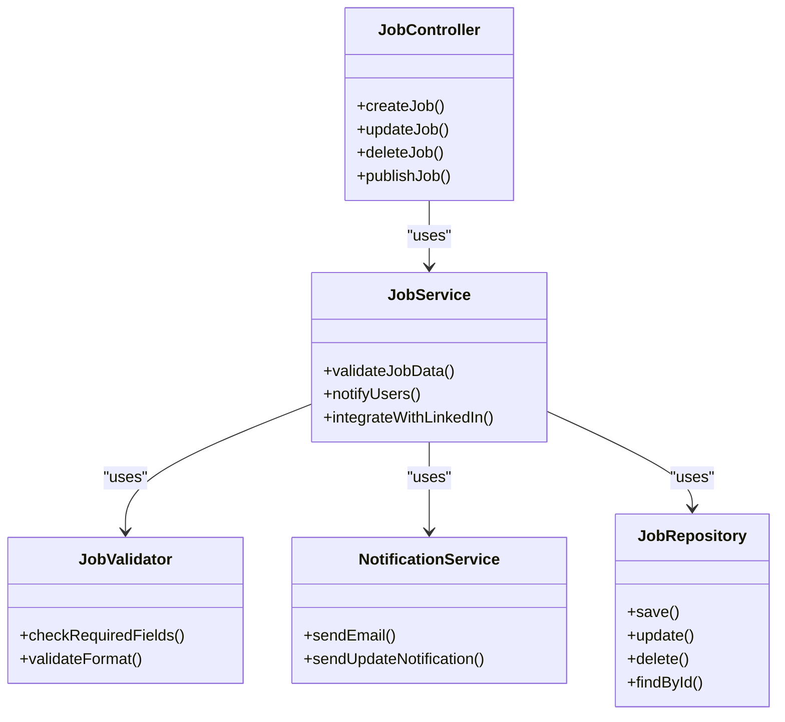

# ARTEFACTO 1:

## Descripción breve del software LTI:

1.  **Publicación de Vacantes en Múltiples Canales**: Permite a los reclutadores crear y publicar ofertas laborales en plataformas como LinkedIn, sitios web de empleo y redes sociales. Facilita el flujo de candidatos y la visibilidad de las vacantes en el mercado.
    
2.  **Recepción y Almacenamiento de Aplicaciones**: Almacena de manera centralizada todas las aplicaciones recibidas para cada vacante, consolidando las solicitudes en un solo lugar y permitiendo el acceso rápido para su revisión y clasificación.
    
3.  **Evaluación y Filtrado de Candidatos**: Automatiza el proceso de evaluación inicial mediante filtros basados en requisitos mínimos, experiencia, habilidades clave, y otros criterios configurables. En el caso de LTI, esto incluiría entrevistas en video automatizadas guiadas por un LLM para un filtro inicial.
    
4.  **Programación de Entrevistas**: Facilita la programación automática de entrevistas con candidatos seleccionados, integrándose con calendarios de reclutadores y managers para optimizar el tiempo y reducir la necesidad de coordinación manual.
    
5.  **Evaluaciones Técnicas Automatizadas**: Permite realizar pruebas técnicas para evaluar conocimientos específicos de los candidatos, enviando y recopilando resultados automáticamente. Esto es especialmente útil para roles técnicos en el sector TI.
    
6.  **Seguimiento de los Candidatos en el Proceso**: Muestra el estado actual de cada candidato (preseleccionado, entrevistado, en pruebas, finalista, etc.) en el flujo de reclutamiento, permitiendo una visión clara del avance de cada vacante.
    
7.  **Colaboración en Tiempo Real entre Reclutadores y Managers**: Facilita el intercambio de notas, comentarios y evaluaciones entre el equipo de reclutamiento y los managers, permitiendo decisiones de contratación más rápidas y fundamentadas.
    
8.  **Automatización de Respuestas y Seguimiento**: Envía respuestas automáticas a los candidatos en cada fase del proceso (recepción de aplicación, seguimiento, rechazo, oferta, etc.), mejorando la experiencia del candidato y ahorrando tiempo al equipo de reclutamiento.
    
9.  **Gestión de Base de Talento**: Almacena y organiza perfiles de candidatos que, aunque no hayan sido seleccionados para una vacante específica, pueden ser considerados para futuras oportunidades, permitiendo acceso fácil a talento previamente evaluado.
    
10.  **Análisis y Reportes de Reclutamiento**: Ofrece reportes y análisis sobre métricas clave (como tiempo de contratación, tasa de aceptación, fuente de los candidatos, etc.), ayudando a medir la efectividad del proceso de reclutamiento y hacer mejoras informadas.
    
11.  **Gestión de Permisos y Roles de Usuario**: Controla el acceso a diferentes funcionalidades según el rol (reclutador, manager, administrador), asegurando la seguridad de la información y que solo el personal autorizado pueda acceder a ciertos datos.
    
12.  **Personalización de Formularios y Flujos de Reclutamiento**: Permite personalizar campos en formularios de aplicación y ajustar los flujos de trabajo de reclutamiento para adaptarse a las necesidades específicas de cada vacante o departamento.
    
13.  **Integración con Sistemas de Recursos Humanos**: Facilita la transferencia de candidatos seleccionados al sistema de recursos humanos para la etapa de onboarding y administración una vez contratados.

## Valor añadido:

   **Ahorro de Tiempo y Eficiencia Operativa**: Un ATS automatiza tareas repetitivas, como la publicación de vacantes, la clasificación inicial de candidatos y la programación de entrevistas, lo que permite a los reclutadores centrarse en actividades estratégicas y reduce el tiempo promedio de contratación.
    
-   **Mejora de la Calidad de Contratación**: Al aplicar filtros automáticos y evaluaciones técnicas, un ATS ayuda a preseleccionar candidatos más adecuados desde el inicio, aumentando la probabilidad de encontrar talentos que se alineen bien con los requisitos del puesto y la cultura de la empresa.
    
-   **Centralización y Organización de Datos**: El ATS consolida toda la información de los candidatos en un solo sistema, lo que facilita el acceso, la búsqueda y el seguimiento de cada perfil sin necesidad de revisar múltiples plataformas o correos electrónicos.
    
-   **Colaboración Fluida entre Equipos**: El sistema permite que reclutadores, managers y otras partes interesadas comenten, evalúen y compartan impresiones sobre los candidatos en tiempo real, mejorando la comunicación y agilidad en la toma de decisiones.
    
-   **Mejora de la Experiencia del Candidato**: Con respuestas automáticas y seguimiento en cada etapa, los candidatos reciben una experiencia de postulación más fluida y profesional, lo que mejora la imagen de la empresa y aumenta las tasas de aceptación de ofertas.
    
-   **Reducción de Costos de Reclutamiento**: Al agilizar el proceso de selección y reducir el tiempo de contratación, el ATS ayuda a disminuir los costos asociados con vacantes prolongadas, errores en la contratación y reclutamiento manual, maximizando la eficiencia del presupuesto de recursos humanos.
    
-   **Análisis y Métricas de Reclutamiento**: Ofrece datos e informes detallados sobre el desempeño del proceso de selección (como fuentes de los mejores candidatos, tiempo de contratación, tasas de aceptación y más), permitiendo a las empresas ajustar su estrategia de reclutamiento con base en datos reales.
    
-   **Construcción de una Base de Talento**: El ATS permite almacenar perfiles de candidatos no seleccionados que podrían ser útiles en futuras vacantes, creando una base de talento sólida para posiciones futuras y reduciendo el tiempo de búsqueda de candidatos.
    
-   **Cumplimiento Normativo y Seguridad**: En muchos casos, un ATS ofrece configuraciones de seguridad y roles de acceso para garantizar que solo el personal autorizado acceda a datos sensibles, lo cual es crucial para cumplir con normativas de privacidad y protección de datos.
    
-   **Escalabilidad y Flexibilidad**: A medida que la empresa crece, el ATS se adapta fácilmente al aumento en la cantidad de vacantes, aplicaciones y necesidades del equipo de reclutamiento, haciendo que el sistema sea una solución a largo plazo.

## Diferenciación en el mercado
-   **Entrevistas en Video Automatizadas con Asistencia de IA**: Implementar entrevistas en video asistidas por un modelo de lenguaje (LLM) que realice preguntas adaptativas en función de las respuestas del candidato, ayudando a realizar un filtro inicial sin intervención humana. Este sistema podría también evaluar emociones y lenguaje corporal para proporcionar insights adicionales.
    
-   **Evaluación Técnica Adaptativa y Personalizada**: Un sistema de pruebas técnicas que se adapte en tiempo real a las respuestas del candidato. Esto permitiría realizar evaluaciones de habilidades más precisas y específicas para cada perfil de TI, ajustando el nivel de dificultad en función del desempeño en las preguntas anteriores.
    
-   **Motor de Recomendación de Candidatos**: Basado en IA, este motor podría sugerir candidatos que ya estén en la base de datos para vacantes abiertas similares o relacionadas, reduciendo el tiempo de búsqueda y ayudando a aprovechar el talento existente. Además, podría alertar sobre candidatos pasivos que podrían ser adecuados para futuras oportunidades.
    
-   **Análisis de Sentimiento en Respuestas de Entrevistas y CVs**: Integrar análisis de sentimiento que evalúe automáticamente las respuestas de los candidatos en entrevistas y sus perfiles de CV, proporcionando insights sobre la actitud y el nivel de compromiso del candidato, lo cual es útil para evaluar el ajuste cultural.
    
-   **Asistente Virtual para el Candidato**: Una herramienta de chat basada en IA que ayude a los candidatos en tiempo real durante el proceso de aplicación. Podría responder preguntas sobre el puesto, la empresa, el proceso de selección o el estatus de la aplicación, mejorando la experiencia del candidato y reduciendo la carga de preguntas para el equipo de reclutamiento.
    
-   **Revisión Automática de CVs y Verificación de Credenciales**: Un sistema que analice los CVs de manera automática en busca de palabras clave y valide credenciales (como certificaciones técnicas) a través de integraciones con plataformas de terceros, asegurando la veracidad de los datos proporcionados y agilizando el proceso de selección.
    
-   **Simulación de Proyectos Colaborativos para Evaluar Habilidades**: Crear una herramienta de simulación donde los candidatos puedan resolver un reto técnico colaborativo en equipo, evaluando tanto sus habilidades técnicas como su capacidad para trabajar en equipo y comunicarse, lo cual es especialmente útil en el sector TI.
    
-   **Tablero de Control de Diversidad e Inclusión**: Proveer un panel que permita analizar datos sobre diversidad de candidatos, ayudando a las empresas a tener un enfoque inclusivo en sus procesos de selección. Este tablero podría incluir métricas sobre la diversidad en cuanto a género, etnia, y otros aspectos importantes para la empresa.
    
-   **Integración de Gamificación en el Proceso de Selección**: Incorporar elementos de gamificación, como pruebas interactivas y retos en línea, que hagan el proceso de selección más atractivo para los candidatos, especialmente para posiciones en tecnología donde el compromiso y la innovación son clave.
    
-   **Predictor de Éxito Basado en Machine Learning**: Un sistema que analice los datos históricos de contrataciones exitosas y de larga duración en la empresa para construir un modelo predictivo. Este modelo podría evaluar a los nuevos candidatos y dar una puntuación de probabilidad de éxito a largo plazo en la empresa, ayudando a tomar decisiones de contratación más informadas.
    
-   **Herramienta de Proyección Salarial para Ofertas Competitivas**: Un módulo que sugiera rangos salariales competitivos según el perfil, experiencia y localización geográfica del candidato, basado en análisis de mercado y en tiempo real. Esto puede ayudar a la empresa a ofrecer sueldos atractivos sin exceder el presupuesto.
    
-   **Gestión de Feedback en Tiempo Real para Candidatos Rechazados**: Permitir que los candidatos reciban un feedback constructivo sobre su proceso de selección en tiempo real. Este feedback automatizado podría basarse en las evaluaciones o pruebas técnicas, mejorando la imagen de la empresa y dando una experiencia positiva incluso para candidatos no seleccionados.
    
-   **Análisis de Productividad del Proceso de Reclutamiento**: Un módulo avanzado de análisis que mida y sugiera mejoras en el proceso de reclutamiento, como cuellos de botella en etapas específicas, comparación de tiempos entre reclutadores, y eficiencia de diferentes canales de captación de talento.
    
-   **Integración con Redes Sociales para la Evaluación de la Presencia Digital**: Permitir a los reclutadores evaluar el perfil público de los candidatos en redes sociales (de manera ética y en conformidad con políticas de privacidad) para obtener insights adicionales sobre el profesionalismo y la compatibilidad cultural del candidato.
    
-   **Accesibilidad Mejorada**: Un enfoque de diseño inclusivo que garantice que personas con discapacidad puedan interactuar sin problemas con el sistema, lo cual no solo es un diferenciador positivo, sino también una necesidad creciente en muchas industrias.
 
## Fases del proyecto
### Funcionalidades Imprescindibles (MVP)

1.  **Publicación de Vacantes en Múltiples Canales**: Crear y publicar ofertas laborales en LinkedIn, sitios web de empleo y redes sociales.
    
2.  **Recepción y Almacenamiento de Aplicaciones**: Centralizar todas las aplicaciones recibidas para cada vacante, facilitando la gestión de candidatos.
    
3.  **Evaluación y Filtrado de Candidatos**: Automatizar el filtro inicial de candidatos basado en requisitos mínimos y experiencia relevante. Incluir entrevistas en video automatizadas guiadas por un LLM para un filtro inicial.
    
4.  **Programación de Entrevistas**: Automatizar la programación de entrevistas, integrándose con los calendarios de reclutadores y managers.
    
5.  **Evaluaciones Técnicas Automatizadas**: Realizar pruebas técnicas automatizadas adaptadas al perfil técnico del sector TI.
    
6.  **Seguimiento del Estado de los Candidatos**: Visualizar el estado de cada candidato en el flujo de reclutamiento (preseleccionado, entrevistado, en pruebas, finalista, etc.).
    
7.  **Colaboración en Tiempo Real entre Reclutadores y Managers**: Facilitar la comunicación y evaluación colaborativa de candidatos en tiempo real.
    
8.  **Automatización de Respuestas para Candidatos**: Enviar respuestas automáticas a los candidatos en cada etapa del proceso (recepción, seguimiento, rechazo, oferta).
    
9.  **Gestión de Base de Talento**: Crear una base de datos de candidatos no seleccionados para futuras oportunidades.
    
10.  **Análisis y Reportes de Reclutamiento Básicos**: Proporcionar reportes sobre métricas clave del proceso de selección (tiempo de contratación, tasa de aceptación, fuente de los candidatos).
    

### Funcionalidades Importantes (Fase 2)

1.  **Motor de Recomendación de Candidatos**: Recomendar candidatos de la base de datos para vacantes abiertas o futuras oportunidades.
    
2.  **Análisis de Sentimiento en Respuestas de Entrevistas y CVs**: Evaluar el sentimiento de las respuestas en entrevistas y en los CVs para insights adicionales.
    
3.  **Asistente Virtual para el Candidato**: Ofrecer una herramienta de chat basada en IA para responder preguntas comunes sobre el proceso y el estado de la aplicación.
    
4.  **Revisión Automática de CVs y Verificación de Credenciales**: Analizar CVs automáticamente y validar credenciales como certificaciones técnicas.
    
5.  **Simulación de Proyectos Colaborativos**: Evaluar habilidades técnicas y de trabajo en equipo mediante una simulación colaborativa.
    
6.  **Panel de Diversidad e Inclusión**: Proveer un tablero para analizar y gestionar métricas de diversidad de candidatos.
    
7.  **Gestión de Roles y Permisos de Usuario**: Controlar el acceso y permisos en el sistema según el rol del usuario (reclutador, manager, administrador).
    

### Funcionalidades Deseables (Futuro)

1.  **Integración de Gamificación en el Proceso de Selección**: Implementar elementos de gamificación en las pruebas y entrevistas para hacer el proceso más atractivo.
    
2.  **Predictor de Éxito Basado en Machine Learning**: Utilizar datos históricos para predecir el éxito y la retención de candidatos a largo plazo.
    
3.  **Herramienta de Proyección Salarial para Ofertas Competitivas**: Sugerir rangos salariales en función del perfil y localización del candidato.
    
4.  **Gestión de Feedback en Tiempo Real para Candidatos Rechazados**: Proporcionar feedback constructivo automático a los candidatos no seleccionados.
    
5.  **Análisis de Productividad del Proceso de Reclutamiento**: Analizar el desempeño del equipo de reclutamiento y optimizar el proceso.
    
6.  **Integración con Redes Sociales para Evaluar la Presencia Digital del Candidato**: Analizar la presencia digital del candidato en redes sociales para insights adicionales.
    
7.  **Accesibilidad Mejorada**: Optimizar la plataforma para que sea accesible para personas con discapacidad, ofreciendo una experiencia inclusiva.

## Diagrama Lean Canvas

# ARTEFACTO 2

## Casos de uso

### Caso de Uso 1: Publicación de Vacantes

**Descripción**: Este caso de uso permite a los reclutadores crear y publicar ofertas laborales en diferentes canales de empleo, incluyendo LinkedIn, sitios web de empleo y redes sociales. La funcionalidad asegura que las vacantes tengan visibilidad y atraigan candidatos potenciales desde diversas fuentes.

-   **Actor Principal**: Reclutador
-   **Precondiciones**: El reclutador debe tener acceso autorizado al sistema.
-   **Flujo Principal**:
    1.  El reclutador inicia sesión en el ATS y selecciona la opción de "Publicar Vacante".
    2.  El sistema presenta un formulario donde el reclutador ingresa los detalles del puesto (título, descripción, requisitos, salario, etc.).
    3.  El reclutador selecciona los canales de publicación (por ejemplo, LinkedIn, bolsas de trabajo externas).
    4.  El sistema valida la información ingresada y permite previsualizar la publicación.
    5.  El reclutador confirma la publicación, y el sistema envía la oferta a los canales seleccionados.
    6.  El sistema muestra una confirmación de que la vacante fue publicada exitosamente.
-   **Postcondiciones**: La vacante se publica en los canales seleccionados, y el sistema guarda la información para futuras revisiones y aplicaciones recibidas.
-   **Excepciones**:
    -   El sistema muestra mensajes de error si algún campo obligatorio está incompleto o si la conexión con algún canal externo falla.

### Caso de Uso 2: Recepción y Filtrado Inicial de Aplicaciones

**Descripción**: Este caso de uso permite recibir aplicaciones y realizar un filtrado inicial basado en requisitos clave (como experiencia, habilidades y palabras clave en el CV). También incluye la funcionalidad de entrevistas en video automatizadas con un LLM para hacer un filtro inicial, evaluando a los candidatos antes de una revisión humana.

-   **Actor Principal**: Candidato y Reclutador
-   **Precondiciones**: La vacante debe estar publicada y el candidato debe tener acceso al formulario de aplicación.
-   **Flujo Principal**:
    1.  El candidato accede a la vacante y completa el formulario de aplicación.
    2.  El sistema recibe la aplicación y realiza un filtrado automático con base en los requisitos establecidos para el puesto.
    3.  Si el candidato cumple con los criterios iniciales, el sistema le envía una invitación para realizar una entrevista en video guiada por el LLM.
    4.  El LLM realiza preguntas al candidato y graba sus respuestas, evaluando puntos clave y generando un informe inicial.
    5.  El reclutador recibe una notificación de la nueva aplicación con el informe y las respuestas en video del candidato.
-   **Postcondiciones**: La aplicación del candidato se registra en el sistema y, si cumple con los requisitos, se le invita a la siguiente fase. El sistema almacena el informe de la entrevista en video para el reclutador.
-   **Excepciones**:
    -   Si el candidato no cumple con los requisitos iniciales, el sistema envía automáticamente un mensaje de rechazo.
    -   En caso de fallos en la entrevista en video, el sistema permite al candidato reprogramar la entrevista.

### Caso de Uso 3: Programación de Entrevistas y Evaluaciones Técnicas

**Descripción**: Este caso de uso permite al reclutador programar entrevistas y enviar evaluaciones técnicas a los candidatos preseleccionados. La programación de entrevistas se sincroniza con el calendario de los reclutadores y managers, mientras que las evaluaciones técnicas se personalizan para el perfil de cada vacante en el sector TI.

-   **Actor Principal**: Reclutador, Candidato y Manager
-   **Precondiciones**: El candidato debe haber pasado el filtrado inicial.
-   **Flujo Principal**:
    1.  El reclutador selecciona al candidato y accede a la opción de "Programar Entrevista" o "Enviar Evaluación Técnica".
    2.  Para la entrevista, el reclutador selecciona una fecha y hora, y el sistema se sincroniza con el calendario del reclutador y/o manager para confirmar la disponibilidad.
    3.  El candidato recibe una invitación de entrevista con los detalles necesarios.
    4.  Si se elige "Enviar Evaluación Técnica", el sistema envía una prueba adaptada al perfil de la vacante.
    5.  El candidato completa la evaluación técnica, y el sistema envía los resultados al reclutador.
-   **Postcondiciones**: La entrevista queda programada en el calendario y el candidato recibe una notificación con la cita. En caso de la evaluación técnica, los resultados se registran en el sistema y quedan disponibles para el reclutador.
-   **Excepciones**:
    -   Si el candidato rechaza la fecha propuesta para la entrevista, el sistema permite al reclutador reprogramar la cita.
    -   Si el candidato no completa la evaluación en el tiempo indicado, el sistema envía un recordatorio automático y notifica al reclutador.
      

# ARTEFACTO 3
## Modelo de datos

# ARTEFACTO 4
## Diseño a alto nivel

### 1. **Frontend (Interfaz de Usuario)**

-   **Descripción**: Este componente es la interfaz que utilizan los usuarios (reclutadores, managers, candidatos) para interactuar con el sistema. Ofrece una experiencia de usuario optimizada, con componentes accesibles desde dispositivos web.
-   **Tecnologías**: React.js o Angular, con diseño responsivo para adaptarse a distintos dispositivos.
-   **Funcionalidades**:
    -   Formulario de creación de vacantes y publicación.
    -   Vista para gestionar y revisar aplicaciones.
    -   Programación de entrevistas y evaluación de candidatos.
    -   Dashboard de métricas básicas de reclutamiento.
    -   Autenticación de usuarios (login/logout).

### 2. **API Gateway**

-   **Descripción**: El API Gateway es el punto de entrada para todas las solicitudes externas. Este componente gestiona la comunicación entre el frontend y los microservicios backend, asegurando la autenticación y autorización de usuarios.
-   **Tecnologías**: AWS API Gateway o Kong API Gateway.
-   **Funcionalidades**:
    -   Autenticación y autorización de solicitudes.
    -   Balanceo de carga y control de tráfico.
    -   Limitar y monitorizar el acceso a las APIs.

### 3. **Servicio de Autenticación y Autorización**

-   **Descripción**: Este servicio maneja la autenticación y autorización de los usuarios. Implementa autenticación basada en tokens (JWT) y verifica roles y permisos para cada solicitud.
-   **Tecnologías**: AWS Cognito o un microservicio propio utilizando OAuth2/JWT.
-   **Funcionalidades**:
    -   Registro y autenticación de usuarios.
    -   Emisión y validación de tokens JWT.
    -   Verificación de roles y permisos de usuarios.

### 4. **Servicio de Gestión de Vacantes**

-   **Descripción**: Este microservicio se encarga de la creación, publicación y gestión de vacantes en el sistema. Almacena los detalles de cada vacante y maneja la publicación en plataformas externas, como LinkedIn.
-   **Tecnologías**: Node.js o Python (FastAPI).
-   **Funcionalidades**:
    -   Creación y almacenamiento de vacantes.
    -   Integración con LinkedIn y otros canales de publicación.
    -   Estado y expiración de las vacantes.

### 5. **Servicio de Aplicación y Filtrado de Candidatos**

-   **Descripción**: Responsable de recibir aplicaciones, ejecutar el filtrado inicial y administrar el flujo de los candidatos en el proceso de reclutamiento.
-   **Tecnologías**: Python o Java (Spring Boot).
-   **Funcionalidades**:
    -   Recepción de aplicaciones.
    -   Filtrado automático según requisitos de la vacante.
    -   Invitación a entrevistas automáticas en video y generación de informes iniciales.
    -   Notificaciones automáticas a candidatos rechazados o seleccionados para la siguiente etapa.

### 6. **Servicio de Programación de Entrevistas y Evaluaciones Técnicas**

-   **Descripción**: Gestiona la programación de entrevistas y el envío de evaluaciones técnicas a los candidatos. Se sincroniza con calendarios y envía recordatorios.
-   **Tecnologías**: Java (Spring Boot) o Python (Django).
-   **Funcionalidades**:
    -   Programación y sincronización de entrevistas.
    -   Envío de evaluaciones técnicas y recolección de resultados.
    -   Notificaciones a candidatos y entrevistadores.

### 7. **Servicio de Evaluación y Generación de Informes**

-   **Descripción**: Este componente realiza la evaluación automática de entrevistas en video asistidas por LLM y genera informes iniciales para los reclutadores.
-   **Tecnologías**: Integración con AWS Comprehend para análisis de texto y AWS Rekognition para análisis de video, con apoyo de modelos LLM para generar reportes.
-   **Funcionalidades**:
    -   Análisis de entrevistas en video con LLM.
    -   Evaluación de competencias técnicas y habilidades.
    -   Generación de informes con resultados de evaluaciones.

### 8. **Servicio de Notificaciones**

-   **Descripción**: Este servicio se encarga de enviar notificaciones por correo electrónico y otros canales a los candidatos y reclutadores en distintas etapas del proceso.
-   **Tecnologías**: AWS SES (Simple Email Service) o un servicio de notificación interno.
-   **Funcionalidades**:
    -   Confirmación de aplicación recibida.
    -   Recordatorios de entrevistas y evaluaciones.
    -   Notificaciones de avance en el proceso de reclutamiento.

### 9. **Base de Datos**

-   **Descripción**: Almacena todos los datos relevantes del sistema, incluyendo usuarios, vacantes, aplicaciones, entrevistas y evaluaciones.
-   **Tecnologías**: Amazon RDS (PostgreSQL o MySQL).
-   **Funcionalidades**:
    -   Almacenamiento de datos estructurados con relaciones definidas.
    -   Replicación y respaldo de datos para alta disponibilidad y recuperación ante fallos.
    -   Optimización de consultas para soportar las operaciones de filtrado y búsqueda.

### 10. **Servicio de Análisis y Reportes**

-   **Descripción**: Proporciona reportes y métricas sobre el proceso de reclutamiento (e.g., tiempo promedio de contratación, tasas de aceptación).
-   **Tecnologías**: AWS QuickSight o Elasticsearch para análisis y visualización.
-   **Funcionalidades**:
    -   Generación de reportes de métricas clave de reclutamiento.
    -   Visualización de datos en un dashboard.
    -   Análisis de la efectividad de los canales de reclutamiento.

### Diagrama de Interacción General

Aquí se detalla la interacción de los componentes principales:

1.  **Frontend** envía las solicitudes al **API Gateway**, el cual verifica los tokens y dirige las solicitudes a los microservicios correspondientes.
2.  **Servicio de Autenticación y Autorización** valida las credenciales y emite tokens de autenticación para los usuarios.
3.  **Servicios de Gestión de Vacantes** y **Aplicación de Candidatos** manejan la publicación de vacantes y el registro de aplicaciones, con notificaciones automáticas.
4.  **Servicio de Entrevistas y Evaluaciones** coordina la programación y realiza el envío de evaluaciones técnicas.
5.  **Servicio de Evaluación y Generación de Informes** analiza entrevistas en video y genera informes para el reclutador.
6.  **Base de Datos** almacena toda la información estructurada del sistema, accediendo y gestionando datos según la estructura definida.
7.  **Servicio de Análisis y Reportes** obtiene métricas y análisis del proceso, presentando insights en un dashboard visual.

# ARTEFACTO 5
## Diagrama C4 - [Servicios de gestión de vacantes]

### Nivel 1: Diagrama de Contexto

El **Diagrama de Contexto** muestra el sistema ATS en relación con sus usuarios y sistemas externos. Este diagrama proporciona una vista de alto nivel, sin detalles internos.

**Componentes principales en el Diagrama de Contexto**:

1.  **Usuarios del sistema**:
    
    -   **Reclutador**: Publica vacantes, gestiona aplicaciones y revisa informes de candidatos.
    -   **Manager**: Revisa candidatos preseleccionados y colabora en entrevistas y decisiones finales.
    -   **Candidato**: Aplica a las vacantes, completa entrevistas y evaluaciones.
    -   **Administrador**: Administra roles y permisos de usuarios en el sistema.
2.  **Sistemas externos**:
    
    -   **LinkedIn**: Plataforma externa para la publicación de vacantes.
    -   **Servicios de Autenticación y Autorización (AWS Cognito)**: Sistema para autenticar usuarios y gestionar roles y permisos.
    -   **Plataforma de Correo (AWS SES)**: Envío de notificaciones y recordatorios.
3.  **Sistema ATS (Sistema Central)**:
    
    -   Los usuarios interactúan con el sistema ATS para realizar tareas específicas.
    -   El sistema ATS se conecta con sistemas externos, como LinkedIn para publicar vacantes y AWS SES para notificaciones.

----------

### Nivel 2: Diagrama de Contenedores

El **Diagrama de Contenedores** desglosa el sistema ATS en sus principales contenedores, que representan aplicaciones y servicios dentro del sistema.

**Contenedores principales en el Diagrama de Contenedores**:

1.  **Frontend (Angular)**:
    
    -   Proporciona la interfaz de usuario para todas las acciones en el sistema, accesible desde dispositivos web.
    -   Se comunica con el **API Gateway** para enviar y recibir datos.
2.  **API Gateway (AWS API Gateway)**:
    
    -   Punto de entrada de todas las solicitudes hacia los microservicios del backend.
    -   Realiza la autenticación de cada solicitud con **AWS Cognito**.
3.  **Microservicios Backend**:
    
    -   **Servicio de Gestión de Vacantes** (Python con FastAPI): Principal contenedor de este nivel, maneja la creación, edición y publicación de vacantes.
    -   **Servicio de Aplicación y Filtrado de Candidatos** (Python con FastAPI): Procesa aplicaciones y realiza el filtrado inicial de candidatos.
    -   **Servicio de Programación de Entrevistas y Evaluaciones Técnicas** (Python con FastAPI): Gestiona la programación de entrevistas y el envío de evaluaciones técnicas.
    -   **Servicio de Evaluación y Generación de Informes** (AWS Comprehend, AWS Rekognition y LLM LLAMA): Analiza entrevistas y genera reportes para los reclutadores.
    -   **Servicio de Notificaciones (AWS SES)**: Envía notificaciones automáticas a los usuarios.
    -   **Base de Datos (Amazon Aurora RDS PostgreSQL)**: Almacena toda la información estructurada, como vacantes, aplicaciones, entrevistas y usuarios.
4.  **Servicios Externos**:
    
    -   **LinkedIn API**: Integración para la publicación de vacantes.
    -   **AWS SES** para envíos de correos.

----------

### Nivel 3: Diagrama de Componentes

El **Diagrama de Componentes** desglosa el **Servicio de Gestión de Vacantes** en sus componentes internos, definiendo cómo se organiza y cómo interactúa cada componente.

**Componentes dentro del Servicio de Gestión de Vacantes**:

1.  **Controlador de Vacantes**:
    
    -   Gestiona las solicitudes de los usuarios para crear, actualizar, eliminar y publicar vacantes.
    -   Expuesto a través del API Gateway para recibir solicitudes desde el Frontend.
2.  **Servicio de Publicación**:
    
    -   Encargado de la integración con **LinkedIn API** para publicar vacantes externas.
    -   Se comunica con el Controlador de Vacantes para recibir datos de la vacante.
3.  **Servicio de Validación**:
    
    -   Valida que los datos de la vacante cumplan con los requisitos antes de su creación o publicación (como campos obligatorios y formato).
    -   Envía errores de validación al Controlador de Vacantes para manejar excepciones.
4.  **Servicio de Notificaciones**:
    
    -   Se conecta al Servicio de Notificaciones (AWS SES) para notificar a los usuarios cuando se publica una nueva vacante o si existe algún cambio.
    -   Gestiona la lógica de notificación según los eventos del sistema.
5.  **Repositorio de Vacantes**:
    
    -   Interfaz que interactúa directamente con la Base de Datos (Aurora PostgreSQL) para almacenar y recuperar datos de vacantes.
    -   Gestiona las consultas relacionadas con las vacantes, optimizando las operaciones CRUD.

----------

### Nivel 4: Diagrama de Código (Diagrama de Clases)

En el **Diagrama de Código**, se detalla la implementación del **Repositorio de Vacantes** y los componentes internos en el Servicio de Gestión de Vacantes. Este diagrama de clases muestra las clases principales y sus interrelaciones.

**Clases principales en el Repositorio de Vacantes**:

1.  **Clase `JobController`**:
    
    -   Métodos: `createJob()`, `updateJob()`, `deleteJob()`, `publishJob()`.
    -   Se comunica con `JobService` para ejecutar la lógica de negocio y responder a las solicitudes del usuario.
2.  **Clase `JobService`**:
    
    -   Métodos: `validateJobData()`, `notifyUsers()`, `integrateWithLinkedIn()`.
    -   Utiliza `JobRepository` para operaciones CRUD y `NotificationService` para el envío de notificaciones.
3.  **Clase `JobValidator`**:
    
    -   Métodos: `checkRequiredFields()`, `validateFormat()`.
    -   Ejecuta la validación de datos antes de que el `JobService` procese una vacante.
4.  **Clase `NotificationService`**:
    
    -   Métodos: `sendEmail()`, `sendUpdateNotification()`.
    -   Gestiona la comunicación con AWS SES para el envío de notificaciones relacionadas con las vacantes.
5.  **Clase `JobRepository`**:
    
    -   Métodos: `save()`, `update()`, `delete()`, `findById()`.
    -   Gestiona el acceso a la Base de Datos, encapsulando la lógica de persistencia en Aurora PostgreSQL.
  

