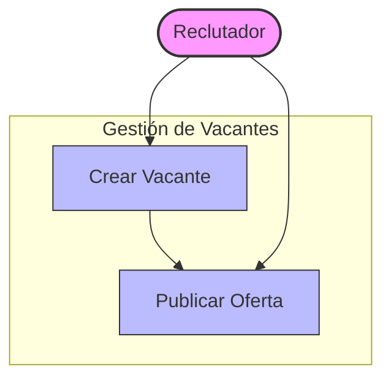
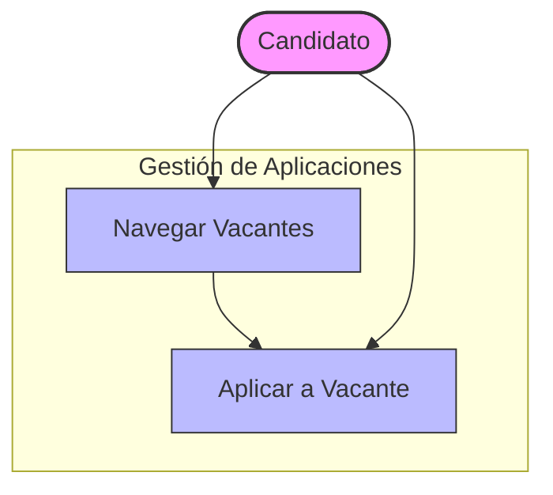
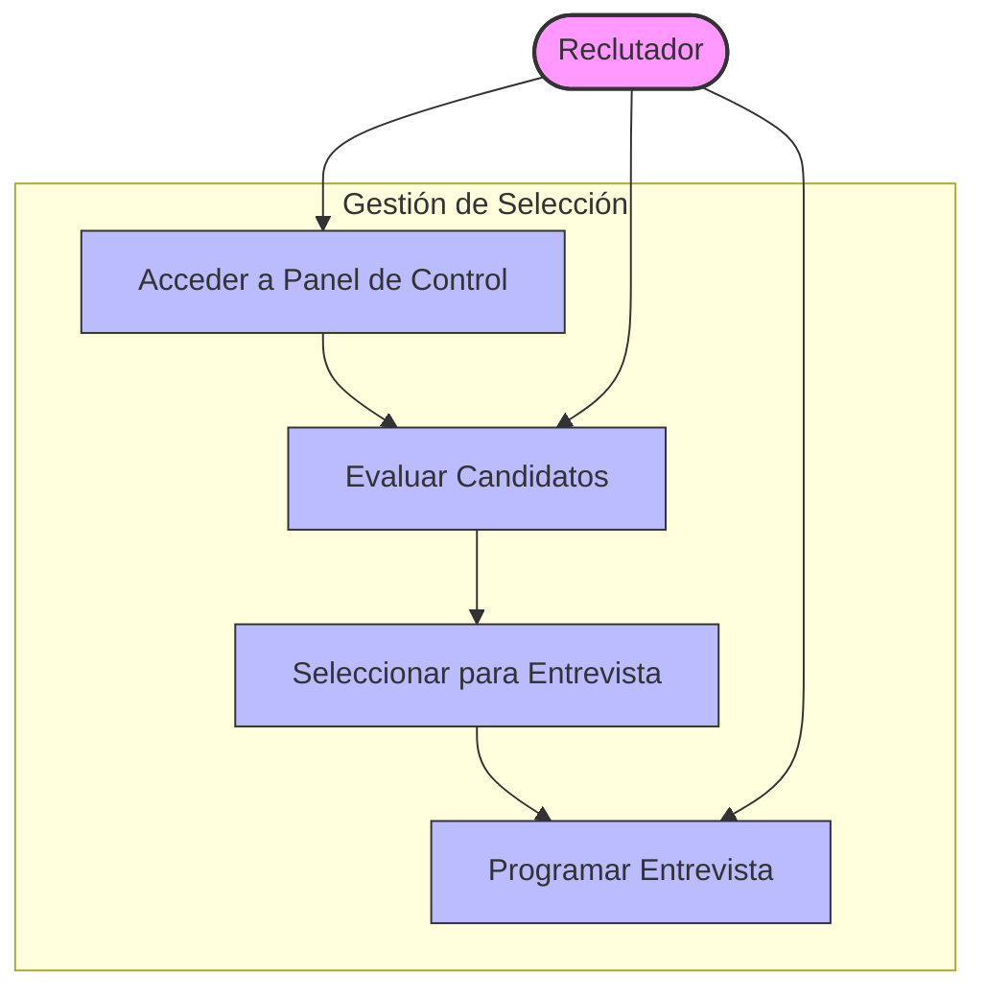
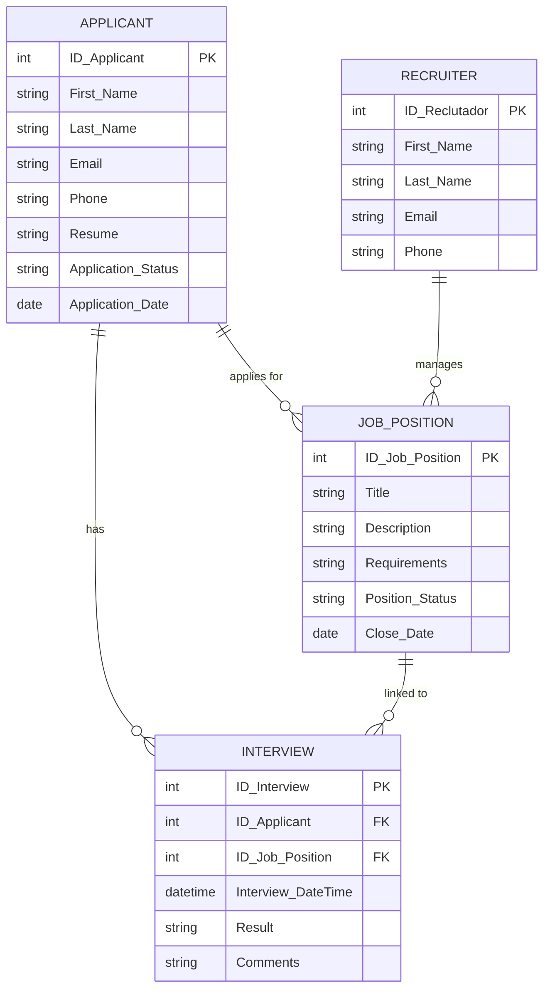
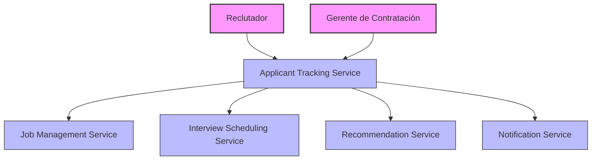
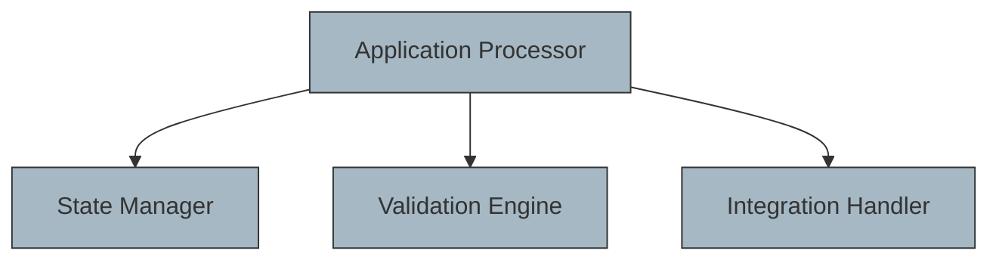

# Documentación del Diseño del Sistema ATS de LTI

---

## 1. Descripción Breve del Software LTI, Valor Añadido y Ventajas Competitivas

**Descripción de LTI**  
LTI es una startup orientada a revolucionar el proceso de reclutamiento mediante un ATS (Applicant Tracking System) de nueva generación. Su plataforma se enfoca en la automatización avanzada y la colaboración optimizada para facilitar la atracción y selección de talento especializado en medianas y grandes empresas, así como en startups de crecimiento rápido.

**Misión de LTI**  
Transformar el ámbito del reclutamiento mediante un sistema ATS accesible y eficiente, eliminando complejidades y brindando herramientas que permitan a los equipos de recursos humanos identificar, atraer y contratar a los mejores candidatos de forma ágil.

**Visión de LTI**  
Convertirse en líder en soluciones de reclutamiento integrando tecnología avanzada, accesibilidad y transparencia, mejorando la experiencia tanto de los candidatos como de los reclutadores y convirtiendo el proceso en un motor de crecimiento.

**Ventaja Competitiva**  
1. **Automatización avanzada**: Clasificación automática de CVs, programación de entrevistas y recomendaciones predictivas.
2. **Experiencia de usuario optimizada**: Interfaz intuitiva y colaboración en tiempo real entre reclutadores y managers.
3. **Cumplimiento normativo y seguridad**: Diseño conforme a GDPR y CCPA para facilitar la adopción en diversos sectores regulados.

**Valor Añadido**  
Al integrar tecnología avanzada y un diseño centrado en el usuario, LTI facilita la contratación de talento de alta calidad, reduce la carga administrativa de recursos humanos y permite que las empresas se concentren en la experiencia humana y la toma de decisiones estratégicas.

---

## 2. Funciones Principales del ATS de LTI

**1. Seguimiento de Candidatos**
   - **Vista de Proceso en Pipeline**: Visualización de cada etapa en el proceso de selección.
   - **Análisis en Tiempo Real**: Reportes sobre el progreso de los candidatos.
   - **Automatización de Actualización de Estado**: Actualización automática y notificaciones.

**2. Gestión de Vacantes**
   - **Integración con Bolsas de Trabajo**: Publicación automática en plataformas externas.
   - **Control de Requisitos y Evaluación Inicial**: Filtrado inicial de candidatos mediante IA.
   - **Análisis de Métricas por Vacante**: Visualización en tiempo real de métricas como número de aplicaciones y tiempo promedio de contratación.

**3. Panel de Control y Reportes**
   - **KPI de Reclutamiento en Tiempo Real**: Métricas clave del proceso de selección.
   - **Reportes Personalizables**: Configuración para analizar tendencias.
   - **Comparación Histórica de Procesos**: Identificación de patrones y áreas de mejora.

**4. Clasificación de CVs y Recomendación de Candidatos (IA)**
   - **Clasificación Automática de CVs**: Filtrado de candidatos usando IA.
   - **Recomendación de Candidatos**: IA que sugiere candidatos destacados.
   - **Historial y Comentarios**: Registro de notas sobre cada candidato.

**5. Programación Automatizada de Entrevistas**
   - **Sincronización con Calendarios**: Integración con Google Calendar y Outlook.
   - **Automatización de Invitaciones y Recordatorios**: Reducción de cancelaciones y mejora de la puntualidad.
   - **Gestión Centralizada de Entrevistas**: Opciones de reprogramación.

**6. Colaboración en Tiempo Real**
   - **Chat en Tiempo Real**: Comunicación inmediata entre reclutadores y managers.
   - **Comentarios y Notas en Perfiles de Candidatos**: Evaluaciones centralizadas.
   - **Menciones y Notificaciones**: Actualizaciones instantáneas para el equipo.

---

## 3. Diagrama Lean Canvas

A continuación se muestra el diagrama Lean Canvas del ATS de LTI, seguido de una explicación detallada de cada sección.

```mermaid
flowchart LR
    subgraph "1. PROBLEMA"
        direction TB
        P1["• Procesos de selección ineficientes
        • Errores en clasificación de CVs
        • Falta de visibilidad en el progreso
        • Dificultad en alto volumen
        • Pérdida de talento por procesos lentos"]
    end

    subgraph "2. SEGMENTO DE CLIENTES"
        direction TB
        CS1["• Empresas de tecnología
        • Startups en crecimiento rápido
        • Departamentos de RRHH especializados
        • Empresas con alta rotación de personal"]
    end

    subgraph "3. PROPUESTA DE VALOR ÚNICA"
        direction TB
        V1["• ATS innovador enfocado en eficiencia
        • IA que optimiza selección
        • Transparencia en el estado
        • Reducción del 50% en tiempo de contratación
        • Mejora de la experiencia del candidato"]
    end

    subgraph "4. SOLUCIÓN"
        direction TB
        S1["• Screening de CVs con IA
        • Puntuación predictiva de candidatos
        • Programación de entrevistas automatizada
        • Dashboard en tiempo real"]
    end

    subgraph "5. CANALES"
        direction TB
        CH1["• Venta directa B2B
        • Alianzas estratégicas
        • Marketing digital"]
    end

    subgraph "6. FUENTES DE INGRESOS"
        direction TB
        R1["• Suscripciones
        • Tarifas por volumen
        • Servicios de consultoría y soporte"]
    end

    subgraph "7. ESTRUCTURA DE COSTOS"
        direction TB
        C1["• Desarrollo y mantenimiento
        • Infraestructura en la nube
        • Soporte técnico 24/7"]
    end

    subgraph "8. MÉTRICAS CLAVE"
        direction TB
        M1["• Reducción de tiempo de contratación
        • Tasa de retención
        • NPS de candidatos y reclutadores"]
    end

    subgraph "9. VENTAJA COMPETITIVA"
        direction TB
        A1["• IA especializada
        • Integración profunda en ecosistemas tech
        • Partnerships estratégicos"]
    end
```



---

## 4. Casos de Uso

Cada caso de uso incluye un diagrama en Mermaid, junto con una descripción completa del flujo y los actores involucrados.

### Caso de Uso 1: Creación de Vacante

**Descripción del Flujo**
- **Actor Principal**: Reclutador.
- **Flujo Principal**: El reclutador inicia sesión, crea una vacante, completa los detalles y publica la oferta.
- **Relación**: Reclutador -> Crear Vacante -> Publicar Oferta.



### Caso de Uso 2: Aplicación de Candidato

**Descripción del Flujo**
- **Actor Principal**: Candidato.
- **Flujo Principal**: El candidato navega las vacantes, selecciona una, completa su perfil y aplica.
- **Relación**: Candidato -> Navegar Vacantes -> Aplicar.



### Caso de Uso 3: Proceso de Selección

**Descripción del Flujo**
- **Actor Principal**: Reclutador.
- **Flujo Principal**: El reclutador evalúa candidatos, selecciona para entrevistas y programa entrevistas.
- **Relación**: Reclutador -> Evaluar Candidatos -> Seleccionar para Entrevista -> Programar Entrevista.



---

## 5. Modelo de Datos

**Descripción del Modelo de Datos**: Cada entidad representa un componente clave del proceso de reclutamiento, con relaciones que permiten la trazabilidad de candidatos, vacantes, reclutadores y entrevistas.



---

## 6. Diseño del Sistema a Alto Nivel

**Descripción General del Sistema**:  
El ATS de LTI utiliza una arquitectura de microservicios en AWS, que proporciona escalabilidad, rendimiento y seguridad. Cada microservicio opera de manera independiente y gestiona sus propias bases de datos y servicios en AWS para cumplir su función de manera óptima.

### Componentes Principales del Sistema

1. **Usuarios**:
   - **Candidato**, **Reclutador** y **Administrador** son los tres tipos principales de usuarios que interactúan con el sistema a través del **User Management Service** para autenticación y autorización.

2. **Microservicios**:
   - **User Management Service**: Gestiona la autenticación con Amazon Cognito, asegurando control de acceso.
   - **Job Management Service**: Utiliza AWS Lambda y DynamoDB para la creación y gestión de vacantes.
   - **Applicant Tracking Service**: Implementado en ECS Fargate y con almacenamiento en Amazon RDS, controla el flujo de los candidatos.
   - **Interview Scheduling Service**: Usa Amazon EventBridge para coordinar entrevistas y Amazon SNS para notificaciones.
   - **Recommendation Service**: Emplea Amazon SageMaker para sugerencias de candidatos basadas en IA.
   - **Notification Service**: Usa Amazon SNS y SES para enviar notificaciones, y almacena registros en Amazon S3.

3. **Bases de Datos**:
   - **CognitoDB**: Amazon Cognito para gestión de usuarios.
   - **JobDB**: DynamoDB para datos de vacantes.
   - **ApplicantDB**: Amazon RDS para datos de candidatos.
   - **NotificationLogs**: S3 para almacenar logs de notificaciones.

4. **Seguridad y Logging**:
   - **CloudTrail**: Auditoría de accesos y cambios.
   - **CloudWatch**: Monitoreo y logging de eventos críticos.

### Diagrama del Sistema a Alto Nivel

**Prompt para DiagramGPT**:

```markdown
**Instrucciones para DiagramGPT**: Crea un diagrama de arquitectura de microservicios en AWS para el ATS de LTI, asegurando que cada componente esté claramente diferenciado y conectado según las especificaciones de diseño. Sigue las especificaciones a continuación para recrear de manera precisa el diseño del sistema a alto nivel.

### Especificaciones del Diagrama

1. **Usuarios**:
   - Tres tipos de usuarios: **Candidato**, **Reclutador**, y **Administrador**. Conéctalos al **User Management Service** para autenticación y autorización usando **Amazon Cognito**.

2. **Microservicios Principales**:
   - **User Management Service**: Encargado de la autenticación, utiliza Amazon Cognito para la autenticación y control de permisos.
   - **Job Management Service**: Implementado con AWS Lambda y DynamoDB, permite la creación y gestión de vacantes.
   - **Applicant Tracking Service**: Implementado en ECS Fargate y usa Amazon RDS para gestionar el estado de los candidatos en el proceso de selección.
   - **Interview Scheduling Service**: Usa Amazon EventBridge para coordinar entrevistas y Amazon SNS para enviar notificaciones.
   - **Recommendation Service**: Emplea Amazon SageMaker para sugerir candidatos calificados.
   - **Notification Service**: Centraliza el envío de notificaciones usando Amazon SNS para SMS y Amazon SES para correos, y almacena logs en Amazon S3.

3. **Bases de Datos**:
   - **Amazon Cognito** para User Management,
   - **DynamoDB** para Job Management,
   - **RDS** para Applicant Tracking, y
   - **S3** para los logs del Notification Service.

4. **Seguridad y Logging**:
   - Usa AWS CloudTrail para auditoría de accesos y cambios.
   - Monitoreo en Amazon CloudWatch para alertas y logging.

### Relaciones entre los Componentes
   - Los usuarios interactúan con el **User Management Service** para autenticación.
   - **User Management Service** se conecta a **Job Management Service**, **Applicant Tracking Service**, y **Interview Scheduling Service**.
   - **Job Management Service** se enlaza con **Applicant Tracking Service** para obtener y gestionar vacantes.
   - **Applicant Tracking Service** interactúa con **Interview Scheduling Service** y **Recommendation Service**.
   - **Interview Scheduling Service** y **Notification Service** se coordinan para enviar notificaciones de entrevistas.
   - **Recommendation Service** se conecta a **Notification Service** para actualizaciones y recomendaciones en el proceso de selección.

**Organización del Diagrama**:
   - Coloca los usuarios a la izquierda, conectados al **User Management Service**.
   - Organiza los microservicios en una columna central.
   - Ubica las bases de datos a la derecha, diferenciando visualmente cada una según su servicio.
   - Conecta **CloudTrail** y **CloudWatch** a todos los servicios para seguridad y logging.
```


---

## 7. Diagrama C4 - Applicant Tracking Service

El diagrama C4 para el **Applicant Tracking Service** del ATS de LTI está estructurado en tres niveles: **Contexto (Nivel 1)**, **Contenedor (Nivel 2)** y **Componente (Nivel 3)**, para mostrar sus interacciones, estructura y subcomponentes. Cada nivel incluye el prompt correspondiente para replicar el diagrama en DiagramGPT.

---

### Nivel 1: Contexto

**Descripción**:  
Este diagrama de contexto muestra cómo el **Applicant Tracking Service** interactúa con otros servicios y usuarios en el sistema. Los usuarios pueden revisar y gestionar candidatos, y el servicio se conecta con componentes internos para coordinar información de vacantes, entrevistas y recomendaciones.



**Prompt para DiagramGPT**:

```markdown
**Instrucciones para DiagramGPT**: Genera un diagrama de contexto de alto nivel para el **Applicant Tracking Service** del ATS de LTI. Sigue las especificaciones para que todos los componentes y relaciones estén correctamente organizados.

### Especificaciones del Diagrama de Contexto (Nivel 1)

1. **Usuarios Externos**:
   - **Reclutador** y **Gerente de Contratación** interactúan con el Applicant Tracking Service para revisar y gestionar el progreso de los candidatos.

2. **Servicios Externos**:
   - **Job Management Service**: Proporciona información sobre las vacantes.
   - **Interview Scheduling Service**: Coordina entrevistas para los candidatos seleccionados.
   - **Recommendation Service**: Utiliza datos del Applicant Tracking Service para recomendar candidatos adecuados.
   - **Notification Service**: Envía actualizaciones de estado a los candidatos y reclutadores según la información del Applicant Tracking Service.

### Relaciones entre Componentes
   - Los usuarios externos (Reclutador y Gerente de Contratación) interactúan directamente con el Applicant Tracking Service.
   - **Applicant Tracking Service** se conecta a **Job Management Service**, **Interview Scheduling Service**, **Recommendation Service**, y **Notification Service** para obtener información y gestionar el flujo de los candidatos.

**Organización del Diagrama**:
   - Coloca los usuarios a la izquierda, el **Applicant Tracking Service** en el centro, y los servicios externos a la derecha.
   - Usa flechas para

 mostrar el flujo de información entre los usuarios y el servicio de seguimiento de candidatos.
```


---

### Nivel 2: Contenedor

**Descripción**:  
Este nivel muestra los contenedores internos del **Applicant Tracking Service** y sus conexiones con la base de datos.

```mermaid
flowchart TB
    classDef service fill:#bbf,stroke:#333,stroke-width:1px
    classDef database fill:#f8e0e0,stroke:#333,stroke-width:1px

    ApplicantTrackingService[Applicant Tracking Service]:::service

    subgraph ApplicantTrackingService
        ApplicationProcessor[Application Processor]:::service
        InterviewCoordinator[Interview Coordinator]:::service
        RecommendationConnector[Recommendation Engine Connector]:::service
        NotificationDispatcher[Notification Dispatcher]:::service
    end

    ApplicantDB[RDS (Applicant Data)]:::database

    ApplicationProcessor --> ApplicantDB
    InterviewCoordinator --> ApplicantDB
    RecommendationConnector --> ApplicantDB
    NotificationDispatcher --> ApplicantDB
```

**Prompt para DiagramGPT**:

```markdown
**Instrucciones para DiagramGPT**: Crea un diagrama a nivel de contenedor para el **Applicant Tracking Service** del ATS de LTI, mostrando sus subcomponentes y sus conexiones con la base de datos.

### Especificaciones del Diagrama de Contenedor (Nivel 2)

1. **Applicant Tracking Service**: Implementado en contenedores en ECS Fargate para escalabilidad. Incluye los siguientes contenedores:
   - **Application Processor**: Gestiona las aplicaciones de candidatos y su estado en el proceso de selección.
   - **Interview Coordinator**: Coordina las entrevistas programadas, interactuando con el Interview Scheduling Service.
   - **Recommendation Engine Connector**: Se comunica con el Recommendation Service para sugerir candidatos destacados.
   - **Notification Dispatcher**: Enlaza con el Notification Service para enviar actualizaciones a los candidatos.

2. **Base de Datos**:
   - **ApplicantDB**: Base de datos en Amazon RDS que almacena la información de los candidatos y sus aplicaciones.

### Relaciones entre Contenedores y Base de Datos
   - Cada subcomponente del Applicant Tracking Service se conecta a **ApplicantDB** para leer y actualizar información de los candidatos.
   - **Interview Coordinator** y **Notification Dispatcher** se conectan a los servicios externos para coordinar entrevistas y notificaciones.

**Organización del Diagrama**:
   - Coloca el **Applicant Tracking Service** como un contenedor principal, desglosado en sus subcomponentes.
   - Ubica **ApplicantDB** a la derecha, mostrando las conexiones con cada contenedor.
   - Usa flechas para ilustrar el flujo de información entre los contenedores y la base de datos.
```


---

### Nivel 3: Componente

**Descripción**:  
Este nivel muestra los componentes internos de **Application Processor**, que administra el procesamiento de candidatos.



**Prompt para DiagramGPT**:

```markdown
**Instrucciones para DiagramGPT**: Genera un diagrama a nivel de componentes para el **Application Processor** del **Applicant Tracking Service** en el ATS de LTI. Asegúrate de incluir todos los subcomponentes y sus relaciones.

### Especificaciones del Diagrama de Componente (Nivel 3)

1. **Application Processor**: Compuesto por los siguientes subcomponentes:
   - **State Manager**: Actualiza y mantiene el estado de cada aplicación en el proceso de selección.
   - **Validation Engine**: Verifica que los datos de los candidatos cumplan con los requisitos mínimos.
   - **Integration Handler**: Se comunica con servicios externos (como el Job Management Service) para obtener información de las vacantes y validar los datos del candidato.

### Relaciones entre Subcomponentes
   - **State Manager** recibe actualizaciones de **Validation Engine** para actualizar el estado de cada candidato.
   - **Integration Handler** se conecta con **State Manager** para confirmar que los candidatos cumplan los requisitos de cada vacante.

**Organización del Diagrama**:
   - Coloca **Application Processor** en el centro como contenedor principal.
   - Ubica los subcomponentes **State Manager**, **Validation Engine**, y **Integration Handler** alrededor, conectándolos con flechas para ilustrar el flujo de datos.
```


---