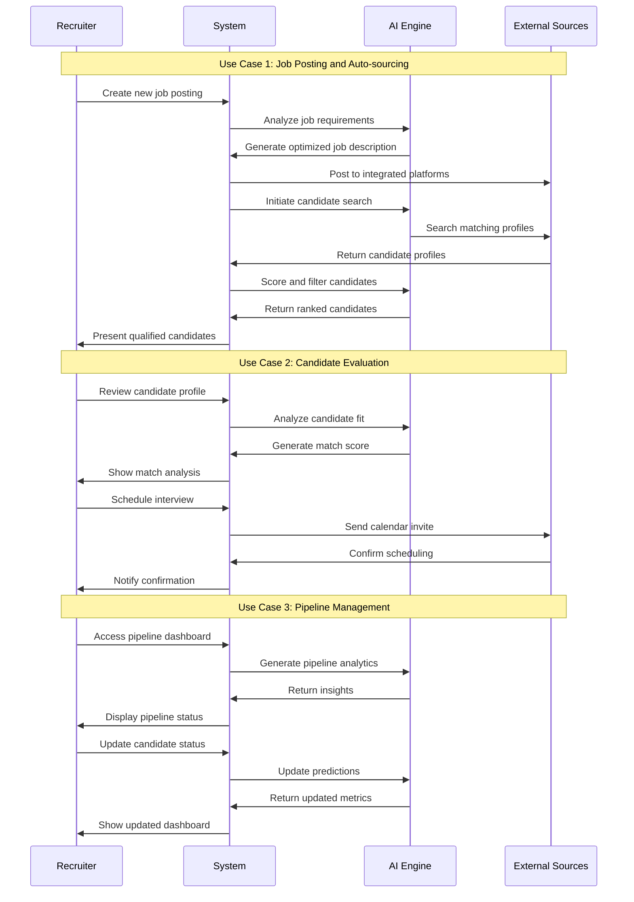
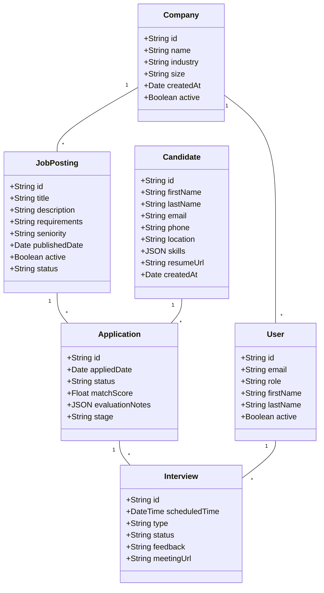
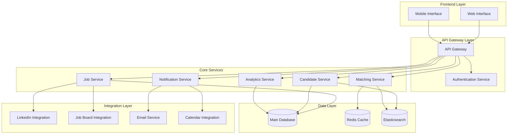
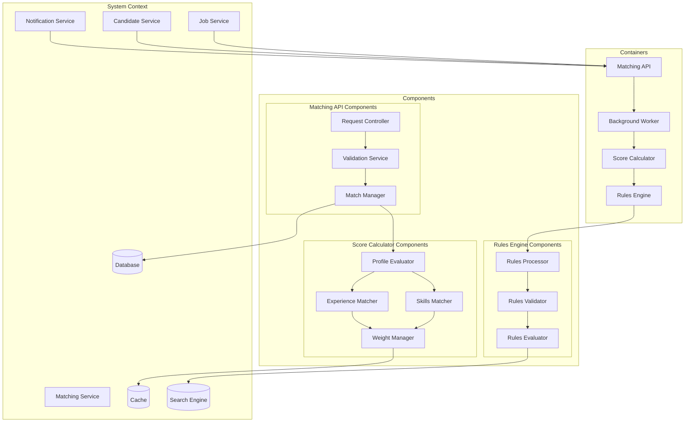

Claude sonnet new

# Primer promp

LTI es una startup que quiere desarrollar el ATS (Applicant-Tracking System) del futuro. 

Eres un experto software developer, arquitecto y manager. Tienes mucha experiencia haciendo desarrollos y definiciones de productos y proyectos.
Encuentra también features que puedan hacer que se diferencie de la competencia.

Tu misión es diseñar la primera versión del sistema, entregando los siguientes artefactos:

Descripción breve del software LTI, valor añadido y ventajas competitivas. Explicación de las funciones principales. Añadir un diagrama Lean Canvas para entender el modelo de negocio
Descripción de los 3 casos de uso principales, con el diagrama asociado a cada uno
Modelo de datos que cubra entidades, atributos (nombre y tipo) y relaciones en PLANTUML
Diseño del sistema a alto nivel, tanto explicado como diagrama adjunto también en PLANTUML
Diagrama C4 que llegue en profundidad a uno de los componentes del sistema, el que prefieras
Si tienes cualquier duda, pregunta antes de dar una respuesta precipitada.

# Respuesta

Antes de proceder con el diseño detallado, me gustaría aclarar algunos puntos importantes para asegurar que el sistema se alinee perfectamente con las necesidades del mercado y los objetivos de LTI:

1. ¿Hay algún sector o tipo de empresa específico al que LTI quiera dirigirse inicialmente? (Por ejemplo, startups tecnológicas, grandes corporaciones, sector específico, etc.)

2. ¿Existe algún dolor específico en los ATS actuales que LTI haya identificado y quiera resolver?

3. ¿Se tiene pensado alguna integración específica con otras herramientas (LinkedIn, Indeed, portales de empleo específicos)?

4. En cuanto a la escala inicial, ¿cuál sería el volumen aproximado de:
   - Empresas objetivo en el primer año
   - Ofertas de trabajo por empresa
   - Candidatos por oferta

5. ¿Hay alguna característica específica que LTI considere fundamental o diferenciadora que deba ser incluida en esta primera versión?

Estas respuestas me ayudarán a diseñar una solución más ajustada a las necesidades reales del proyecto y proponer características verdaderamente diferenciadoras en el mercado.

# Mi respuesta

¿Hay algún sector o tipo de empresa específico al que LTI quiera dirigirse inicialmente? (Por ejemplo, startups tecnológicas, grandes corporaciones, sector específico, etc.)
Startups tech
¿Existe algún dolor específico en los ATS actuales que LTI haya identificado y quiera resolver?
El flujo es muy tedioso y lento. Además de tener un coste altisimo.
¿Se tiene pensado alguna integración específica con otras herramientas (LinkedIn, Indeed, portales de empleo específicos)?
Linkedin y scrap de los mejores portales de trabajo.
En cuanto a la escala inicial, ¿cuál sería el volumen aproximado de:
Empresas objetivo en el primer año
5
Ofertas de trabajo por empresa
2
Candidatos por oferta
Lo máximo
¿Hay alguna característica específica que LTI considere fundamental o diferenciadora que deba ser incluida en esta primera versión?
No, decide tú.

# Respuesta final

Gracias por las aclaraciones. Con esta información, procederé a diseñar el sistema comenzando por una visión general y el Lean Canvas.

# LTI - El ATS del futuro

## Descripción General
LTI es un Applicant Tracking System (ATS) diseñado específicamente para startups tecnológicas, enfocado en maximizar la eficiencia del proceso de contratación mediante automatización inteligente y una experiencia de usuario fluida. El sistema se diferencia por su capacidad de integración con múltiples fuentes de talento, procesamiento inteligente de candidatos y un modelo de precios accesible para startups.

## Propuesta de Valor
- **Automatización Inteligente**: Reducción drástica del tiempo dedicado a la gestión de candidatos mediante IA
- **Integración Completa**: Conexión seamless con LinkedIn y principales job boards
- **Experiencia Optimizada**: Interface intuitiva y flujos de trabajo simplificados
- **Precio Competitivo**: Modelo de precios adaptado a startups

## Lean Canvas

| Problem                                   | Solution                                     | Unique Value Proposition                              | Unfair Advantage                        | Customer Segments                        |
|------------------------------------------|----------------------------------------------|------------------------------------------------------|------------------------------------------|------------------------------------------|
| - Procesos de selección lentos y tediosos| - Automatización del screening inicial      | "Reduce tu tiempo de contratación en un 70% con IA"  | - Algoritmos de matching avanzados      | **Early Adopters:**                      |
| - ATSs actuales muy caros               | - Integración automática con fuentes        |                                                      | - UX optimizada para startups           | - Startups tech en fase de crecimiento   |
| - Dificultad para gestionar candidatos   | - Pipeline visual e intuitivo              |                                                      | - Modelo de precios disruptivo          | - CTOs y founders                        |
| **Existing Alternatives:**               | **Key Metrics:**                            | **High-Level Concept:**                              | **Channels:**                           |                                          |
| - Hojas de cálculo                      | - Tiempo de contratación                    | "El ATS que entiende a las startups"                 | - Marketing de contenido                |                                          |
| - Email                                  | - Satisfacción del recruiter                |                                                      | - LinkedIn directo                      |                                          |
| - ATSs tradicionales                     | - Ratio de conversión                       |                                                      | - Comunidades tech                      |                                          |
|                                          |                                              |                                                      |                                          |                                          |
| **Cost Structure:**                                                                     | **Revenue Streams:**                                                                                                                           |
| - Desarrollo y mantenimiento de la plataforma                                          | - Suscripción base: €199/mes por empresa                                                                                                      |
| - Infraestructura cloud                                                                | - Add-ons: Integraciones premium, análisis avanzados                                                                                          |
| - Marketing y ventas                                                                   | - Setup inicial y onboarding                                                                                                                   |

## Funcionalidades Principales

1. **Smart Sourcing**
   - Integración automática con LinkedIn y job boards
   - Scraping inteligente de perfiles
   - Detección automática de duplicados

2. **Pipeline Inteligente**
   - Evaluación automática de candidatos mediante IA
   - Workflow personalizable
   - Sistema de scoring automatizado

3. **Comunicación Eficiente**
   - Templates personalizables
   - Seguimiento automático
   - Calendario integrado para entrevistas

4. **Analytics & Reporting**
   - Métricas de rendimiento del proceso
   - Análisis de fuentes de candidatos
   - Predicciones de tiempo de contratación

### Descripción de los Casos de Uso Principales

1. **Job Posting and Auto-sourcing**
   - El recruiter crea una nueva oferta de trabajo
   - El sistema analiza los requisitos y optimiza la descripción
   - Se publica automáticamente en las plataformas integradas
   - El sistema busca y califica automáticamente candidatos potenciales
   - Se presentan los candidatos más cualificados al recruiter

2. **Candidate Evaluation**
   - El recruiter revisa el perfil del candidato
   - El sistema proporciona un análisis de ajuste automático
   - Se facilita la programación de entrevistas
   - El sistema gestiona la comunicación automatizada

3. **Pipeline Management**
   - Vista general del estado de todos los procesos
   - Análisis en tiempo real del pipeline
   - Actualización de estados y métricas
   - Predicciones y recomendaciones automáticas

¿Te gustaría que profundice en algún aspecto específico del diseño o que aclare algún punto en particular?
