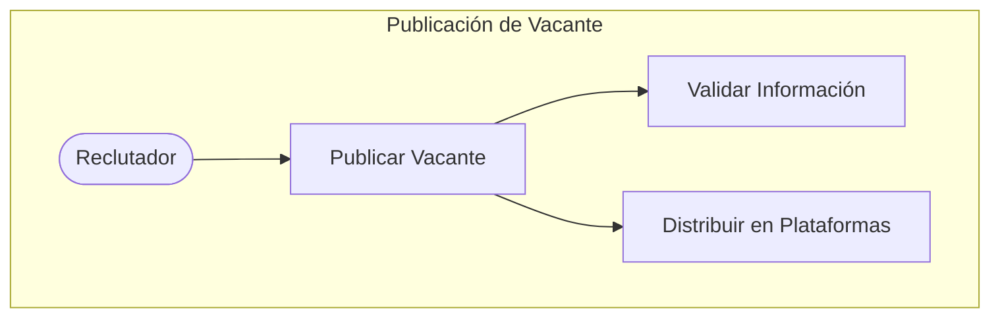
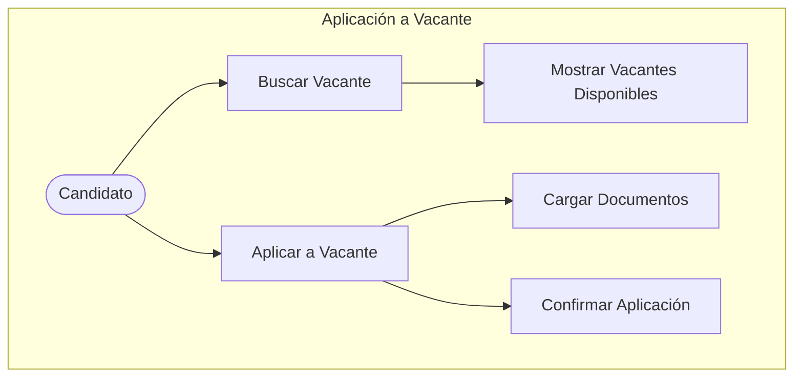
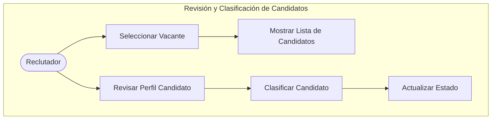

# ✍️ Diseño de un sistema de gestión de candidatos 🔴

Por: Jorge Luis Sánchez Ocampo

Empresa: LTI (startup)

Proyecto: **ATS (Applicant-Tracking System)**


**Objetivos:** 

**Definir esas funcionalidades clave que harán brillar a LTI** por encima de los competidores: aumentar la eficiencia para los departamentos de HR, mejorar la colaboración en tiempo real entre reclutadores y managers, automatizaciones, asistencia de IA en diversas tareas...es el momento de hacer brainstorming, investigar cuáles pueden ser las claves del éxito, y dejarlo plasmado para el resto del equipo.

**Entregables:** 

1. Descripción breve del software LTI, valor añadido y ventajas competitivas. Explicación de las funciones principales. Añadir un diagrama Lean Canvas para entender el modelo de negocio
2. Descripción de los 3 casos de uso principales, con el diagrama asociado a cada uno
3. Modelo de datos que cubra entidades, atributos (nombre y tipo) y relaciones
4. Diseño del sistema a alto nivel, tanto explicado como diagrama adjunto
5. Diagrama C4 que llegue en profundidad a uno de los componentes del sistema, el que prefieras

## Ejecución:

## **1. Descripción breve del software LTI, valor añadido y ventajas competitivas. Explicación de las funciones principales. Añadir un diagrama Lean Canvas para entender el modelo de negocio.**

**Descripción breve del software ATS para LTI**

---

El software **ATS de LTI** es una plataforma innovadora diseñada para optimizar y automatizar el proceso de selección de personal, ayudando a las empresas a captar y gestionar talento de manera eficiente. Nuestro sistema centraliza la información de los candidatos, agiliza la toma de decisiones y reduce los tiempos de contratación, todo con una experiencia intuitiva y persona

**Valor añadido y ventajas competitivas**

---

1.	**Automatización y eficiencia**: El ATS de LTI permite que los equipos de recursos humanos ahorren tiempo en tareas repetitivas, como la publicación de ofertas y el filtrado inicial de candidatos, permitiéndoles enfocarse en la selección de talento de calidad.

2.	**Experiencia de usuario mejorada**: La plataforma ofrece un portal intuitivo para candidatos y reclutadores, facilitando la interacción y mejorando la imagen de marca empleadora.

3.	**Datos en tiempo real y análisis predictivo**: Con herramientas de reportes avanzados y análisis predictivo, el sistema ayuda a identificar patrones de contratación, ajustar estrategias y predecir el éxito de los candidatos.

4.	**Integración sin fisuras**: Se integra fácilmente con otros sistemas de RRHH (nómina, onboarding, etc.), garantizando una transición fluida entre contratación y gestión de personal.

5.	**Personalización y escalabilidad**: Adaptable a empresas de todos los tamaños, el ATS de LTI permite configurar sus funciones según las necesidades específicas de cada cliente, ofreciendo una solución flexible y escalable.

**Principales funciones del ATS de LTI**

---

1.	**Gestión de Candidatos**: Organización y almacenamiento centralizado del perfil completo de cada candidato.

2.	**Filtrado Inteligente y Clasificación Automática**: Filtros avanzados y algoritmos para identificar los perfiles más cualificados.

3.	**Publicación de Vacantes Multicanal**: Creación y distribución de ofertas en plataformas múltiples desde una única interfaz.

4.	**Seguimiento del Proceso de Selección**: Estado y progreso de los candidatos en cada fase del proceso.

5.	**Comunicación Automatizada**: Herramientas de mensajería y recordatorios para mantener el contacto constante con los candidatos.

6.	**Programación de Entrevistas**: Planificación de citas y recordatorios automáticos para simplificar la coordinación de entrevistas.

7.	**Evaluación y Scoring**: Herramientas para evaluar a los candidatos, facilitando comparaciones objetivas.

8.	**Reportes y Análisis en Tiempo Real**: Métricas clave para mejorar continuamente la eficiencia del proceso de selección.

**Diagrama Lean Canvas**

---


## **2. Descripción de los 3 casos de uso principales, con el diagrama asociado a cada uno**

**Recurso de generación de diagramas:** https://mermaid-js.github.io/mermaid-live-editor/

### **Caso de uso 1: Publicación de Vacante**

---

**Descripción**: Este caso de uso permite a un reclutador crear y publicar una nueva oferta de trabajo en el sistema. Incluye opciones para definir el título, descripción, requisitos y fecha de cierre de la vacante, y para distribuir la oferta en diferentes plataformas (sitio web, redes sociales, bolsas de trabajo).

Flujo principal:

```
1.	El reclutador accede al sistema.
2.	El reclutador selecciona la opción de “Publicar nueva vacante”.
3.	Se completan los campos necesarios: título, descripción, requisitos y fecha de cierre.
4.	El reclutador elige las plataformas de publicación.
5.	El sistema valida la información y publica la vacante.
```



### **Caso de uso 2: Aplicación a Vacante**

---

**Descripción**: Este caso de uso permite a un candidato postularse a una vacante publicada en el sistema. Incluye el registro del candidato, la carga de documentos (CV, carta de presentación) y la verificación de la aplicación.

**Flujo principal**:

```
1.	El candidato accede al sistema y busca vacantes.
2.	Selecciona la vacante a la que quiere aplicar.
3.	Completa su perfil o carga los documentos requeridos.
4.	Envía la aplicación.
5.	El sistema confirma la recepción y registra al candidato.
```

**Diagrama de caso de uso:**



### Caso de uso 3: Revisión y Clasificación de Candidatos

---

Descripción: Este caso de uso permite al reclutador ver las aplicaciones recibidas para una vacante específica y clasificarlas según criterios predefinidos o personalizados (experiencia, habilidades, etc.). Incluye la opción de avanzar a los candidatos más calificados en el proceso de selección o rechazarlos.

Flujo principal:

```
1.	El reclutador accede al sistema y selecciona una vacante.
2.	Ve la lista de candidatos postulados.
3.	Revisa y clasifica cada perfil según los criterios de la posición.
4.	Actualiza el estado de cada candidato (preseleccionado, rechazado, en revisión).
```

Diagrama de caso de uso



## 3. Modelo de datos que cubra entidades, atributos (nombre y tipo) y relaciones

Recurso para generación de diagrama: https://www.planttext.com/

```
@startuml
!define VARCHAR VARCHAR(255)

entity Reclutador {
    reclutador_id INT <<PK>>
    nombre VARCHAR
    correo VARCHAR
    telefono VARCHAR
    rol VARCHAR
    fecha_creacion DATETIME
}

entity Vacante {
    vacante_id INT <<PK>>
    titulo VARCHAR
    descripcion TEXT
    requisitos TEXT
    fecha_cierre DATETIME
    estado ENUM("Activa", "Cerrada", "En proceso")
    reclutador_id INT <<FK>> -- Reclutador
}

entity Candidato {
    candidato_id INT <<PK>>
    nombre VARCHAR
    correo VARCHAR
    telefono VARCHAR
    fecha_postulacion DATETIME
    estado_aplicacion ENUM("En revisión", "Pre-seleccionado", "Rechazado", "Contratado")
}

entity Aplicacion {
    aplicacion_id INT <<PK>>
    fecha_aplicacion DATETIME
    estado ENUM("En revisión", "Pre-seleccionado", "Rechazado", "Contratado")
    comentarios TEXT
    vacante_id INT <<FK>> -- Vacante
    candidato_id INT <<FK>> -- Candidato
}

entity PlataformaPublicacion {
    plataforma_id INT <<PK>>
    nombre VARCHAR
    url VARCHAR
}

entity Publicacion {
    publicacion_id INT <<PK>>
    fecha_publicacion DATETIME
    vacante_id INT <<FK>> -- Vacante
    plataforma_id INT <<FK>> -- PlataformaPublicacion
}

Reclutador ||--o{ Vacante : "publica"
Vacante ||--o{ Aplicacion : "recibe"
Candidato ||--o{ Aplicacion : "aplica a"
Vacante ||--o{ Publicacion : "publicada en"
PlataformaPublicacion ||--o{ Publicacion : "alberga"
@enduml
```


## **4. Diseño del sistema a alto nivel, tanto explicado como diagrama adjunto**

Recurso utilizado: Diagram GPT → [https://app.eraser.io/workspace/xzJcwxTSJ5hZirtZYyeV](https://app.eraser.io/workspace/xzJcwxTSJ5hZirtZYyeV)


```
title Online ATS Microservice Architecture

Frontend [icon: monitor] {
  CDN [icon: aws-cloudfront]
}

Load Balancer [icon: aws-elb]

// Microservices
User Service [color: blue, icon: user] {
  User API [icon: aws-ec2, label: "API"] // entry point
  User DB [icon: aws-rds, label: "DB"]
}

Job Service [color: green, icon: briefcase] {
  Job API [icon: aws-ec2, label: "API"] // entry point
  Job DB [icon: aws-rds, label: "DB"]
}

Application Service [color: orange, icon: file-text] {
  Application API [icon: aws-ec2, label: "API"] // entry point
  Application DB [icon: aws-rds, label: "DB"]
}

// Shared Services
Analytics Service [icon: bar-chart] {
  Analytics API [icon: aws-ec2, label: "API"] // entry point
  Analytics DB [icon: aws-rds, label: "DB"]
}

Cache [icon: aws-elasticache, label: "Redis"]

// Connections
CDN > Load Balancer
Load Balancer > User API
Load Balancer > Job API
Load Balancer > Application API
Load Balancer > Analytics API
User API <> User DB
Job API <> Job DB
Application API <> Application DB
Analytics API <> Analytics DB
User API <> Cache
Job API <> Cache
Application API <> Cache

```

### Explicación:

**Frontend**

---

•	**Frontend**: Representado por el icono de un monitor, indica la capa de la interfaz de usuario del sistema.

•	**CDN (Content Delivery Network)**: Representado con el icono de AWS CloudFront, asegura que los recursos estáticos (imágenes, scripts, etc.) se sirvan rápidamente desde ubicaciones cercanas al usuario final, reduciendo la latencia.

**Load Balancer**

---

•	**Balanceador de carga**: Representado con el icono de AWS ELB, distribuye las solicitudes de los usuarios hacia los diferentes microservicios para optimizar el rendimiento y la disponibilidad.

**Microservicios**

---

Cada microservicio (Usuario, Vacante y Aplicación) tiene dos componentes: la API, que es el punto de entrada del servicio, y la base de datos (DB) específica para cada servicio.

•	**User Service (Servicio de Usuario)**

•	**User API**: La API de usuario, desplegada en una instancia de EC2, maneja las solicitudes relacionadas con los usuarios (como crear cuentas, autenticación, etc.).

•	**User DB**: La base de datos específica de usuarios, representada por AWS RDS, almacena la información de los usuarios.

•	**Job Service (Servicio de Vacantes)**

•	**Job API**: Maneja todas las solicitudes relacionadas con la gestión de vacantes (crear, actualizar y listar vacantes).

•	**Job DB**: Base de datos que almacena la información de las vacantes.

•	**Application Service (Servicio de Aplicaciones)**

•	**Application API**: La API de aplicaciones maneja las solicitudes relacionadas con las postulaciones de los candidatos.

•	**Application DB**: La base de datos donde se guarda la información de las aplicaciones a las vacantes.

**Shared Services (Servicios Compartidos)**

---

Incluye servicios adicionales que no son específicos de un microservicio, pero que pueden ser utilizados por varios de ellos para mejorar la funcionalidad general.

•	**Analytics Service (Servicio de Análisis)**

•	**Analytics API**: La API de análisis maneja todas las solicitudes relacionadas con la obtención de datos y estadísticas del sistema.

•	**Analytics DB**: Base de datos dedicada a almacenar información para análisis y reportes.

•	**Cache (Caché)**

•	Implementado en **Redis** (AWS ElastiCache), este sistema de caché mejora la velocidad de respuesta, reduciendo el acceso repetido a las bases de datos al almacenar temporalmente datos en memoria.

**Conexiones**

---

•	El **CDN** envía las solicitudes de los usuarios al **Load Balancer**.

•	El **Load Balancer** distribuye estas solicitudes a los distintos microservicios (User API, Job API, Application API y Analytics API).

•	Cada **API** se comunica con su respectiva base de datos para almacenar y recuperar datos.

•	Además, los servicios que acceden con frecuencia a datos pueden utilizar el **Cache** para mejorar la rapidez de acceso.

Este diseño garantiza que el sistema ATS sea escalable y altamente disponible, con componentes independientes y bien organizados para facilitar su mantenimiento y evolución.

## **5. Diagrama C4 que llegue en profundidad a uno de los componentes del sistema, el que prefieras**

1. **Context diagram**
    
    **1. Actores externos:**
    
    •	**Reclutador**: Interactúa con el ATS para publicar vacantes, revisar aplicaciones y gestionar el proceso de selección.
    
    •	**Candidato**: Usa el sistema para buscar vacantes, enviar su información y dar seguimiento a su postulación.
    
    •	**Administradores de RRHH**: Gestionan configuraciones, permisos y reportes.
    
    •	**Servicios externos de empleo**: Ejemplo, LinkedIn, Indeed u otros portales de empleo que publican automáticamente vacantes creadas en el ATS.
    
    •	**Proveedor de autenticación**: Para autenticar usuarios (p. ej., mediante Google OAuth, Facebook Login, etc.).
    
    •	**Sistema de Análisis (opcional)**: Para proporcionar métricas y reportes a los administradores de RRHH.
    
    **2. Relaciones y comunicación:**
    
    •	El **Reclutador** y **Candidato** interactúan principalmente con la interfaz del ATS (Frontend).
    
    •	**Administradores de RRHH** acceden a una sección administrativa para configuraciones avanzadas y reportes.
    
    •	El **ATS** interactúa con **Servicios externos de empleo** para distribuir automáticamente las vacantes.
    
    •	**Proveedor de autenticación** facilita el inicio de sesión de todos los usuarios.
    
    •	**Sistema de Análisis** (opcional) recopila datos para informes sobre el flujo de candidatos y las métricas de reclutamiento.
    
    
    
    Context diagram
    
    ```
    @startuml
    title ATS - System Context Diagram
    
    actor "Reclutador" as recruiter
    actor "Candidato" as candidate
    actor "Administradores de RRHH" as admin
    
    node "Applicant Tracking System (ATS)" as ats {
        [Frontend] --> [Backend]
    }
    
    recruiter --> [Frontend] : Publicar y gestionar vacantes
    candidate --> [Frontend] : Buscar y aplicar a vacantes
    admin --> [Frontend] : Configurar, supervisar y obtener reportes
    
    [Backend] --> "Servicios externos de empleo" : Publicación de vacantes
    [Backend] --> "Proveedor de autenticación" : Inicio de sesión de usuarios
    [Backend] --> "Sistema de Análisis" : Generación de métricas y reportes
    
    @enduml
    ```
    
    **Descripción del Diagrama**
    
    •	**Applicant Tracking System (ATS)** es el núcleo del sistema que contiene el **Frontend** (accesible para usuarios) y el **Backend** (gestiona la lógica del sistema).
    
    •	**Reclutador** interactúa con el **Frontend** para realizar acciones como publicar y gestionar vacantes.
    
    •	**Candidato** utiliza el **Frontend** para buscar vacantes y enviar postulaciones.
    
    •	**Administradores de RRHH** acceden a configuraciones avanzadas y reportes.
    
    •	**Servicios externos de empleo** reciben las vacantes publicadas en el ATS.
    
    •	**Proveedor de autenticación** permite el inicio de sesión para todos los usuarios.
    
    •	**Sistema de Análisis** almacena datos para reportes y métricas relevantes.
    
    Este diagrama es ideal para comunicar a los interesados los actores involucrados y cómo interactúan externamente con el ATS, proporcionando un panorama general del sistema.
    
2. **Container diagram**
    
    **Contenedores principales:**
    
    1.	**Frontend (Web App)**:
    
    •	Permite a los usuarios (reclutadores y candidatos) interactuar con el sistema.
    
    •	Proporciona interfaces para la publicación de vacantes, revisión de postulaciones y gestión de procesos de selección.
    
    •	Se comunica con los servicios de backend a través de llamadas a la API.
    
    2.	**API Gateway**:
    
    •	Sirve como único punto de entrada para el frontend.
    
    •	Distribuye las solicitudes a los microservicios del backend y maneja aspectos como autenticación, autorización y enrutamiento de las peticiones.
    
    3.	**Microservicios Backend**:
    
    •	**User Service**:
    
    •	Gestiona los datos y autenticación de usuarios.
    
    •	Realiza operaciones de autenticación a través del proveedor externo y gestiona roles/permisos.
    
    •	**Job Service**:
    
    •	Permite a los reclutadores crear, actualizar y listar vacantes.
    
    •	Almacena los datos de las vacantes en su propia base de datos.
    
    •	**Application Service**:
    
    •	Gestiona el flujo de postulaciones.
    
    •	Procesa las aplicaciones de candidatos y permite que los reclutadores den seguimiento.
    
    •	**Analytics Service**:
    
    •	Genera reportes y métricas a partir de los datos de los candidatos y procesos de reclutamiento.
    
    •	**Notification Service**:
    
    •	Envía notificaciones (por email o SMS) a candidatos y reclutadores sobre el estado de la aplicación.
    
    4.	**Bases de datos**:
    
    •	Cada microservicio tiene su propia base de datos para soportar los principios de independencia y escalabilidad.
    
    •	**User DB**: Almacena la información de los usuarios y permisos.
    
    •	**Job DB**: Almacena la información de las vacantes.
    
    •	**Application DB**: Almacena las postulaciones de los candidatos.
    
    •	**Analytics DB**: Almacena datos relevantes para el análisis de los procesos.
    
    5.	**Cache**:
    
    •	Utiliza Redis para almacenar datos temporales y mejorar la velocidad de respuesta del sistema.
    
    6.	**Proveedor de Autenticación (Externo)**:
    
    •	Realiza la autenticación de usuarios, como el inicio de sesión mediante proveedores de OAuth (Google, Facebook, etc.).
    
    7.	**Servicios externos de empleo**:
    
    •	Interactúan con el sistema para recibir publicaciones automáticas de vacantes.
    
    
    
    Container diagram
    
    ```
    @startuml
    title ATS - Container Diagram
    
    node "Frontend (Web App)" as frontend {
        [User Interface] --> [API Gateway]
    }
    
    node "Backend" as backend {
        node "API Gateway" as apigateway
    
        node "User Service" as userService {
            [User API] --> [User DB]
        }
    
        node "Job Service" as jobService {
            [Job API] --> [Job DB]
        }
    
        node "Application Service" as applicationService {
            [Application API] --> [Application DB]
        }
    
        node "Analytics Service" as analyticsService {
            [Analytics API] --> [Analytics DB]
        }
    
        node "Notification Service" as notificationService {
            [Notification API]
        }
    
        [Cache] as cache
    }
    
    node "External Services" as external {
        [Authentication Provider] as authProvider
        [Job Boards] as jobBoards
    }
    
    frontend --> apigateway : User Requests
    apigateway --> userService : User Management Requests
    apigateway --> jobService : Job Management Requests
    apigateway --> applicationService : Application Management Requests
    apigateway --> analyticsService : Analytics Requests
    apigateway --> notificationService : Notification Requests
    
    userService --> authProvider : Authentication Requests
    jobService --> jobBoards : Publish Jobs
    applicationService --> cache : Cached Application Data
    analyticsService --> cache : Cached Analytics Data
    
    @enduml
    ```
    
    **Descripción del Diagrama**
    
    •	**Frontend (Web App)** representa la interfaz del usuario y se conecta al **API Gateway** para realizar todas las solicitudes.
    
    •	**API Gateway** dirige las solicitudes al microservicio correspondiente.
    
    •	**Microservicios** (User, Job, Application, Analytics, Notification) manejan distintas funciones del ATS:
    
    •	**User Service** gestiona usuarios y autenticación.
    
    •	**Job Service** gestiona las vacantes.
    
    •	**Application Service** gestiona las postulaciones.
    
    •	**Analytics Service** genera reportes y métricas.
    
    •	**Notification Service** envía notificaciones.
    
    •	**Cache** mejora el rendimiento de lectura/escritura.
    
    •	**Proveedor de Autenticación** se encarga de la autenticación externa de los usuarios.
    
    •	**Servicios externos de empleo** reciben vacantes publicadas automáticamente.
    
    Este Container Diagram establece las bases de cómo los componentes principales del sistema ATS se relacionan entre sí y con los servicios externos, proporcionando una visión clara de su arquitectura de alto nivel.
    
3. **Components diagram**
    
    **Componentes clave del “User Service” en el ATS**
    
    1.	**User Controller**:
    
    •	Expone una API REST para la gestión de usuarios.
    
    •	Recibe las solicitudes del “API Gateway” y las direcciona hacia los componentes adecuados.
    
    2.	**Authentication Manager**:
    
    •	Encargado de gestionar la autenticación de usuarios.
    
    •	Se conecta al **Proveedor de Autenticación Externo** (p. ej., Google OAuth) para realizar la autenticación de usuarios externos.
    
    3.	**User Repository**:
    
    •	Componente encargado de interactuar con la base de datos de usuarios.
    
    •	Realiza operaciones CRUD (crear, leer, actualizar, eliminar) en la base de datos de usuarios.
    
    4.	**User Profile Manager**:
    
    •	Responsable de gestionar la información y permisos de perfil de los usuarios.
    
    •	Maneja la lógica de negocio para roles y permisos.
    
    5.	**Notification Client**:
    
    •	Se conecta con el “Notification Service” para enviar notificaciones a los usuarios, como correos electrónicos de bienvenida o alertas de cambios de contraseña.
    
    
    
    Components diagram
    
    ```
    @startuml
    title ATS - Component Diagram for User Service
    
    node "User Service" {
        
        [User Controller] --> [Authentication Manager] : Authenticate User
        [User Controller] --> [User Profile Manager] : Manage User Profile
        [User Controller] --> [User Repository] : CRUD Operations
    
        [Authentication Manager] --> "Authentication Provider" : External Authentication Request
        [User Profile Manager] --> [User Repository] : Retrieve/Update User Info
        [User Profile Manager] --> "Notification Client" : Send Notifications
    
        [Notification Client] --> "Notification Service" : Send Notification Requests
        [User Repository] --> "User DB" : Store/Retrieve User Data
    }
    
    @enduml
    ```
    
    **Descripción del Diagrama**
    
    •	**User Controller**: Actúa como el punto de entrada de las solicitudes, direccionando la lógica hacia el componente adecuado (Autenticación, Perfil o CRUD).
    
    •	**Authentication Manager**: Realiza la autenticación a través de un proveedor externo, como Google o Facebook.
    
    •	**User Profile Manager**: Gestiona la lógica de negocio relacionada con el perfil y los permisos del usuario.
    
    •	**User Repository**: Es el único componente que interactúa directamente con la **Base de Datos de Usuarios**.
    
    •	**Notification Client**: Se comunica con el **Notification Service** para enviar notificaciones relacionadas con la cuenta o cambios de perfil.
    
    Este diagrama ayuda a visualizar cómo se organizan las funcionalidades del “User Service” en el ATS, mostrando los componentes responsables de cada tarea y sus relaciones clave.
    
4. Code diagram
    
    Is akin to a class diagram from UML. This is the lowest level of zoom and one where we get less usage out of, the recommendation is you stop at the Component view to get the most value.
    
    
    
    ```
    @startuml
    title ATS - User Controller Code Diagram
    
    class UserController {
        +POST /login()
        +POST /register()
        +PUT /profile()
        +GET /profile()
        
        -AuthenticationService authService
        -ProfileService profileService
        -NotificationService notificationService
        -UserDB userDB
    
        +UserController(authService: AuthenticationService, profileService: ProfileService, notificationService: NotificationService, userDB: UserDB)
    }
    
    class AuthenticationService {
        +authenticateUser(credentials: Credentials): User
        +registerUser(userData: UserData): User
    }
    
    class ProfileService {
        +getUserProfile(userId: String): UserProfile
        +updateUserProfile(userId: String, profileData: UserProfile): UserProfile
    }
    
    class NotificationService {
        +sendNotification(userId: String, message: String)
    }
    
    class UserDB {
        +saveUser(user: User)
        +findUserById(userId: String): User
    }
    
    UserController --> AuthenticationService : uses
    UserController --> ProfileService : uses
    UserController --> NotificationService : uses
    UserController --> UserDB : reads/writes
    
    @enduml
    ```
    
    **Descripción del Diagrama**
    
    •	**UserController**: Esta clase representa el controlador de usuario, que maneja las solicitudes relacionadas con la autenticación y el perfil del usuario.
    
    •	**Métodos**: Incluye los métodos de la API, como /login, /register, /profile para obtener y actualizar el perfil.
    
    •	**Atributos**: Contiene referencias a servicios como AuthenticationService, ProfileService, NotificationService y la base de datos UserDB.
    
    •	**Servicios**:
    
    •	**AuthenticationService**: Maneja la autenticación de usuarios, incluyendo métodos para autenticar y registrar usuarios.
    
    •	**ProfileService**: Proporciona métodos para obtener y actualizar los perfiles de usuario.
    
    •	**NotificationService**: Envía notificaciones a los usuarios.
    
    •	**UserDB**: Representa la base de datos que almacena la información del usuario, con métodos para guardar y buscar usuarios.
    
    •	**Relaciones**: Las flechas indican que el UserController utiliza otros servicios y la base de datos, mostrando cómo se comunican entre sí.