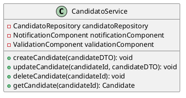

# Documentación del Chat - Diseño del Sistema ATS

## Asistente Utilizado
- **Modelo Asistente**: ChatGPT por OpenAI
- **Versión del Modelo**: GPT-4 

Este asistente ha sido utilizado para discutir y crear varios elementos de diseño para un sistema de seguimiento de candidatos (ATS). La información recopilada durante esta conversación incluye un análisis de competidores, un modelo Lean Canvas, el modelo de datos esenciales, la arquitectura de alto nivel, y un diagrama C4, entre otros aspectos. A continuación, se presenta la documentación detallada en diferentes etapas de diseño.

---

## Prompts y Respuestas
### Prompt 1:
**Usuario**: "Somos una startup llamada LTI que necesita crear un sistema de gestion de candidatos. Para ello se quiere desarrollar el ATS (Applicant-Tracking System) del futuro, si esta terminologia no es familiar para ti o necesitas mas informacion, te adjunto esta imagen para ayudarte a entender mejor lo que es."

**Respuesta**: 
Gracias por proporcionar la imagen. La imagen que has compartido muestra el ciclo del proceso de reclutamiento, típicamente gestionado por un sistema de seguimiento de candidatos (Applicant Tracking System, ATS). Vamos a desglosar brevemente este proceso y cómo podemos diseñar el ATS del futuro para tu startup LTI.

Según la imagen, el ciclo de contratación tiene varios pasos:

1. **Creación de puestos de trabajo**: Primero se crean las vacantes para los distintos puestos dentro de la organización.
2. **Publicación de los puestos**: Los trabajos se publican en distintas plataformas como tablones de empleo, sitios web y redes sociales.
3. **Recepción de las solicitudes**: Los candidatos interesados envían sus solicitudes y el sistema las empieza a acumular.
4. **Revisión de solicitudes**: Se revisan las solicitudes para filtrar los perfiles adecuados.
5. **Pruebas en línea**: Los candidatos seleccionados pasan a pruebas online para evaluar sus competencias técnicas y aptitudes.
6. **Programación de entrevistas**: Después de las pruebas, los candidatos que cumplen los requisitos pasan a la fase de entrevistas.
7. **Contratación de candidatos seleccionados**: Finalmente, los candidatos seleccionados son contratados.

Un ATS ayuda a automatizar cada uno de estos pasos, facilitando el flujo de trabajo para el equipo de recursos humanos, lo que permite manejar múltiples candidatos de manera efectiva. Ahora, ¿qué podemos hacer para desarrollar el ATS del futuro?

### Prompt 2:
**Usuario**: "Antes de comenzar con la fase de diseño, me gustaria que hicieras un analisis de de los principales competidores que hay hoy en dia (con analizar los 3 mas notorios es suficiente) y en base a dicho analisis, extraer los puntos mas fuertes y debiles de cara a diseñar nuestro sistema para conseguir que nuestro sistema suponga un valor añadido de cara al usuario final"

**Respuesta**: 
Claro, vamos a empezar analizando los tres principales sistemas de seguimiento de candidatos (ATS) más notorios en el mercado actual. Esto nos ayudará a identificar las fortalezas y debilidades clave que existen y que podemos aprovechar para diseñar una solución innovadora y diferenciada.

#### 1. **Greenhouse**
**Greenhouse** es uno de los sistemas ATS más utilizados, conocido por su enfoque en la colaboración, sus funciones avanzadas de automatización y la capacidad de integrarse con una amplia gama de otras herramientas.

**Puntos fuertes**:
- **Enfoque colaborativo**: Permite a los equipos de contratación colaborar en cada etapa del proceso. Ofrece puntuaciones de candidatos, retroalimentación estructurada y decisiones colectivas.
- **Integración extensiva**: Se conecta con más de 300 herramientas y plataformas de terceros, lo que hace que sea altamente versátil y adecuado para empresas que ya usan otras soluciones tecnológicas.
- **Automatización y análisis de calidad de contratación**: Incluye funciones avanzadas de análisis para medir la calidad de contratación y el desempeño de los reclutadores.

**Puntos débiles**:
- **Complejidad y curva de aprendizaje**: La interfaz es bastante completa, lo cual puede ser abrumador para usuarios nuevos o empresas que no cuenten con personal de RRHH especializado.
- **Coste elevado**: Es una herramienta costosa, lo cual puede limitar su accesibilidad para startups o empresas pequeñas.

**Oportunidad para nuestro ATS**:
- Crear una interfaz más **intuitiva y sencilla** que reduzca la curva de aprendizaje y que ofrezca una experiencia de usuario optimizada para empresas más pequeñas.
- Mantener **capacidades de integración**, pero automatizando el proceso para minimizar la configuración técnica.

#### 2. **Lever**
**Lever** se destaca por su enfoque en la relación con los candidatos y la idea de gestionar talento de manera proactiva, combinando un CRM (gestión de relaciones) con ATS.

**Puntos fuertes**:
- **Gestión proactiva del talento**: Lever combina un ATS con un CRM, lo que permite a las empresas mantener relaciones continuas con los candidatos potenciales incluso antes de que surjan vacantes. Esto facilita tener una “banca” de talento disponible.
- **Enfoque en la experiencia del candidato**: Ofrece comunicación fluida con los candidatos durante todo el proceso y se esfuerza en proporcionar transparencia y comodidad.
- **Análisis y reporting personalizados**: Tiene una herramienta de reportes que permite visualizar el pipeline de candidatos y evaluar métricas clave de forma personalizada.

**Puntos débiles**:
- **Funcionalidad avanzada que requiere más formación**: Su interfaz es menos intuitiva debido a la combinación ATS/CRM, lo cual genera una mayor necesidad de capacitación para aprovechar su máximo potencial.
- **Enfoque demasiado complejo para procesos más pequeños**: Para empresas con procesos de contratación simples, puede parecer excesivo e innecesario, lo cual lo vuelve menos atractivo para pequeñas empresas.

**Oportunidad para nuestro ATS**:
- Adoptar la idea de **gestión de relaciones** con candidatos, pero simplificarlo para empresas que no tengan un equipo grande de reclutamiento. Se podría incluir una función que permita a startups mantenerse conectadas con candidatos potenciales de manera **más automática** y menos compleja.
- Focalizarse en la **simplicidad** de uso con funcionalidades inteligentes que no necesiten mucho entrenamiento.

#### 3. **Workday Recruiting**
**Workday Recruiting** es un sistema de ATS robusto que está especialmente orientado a grandes empresas, ofreciendo un enfoque completamente integrado a los recursos humanos, ya que forma parte del paquete Workday HCM (Human Capital Management).

**Puntos fuertes**:
- **Integración completa con el sistema de gestión de capital humano (HCM)**: Esto permite a las grandes organizaciones unificar todo lo relativo a recursos humanos, desde la contratación hasta el desarrollo profesional y la gestión de nóminas.
- **Automatización robusta**: Incluye funcionalidades automatizadas para procesos de evaluación, pruebas y entrevistas, además de capacidades analíticas avanzadas para optimizar el pipeline de contratación.
- **Multinacionalidad y adaptabilidad**: Tiene capacidades para soportar contrataciones en múltiples países, siendo ideal para empresas globales.

**Puntos débiles**:
- **Centrado en grandes empresas**: Las funcionalidades y su precio lo hacen un producto poco atractivo y complejo para pequeñas y medianas empresas.
- **Interfaz poco amigable para usuarios sin experiencia**: La curva de aprendizaje es alta, lo cual puede suponer una barrera para muchos usuarios.

**Oportunidad para nuestro ATS**:
- Dirigirnos específicamente a startups y medianas empresas que necesitan **flexibilidad y facilidad de uso**, pero sin la complejidad de Workday.
- Ofrecer un ATS que permita a empresas en crecimiento escalar de manera orgánica, con funcionalidades ajustables a medida que la empresa crece.

### Resumen de Fortalezas y Debilidades para Nuestro ATS:

**Fortalezas que debemos aprovechar para nuestro ATS**:
1. **Simplicidad e intuitividad**: Crear un sistema fácil de usar desde el primer día, minimizando la necesidad de formación para que cualquier miembro del equipo pueda usarlo sin barreras.
2. **Enfoque colaborativo**: Mantener una estructura que permita la colaboración entre los equipos de recursos humanos y las áreas involucradas, pero de una manera clara y visualmente intuitiva.
3. **Capacidades de relación con los candidatos**: Integrar un módulo de relación con candidatos que permita mantener una lista de talento activa, sin llegar a ser un CRM complejo.

**Debilidades que podemos mejorar**:
1. **Curva de aprendizaje**: La mayoría de ATS presentan interfaces complejas. Necesitamos diseñar una interfaz **amigable y moderna** que se adapte al usuario, con tutoriales y un asistente que guíe cada paso del proceso.
2. **Coste y accesibilidad**: Ofrecer una **estructura de precios flexible**, que permita a startups acceder a funcionalidades básicas y luego ir ampliando a medida que crecen, manteniendo precios competitivos.
3. **Automatización inteligente**: Hacer que la automatización no requiera configuraciones extensas. Por ejemplo, integrar un **motor de recomendaciones** que sugiera automáticamente acciones como candidatos recomendados para ciertos puestos, basándose en el aprendizaje del uso del sistema.

---

## 1. Análisis de Competencia
Se realizó un análisis de los principales ATS del mercado para identificar fortalezas y debilidades:

- **Greenhouse**: Ofrece integración extensa y colaboración de equipos, pero es costoso y complejo.
- **Lever**: Combina CRM y ATS, gestiona talento proactivamente, pero resulta avanzado y difícil para usuarios sin experiencia.
- **Workday Recruiting**: Integración completa de recursos humanos, pero está enfocado en grandes empresas, con una curva de aprendizaje elevada.

**Conclusiones**:
Nuestro ATS debe ser intuitivo, flexible, y ofrecer precios accesibles para startups y PYMES.

---

## 2. Lean Canvas para el Sistema ATS
Se desarrolló un Lean Canvas para identificar los aspectos clave del negocio, como problemas, soluciones, segmentos de clientes, y propuestas de valor únicas. Los puntos relevantes incluyen:

- **Problemas**: Complejidad de ATS actuales, precios elevados, falta de flexibilidad.
- **Propuesta de Valor**: ATS amigable, escalable, diseñado para startups.
- **Segmentos de Clientes**: Startups, PYMES, equipos de recursos humanos pequeños.

[**Enlace a Lean Canvas completo**](#)

---

## 3. Modelo de Datos Esenciales del ATS
Se creó un modelo de datos esencial para el sistema ATS, con las siguientes entidades clave y sus relaciones:

### Entidades Clave:
- **Candidato**: Almacena datos del candidato como nombre, correo, teléfono, URL del CV, y estado de candidatura.
- **Vacante**: Detalles de la vacante, incluyendo título, descripción, departamento, y estado.
- **Entrevista**: Registra información sobre las entrevistas (fechas, estado, resultado).
- **Usuario**: Incluye los datos del reclutador o administrador, su rol, y credenciales.
- **Prueba**: Evaluaciones aplicadas a los candidatos.

**Diagrama Visual Mejorado del Modelo de Datos**: 

---

## 4. Arquitectura de Alto Nivel del Sistema ATS
Se diseñó una arquitectura a alto nivel utilizando como referencia el repositorio "[System Design Primer](https://github.com/donnemartin/system-design-primer)". Los componentes incluyen:

### Componentes Esenciales:
1. **Frontend (Web/Móvil)**: Interfaz para interactuar con el sistema.
2. **API Gateway**: Puerta de entrada para todas las solicitudes que redirige a los microservicios correspondientes.
3. **Microservicios**: Cada microservicio tiene una funcionalidad específica, como la gestión de candidatos o entrevistas.
4. **Bases de Datos**: Bases de datos SQL y NoSQL para almacenar la información estructurada y no estructurada.
5. **Message Queue**: Para manejar la comunicación asincrónica entre servicios.

**Componentes Relacionados**:
- Autenticación: OAuth 2.0 y servicios como AWS Cognito.
- Monitorización: Grafana y Prometheus.

---

## 5. Diagrama C4 del Sistema ATS
### Nivel 1: Contexto del Sistema
Este nivel muestra la relación entre el sistema ATS y los diferentes actores:
- **Reclutador**, **Candidato**, **Administrador** interactúan con el sistema para gestionar el ciclo de vida del candidato.

### Nivel 2: Diagrama de Contenedores
- **Frontend** (Cliente Web/Móvil)
- **Backend** con varios microservicios:
  - **Gestor de Vacantes**
  - **Gestor de Candidatos**
  - **Gestor de Entrevistas**
- **Bases de Datos** (SQL y NoSQL)
- **Message Queue** para comunicaciones internas.

### Nivel 3: Diagrama de Componentes
Enfocado en el **Servicio de Gestión de Candidatos**:
- **CandidatoController**: Maneja solicitudes HTTP.
- **CandidatoService**: Contiene la lógica de negocio.
- **CandidatoRepository**: Interactúa con la base de datos.
- **NotificationComponent** y **ValidationComponent**.

### Nivel 4: Diagrama de Código - CandidatoService
- Contiene métodos como `createCandidate()`, `updateCandidate()`, `deleteCandidate()`, `getCandidate()`.

**Código UML de Referencia (Pseudo-código en PlantUML)**

---

## Conclusión
El sistema ATS está diseñado teniendo en cuenta la escalabilidad, la facilidad de uso, y la capacidad de integrarse sin problemas en procesos de recursos humanos. La arquitectura modular basada en microservicios, junto con una interfaz intuitiva y herramientas modernas de desarrollo, permitirán optimizar el proceso de selección de personal en startups y PYMES.

Este documento resume los resultados del diseño del sistema ATS, proporcionando una guía clara desde el modelo de negocio inicial hasta los detalles de implementación en diferentes niveles arquitectónicos.
