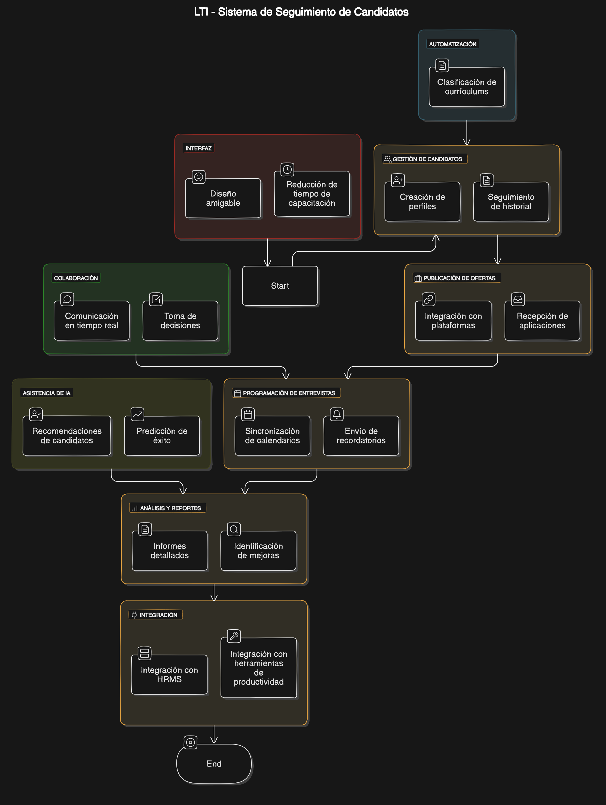
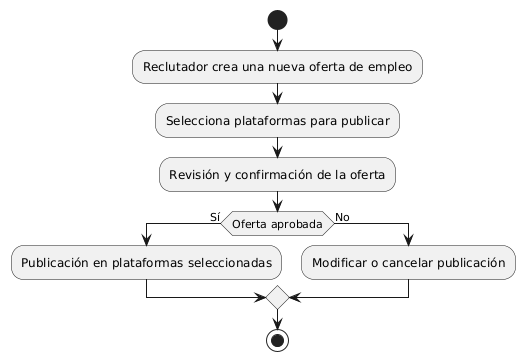
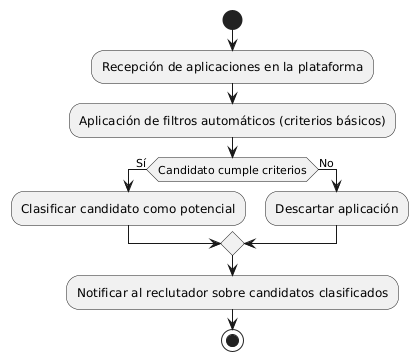
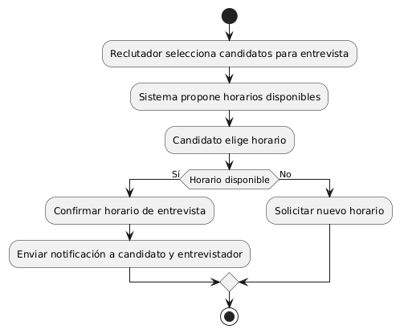
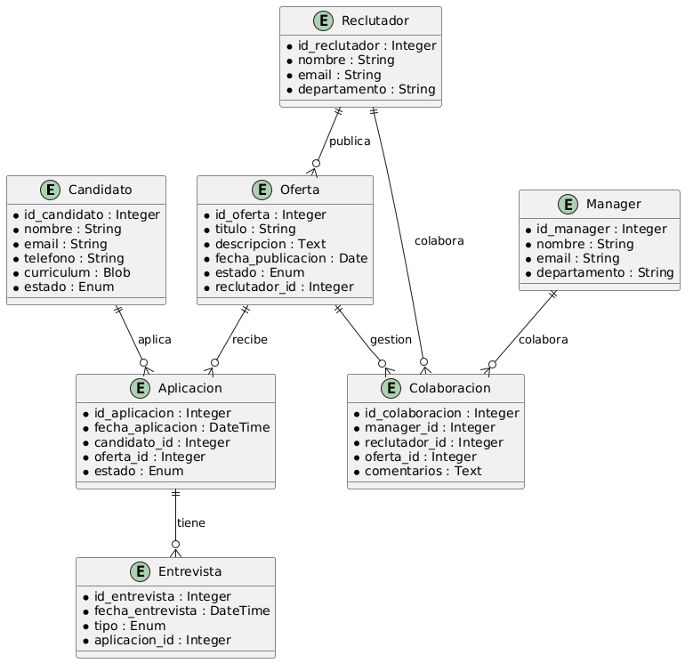
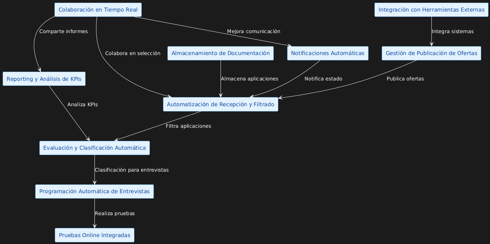
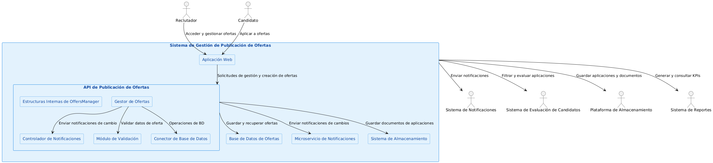

# LTI - Sistema de Seguimiento de Candidatos

## Descripción breve del software LTI
LTI es un sistema de seguimiento de candidatos (ATS) diseñado para optimizar los procesos de contratación en las empresas. Su objetivo es aumentar la eficiencia de los departamentos de recursos humanos mediante la automatización de tareas y la mejora de la colaboración en tiempo real entre reclutadores y managers.

## Valor añadido y ventajas competitivas
- **Automatización de tareas:** LTI automatiza tareas repetitivas como la clasificación de currículums y la programación de entrevistas, lo que permite a los reclutadores centrarse en actividades más estratégicas.
- **Colaboración en tiempo real:** Facilita la comunicación y colaboración entre los miembros del equipo de contratación, mejorando la toma de decisiones.
- **Asistencia de IA:** Utiliza inteligencia artificial para proporcionar recomendaciones sobre candidatos y predecir el éxito de las contrataciones.
- **Interfaz intuitiva:** Su diseño amigable y fácil de usar reduce el tiempo de capacitación y aumenta la adopción por parte de los usuarios.

## Funciones principales
- **Gestión de candidatos:** Permite la creación y seguimiento de perfiles de candidatos, incluyendo historial de entrevistas y evaluaciones.
- **Publicación de ofertas de empleo:** Integra con múltiples plataformas de empleo para publicar ofertas y recibir aplicaciones directamente en el sistema.
- **Programación de entrevistas:** Automatiza la programación de entrevistas, sincronizando calendarios y enviando recordatorios.
- **Análisis y reportes:** Proporciona informes detallados sobre el proceso de contratación, ayudando a identificar áreas de mejora.
- **Integración con otras herramientas:** Se integra con sistemas de gestión de recursos humanos (HRMS) y otras herramientas de productividad.

### Casos de uso:

## Publicación y Gestión de Ofertas de Empleo

**Descripción:** Este caso de uso permite a los reclutadores crear, publicar y gestionar ofertas de empleo en múltiples plataformas desde una única interfaz. La herramienta simplifica el proceso de publicación y asegura que las vacantes tengan mayor visibilidad en las bolsas de empleo, redes sociales y sitios web de la empresa.

**Impacto:** Aumenta la visibilidad de las vacantes, optimiza la gestión de publicaciones y mejora el alcance, atrayendo un mayor número de candidatos potenciales.

## Automatización de Recepción y Filtrado de Aplicaciones

**Descripción:** Este caso de uso permite al sistema centralizar las solicitudes de empleo y aplicar filtros automáticos basados en criterios específicos, descartando automáticamente a los candidatos que no cumplen con los requisitos mínimos.

**Impacto:** Reduce significativamente el tiempo que los reclutadores dedican a revisar aplicaciones no cualificadas y permite concentrarse en los candidatos que cumplen con los requisitos básicos, agilizando la primera fase de selección.

## Programación Automática de Entrevistas

**Descripción:** Este caso de uso permite al sistema coordinar y agendar entrevistas con candidatos de forma automática, enviando notificaciones tanto a los candidatos como a los entrevistadores, y minimizando la necesidad de intervención humana en esta tarea.

**Impacto:** Optimiza la coordinación del proceso de entrevistas, evitando confusiones de horarios y liberando tiempo de los reclutadores para que puedan enfocarse en otras tareas clave del proceso de selección.

### Modelo de datos

### Diseño a alto nivel 

**Gestión de Publicación de Ofertas:** Facilita la creación de ofertas de empleo y su publicación en múltiples plataformas (bolsas de trabajo, redes sociales, sitios web de la empresa). Permite gestionar todo desde una única interfaz y asegura mayor visibilidad de las vacantes.

**Automatización de Recepción y Filtrado de Aplicaciones:** Recoge todas las aplicaciones en un solo lugar y utiliza filtros y criterios automáticos para descartar aplicaciones no calificadas, ayudando a los reclutadores a centrarse en los candidatos más adecuados.

**Evaluación y Clasificación Automática de Candidatos (con IA):** Utiliza algoritmos de inteligencia artificial para analizar el currículum y otros datos de los candidatos, clasificándolos en función de su compatibilidad con el puesto, lo que agiliza la selección inicial.

**Programación Automática de Entrevistas:** Permite coordinar y agendar entrevistas directamente desde el sistema, con notificaciones automáticas para candidatos y entrevistadores, reduciendo la necesidad de coordinación manual.

**Pruebas Online Integradas:** Ofrece la opción de administrar pruebas y evaluaciones en línea para los candidatos, con integración automática de los resultados en su perfil.

**Colaboración en Tiempo Real para Reclutadores y Managers:** Facilita la comunicación y la colaboración en tiempo real entre los reclutadores y los responsables de contratación, permitiendo comentarios, calificaciones y revisiones en el sistema.

**Almacenamiento y Seguimiento de Documentación de Candidatos:** Organiza toda la documentación relevante de los candidatos en un solo lugar, con seguimiento de cualquier cambio o actualización, asegurando un fácil acceso a la información en cada etapa del proceso.

**Notificaciones y Actualizaciones Automáticas para los Candidatos:** Mantiene a los candidatos informados de su estado a través de notificaciones automáticas, mejorando la experiencia del candidato y reduciendo la carga de comunicación para el equipo de RRHH.

**Reporting y Análisis de KPIs de Contratación:** Proporciona informes detallados y métricas clave (como tiempo de contratación, tasa de retención, y fuentes de candidatos) para ayudar a mejorar continuamente el proceso de reclutamiento.

**Integración con Herramientas Externas y Sistemas de RRHH:** Facilita la integración con sistemas de RRHH y otras herramientas, como CRMs o software de nómina, para centralizar la gestión de empleados desde la contratación hasta la administración.

### Diagrama C4

