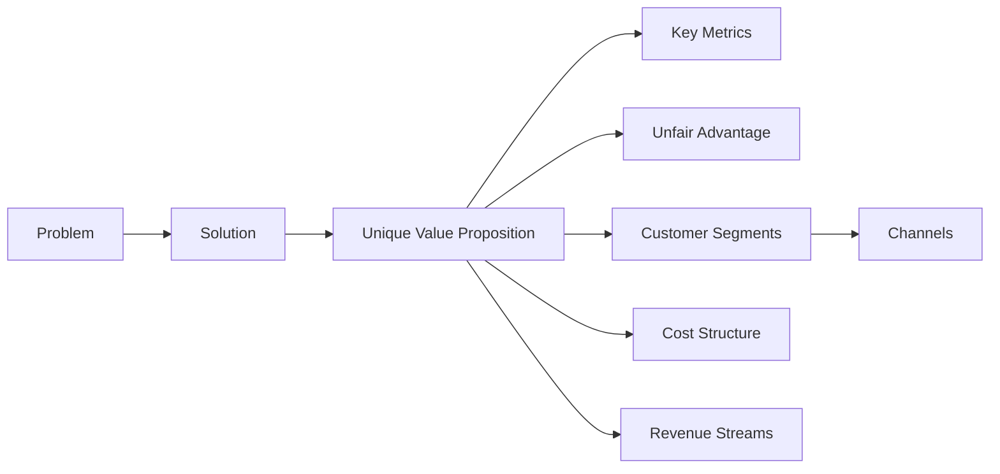
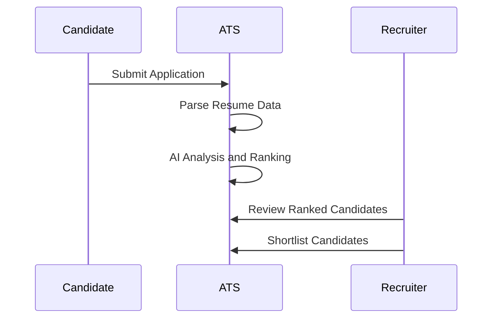
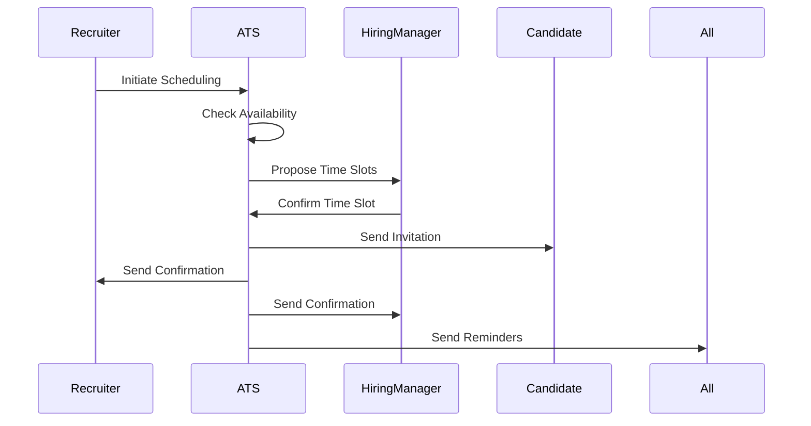
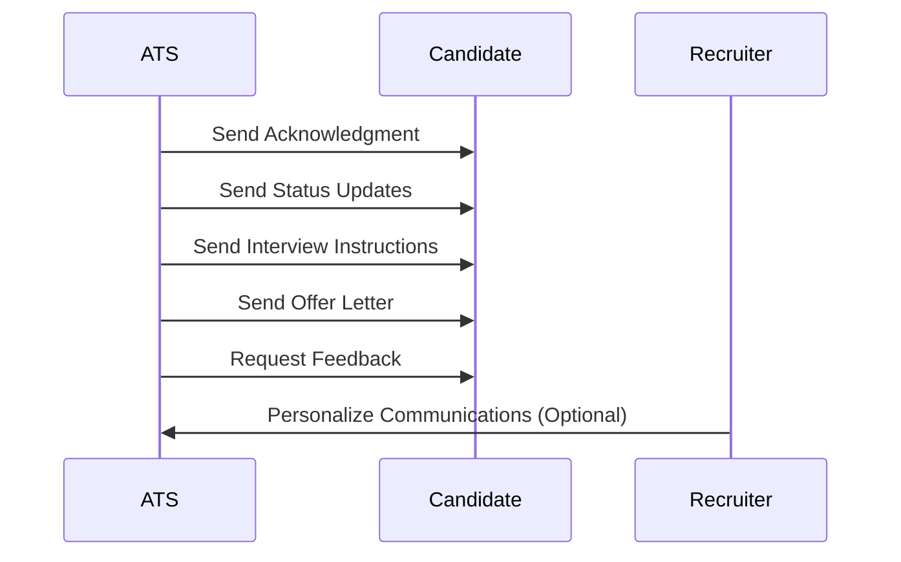

LTI Applicant Tracking System (ATS) Documentation

Table of Contents

	1.	Software Description
	•	Added Value and Advantages
	•	Main Features
	•	Lean Canvas Diagram
	2.	Main Use Cases
	•	Use Case 1: AI-Powered Candidate Screening
	•	Use Case 2: Collaborative Interview Scheduling
	•	Use Case 3: Automated Candidate Communication
	3.	Data Model
	•	Entities and Attributes
	•	Relationships Between Entities
	4.	High-Level System Design
	•	System Architecture Components
	•	Component Interaction Flow
	5.	C4 Model Diagrams
	•	Level 1: System Context Diagram
	•	Level 2: Container Diagram

Software Description

LTI is an innovative Applicant Tracking System (ATS) designed specifically for medium-sized businesses. It leverages advanced AI data analysis to streamline the recruitment process, enhance HR efficiency, and foster real-time collaboration between recruiters and hiring managers. By automating routine tasks and providing insightful analytics, LTI empowers organizations to make faster and more informed hiring decisions.

Added Value and Advantages

	•	AI-Powered Applicant Screening: Utilizes machine learning algorithms to analyze resumes and rank candidates based on fit, significantly reducing manual screening time.
	•	Real-Time Collaboration Tools: Offers integrated communication platforms that allow recruiters and hiring managers to share feedback, schedule interviews, and make collective decisions swiftly.
	•	Automation of Routine Tasks: Automates scheduling, follow-ups, and notifications, freeing up HR professionals to focus on strategic activities.
	•	User-Friendly Interface: Designed with simplicity in mind, ensuring quick adoption and minimal training for users.
	•	Advanced Analytics and Reporting: Provides actionable insights through customizable dashboards, helping organizations track key recruitment metrics and optimize their processes.
	•	Scalability and Integration: Easily integrates with existing HR systems and scales with the growing needs of a business.

Main Features

	1.	AI Resume Parsing and Candidate Ranking
	2.	Collaborative Workspace for Recruiters and Managers
	3.	Automated Communication and Scheduling
	4.	Customizable Recruitment Pipelines
	5.	Real-Time Analytics and Reporting Dashboards
	6.	Mobile Accessibility
	7.	Integration with Job Boards and Social Platforms
	8.	Compliance and Data Security Features

Lean Canvas Diagram



Problem

	•	Time-consuming manual screening of applicants.
	•	Lack of efficient collaboration between recruiters and hiring managers.
	•	Inefficiencies due to repetitive administrative tasks.

Solution

	•	Implement AI for initial screening and candidate ranking.
	•	Provide a platform for real-time communication and collaboration.
	•	Automate administrative tasks like scheduling and notifications.

Key Metrics

	•	Reduction in time-to-fill positions.
	•	Increase in recruiter and manager productivity.
	•	User engagement rates within the platform.

Unique Value Proposition

	“Accelerate your hiring process with AI-driven insights and seamless collaboration.”

Unfair Advantage

	•	Proprietary AI algorithms tailored for medium-sized business recruitment challenges.
	•	Deep integration capabilities with popular HR tools and platforms.

Customer Segments

	•	HR departments of medium-sized businesses across various industries seeking efficiency and modernization.

Channels

	•	Direct sales and onboarding.
	•	Partnerships with HR consultancies and tech providers.
	•	Online marketing campaigns and webinars.

Cost Structure

	•	Development and maintenance of the platform.
	•	AI infrastructure and data processing costs.
	•	Marketing, sales, and customer support expenses.

Revenue Streams

	•	Subscription-based model with tiered pricing.
	•	Additional fees for premium features or add-ons.
	•	Possible integration and customization services.

Main Use Cases

Use Case 1: AI-Powered Candidate Screening

Objective: Automate the initial screening process to quickly identify top candidates using AI algorithms.

Actors: Candidate, Recruiter

Flow:

	1.	Candidate Submits Application: Candidate applies for a job via the portal.
	2.	System Parses Application: ATS parses the resume and extracts data.
	3.	AI Analysis and Ranking: AI analyzes data and ranks candidates.
	4.	Recruiter Reviews Ranked Candidates: Recruiter reviews AI-ranked list.
	5.	Recruiter Shortlists Candidates: Recruiter selects candidates for the next stage.

Diagram:



Use Case 2: Collaborative Interview Scheduling

Objective: Streamline the interview scheduling process by facilitating real-time collaboration.

Actors: Recruiter, Hiring Manager, Candidate

Flow:

	1.	Recruiter Initiates Scheduling: Proposes interview slots.
	2.	System Checks Availability: Syncs calendars and suggests times.
	3.	Collaborative Selection: Recruiter and manager select time.
	4.	Automated Invitations: System sends invites to candidate and participants.
	5.	Notifications and Reminders: System sends reminders.

Diagram:



Use Case 3: Automated Candidate Communication

Objective: Enhance candidate engagement by automating communications.

Actors: Candidate, Recruiter

Flow:

	1.	Application Acknowledgment: System sends acknowledgment.
	2.	Status Updates: System sends updates at each stage.
	3.	Interview Instructions: System sends interview details.
	4.	Offer Communication: System sends offer letter.
	5.	Feedback Requests: System requests feedback from candidate.

Diagram:



Data Model

Entities and Attributes

	1.	User
	•	UserID (UUID, PK)
	•	FirstName (String)
	•	LastName (String)
	•	Email (String)
	•	PasswordHash (String)
	•	Role (Enum)
	•	PhoneNumber (String)
	•	Department (String)
	•	CreatedAt (Datetime)
	•	UpdatedAt (Datetime)
	2.	Candidate
	•	CandidateID (UUID, PK)
	•	FirstName (String)
	•	LastName (String)
	•	Email (String)
	•	PhoneNumber (String)
	•	ResumeID (UUID, FK)
	•	CreatedAt (Datetime)
	•	UpdatedAt (Datetime)
	3.	Resume
	•	ResumeID (UUID, PK)
	•	CandidateID (UUID, FK)
	•	FileURL (String)
	•	ParsedData (JSON)
	•	UploadedAt (Datetime)
	•	UpdatedAt (Datetime)
	4.	JobPosting
	•	JobID (UUID, PK)
	•	Title (String)
	•	Description (Text)
	•	Department (String)
	•	Location (String)
	•	CreatedBy (UUID, FK)
	•	Status (Enum)
	•	CreatedAt (Datetime)
	•	UpdatedAt (Datetime)
	5.	Application
	•	ApplicationID (UUID, PK)
	•	CandidateID (UUID, FK)
	•	JobID (UUID, FK)
	•	AppliedAt (Datetime)
	•	Status (Enum)
	•	AIScore (Float)
	•	AIInsights (JSON)
	•	UpdatedAt (Datetime)
	6.	Interview
	•	InterviewID (UUID, PK)
	•	ApplicationID (UUID, FK)
	•	ScheduledAt (Datetime)
	•	InterviewType (Enum)
	•	Location (String)
	•	CreatedBy (UUID, FK)
	•	Status (Enum)
	•	CreatedAt (Datetime)
	•	UpdatedAt (Datetime)
	7.	Feedback
	•	FeedbackID (UUID, PK)
	•	InterviewID (UUID, FK)
	•	ReviewerID (UUID, FK)
	•	Comments (Text)
	•	Rating (Integer)
	•	CreatedAt (Datetime)
	8.	Notification
	•	NotificationID (UUID, PK)
	•	UserID (UUID, FK)
	•	Message (Text)
	•	IsRead (Boolean)
	•	CreatedAt (Datetime)
	9.	CalendarEvent
	•	EventID (UUID, PK)
	•	InterviewID (UUID, FK)
	•	Participants (Array of UUIDs)
	•	StartTime (Datetime)
	•	EndTime (Datetime)
	•	Location (String)
	•	CreatedAt (Datetime)
	•	UpdatedAt (Datetime)
	10.	Message
	•	MessageID (UUID, PK)
	•	SenderID (UUID, FK)
	•	RecipientID (UUID, FK)
	•	Content (Text)
	•	SentAt (Datetime)
	•	IsRead (Boolean)
	11.	AIAnalysis
	•	AnalysisID (UUID, PK)
	•	ApplicationID (UUID, FK)
	•	Score (Float)
	•	Insights (JSON)
	•	AnalyzedAt (Datetime)

Relationships Between Entities

```mermaid
erDiagram
User ||–o{ JobPosting : creates
User ||–o{ Interview : schedules
User ||–o{ Feedback : provides
User ||–o{ Notification : receives
User ||–o{ Message : sends/receives
Candidate ||–o{ Application : submits
Candidate ||–|| Resume : has
Candidate ||–o{ Interview : attends
Candidate ||–o{ Message : sends/receives
Application ||–|| JobPosting : relates
Application ||–o{ Interview : has
Application ||–|| AIAnalysis : generates
Interview ||–o{ Feedback : has
Interview ||–|| CalendarEvent : scheduled in
```

High-Level System Design

System Architecture Components

	1.	User Interface (UI)
	•	Web Application
	•	Mobile Application
	2.	API Layer
	•	RESTful API
	•	Authentication & Authorization
	3.	Business Logic Layer
	•	Application Management Module
	•	Interview Scheduling Module
	•	Communication Module
	•	Collaboration Module
	4.	AI Services
	•	Resume Parsing Service
	•	Candidate Scoring Service
	•	Analytics and Reporting Service
	5.	Data Storage Layer
	•	Relational Database
	•	NoSQL Database
	•	File Storage
	6.	Integration Layer
	•	Calendar Integration
	•	Email and Messaging Services
	•	Third-Party Services
	7.	Security Layer
	•	Data Encryption
	•	Compliance Management
	8.	Infrastructure Layer
	•	Cloud Services
	•	Load Balancing and Scaling
	•	Monitoring and Logging

Component Interaction Flow

Diagram:

```mermaid
flowchart TD
subgraph UI
A1[Web Application]
A2[Mobile Application]
end
subgraph API Layer
B[RESTful API]
end
subgraph Business Logic Layer
C1[Application Management]
C2[Interview Scheduling]
C3[Communication Module]
C4[Collaboration Module]
end
subgraph AI Services
D1[Resume Parsing]
D2[Candidate Scoring]
D3[Analytics & Reporting]
end
subgraph Data Storage Layer
E1[Relational Database]
E2[NoSQL Database]
E3[File Storage]
end
subgraph Integration Layer
F1[Calendar Integration]
F2[Email Services]
F3[Third-Party Services]
end
UI –> API Layer
API Layer –> Business Logic Layer
Business Logic Layer –> Data Storage Layer
Business Logic Layer –> AI Services
Business Logic Layer –> Integration Layer
AI Services –> Data Storage Layer
Integration Layer –> External[External Systems]
```

C4 Model Diagrams

Level 1: System Context Diagram

Diagram:

```mermaid
flowchart TD
subgraph LTI ATS
A[Applicant Tracking System]
end
Users[Recruiters & Hiring Managers] –> A
Candidates[Candidates] –> A
A –> Email[Email Servers]
A –> Calendar[Calendar Systems]
A –> JobBoards[Job Boards]
A –> HRSystems[HR Systems]
```

Level 2: Container Diagram

Diagram:

```mermaid
flowchart TD
subgraph LTI ATS
subgraph UI
A1[Web Application]
A2[Candidate Portal]
end
B[API Server]
subgraph Services
C1[Business Logic Services]
C2[AI Services]
C3[Integration Services]
end
D1[Relational Database]
D2[NoSQL Database]
D3[File Storage Service]
end
A1 –> B
A2 –> B
B –> C1
C1 –> D1
C1 –> C2
C2 –> D2
C2 –> D3
C1 –> C3
C3 –> External[External Systems]
```