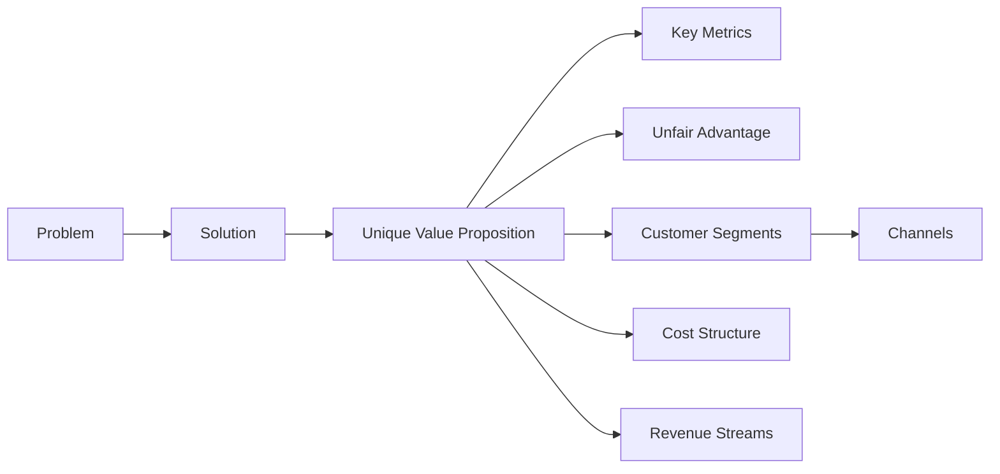
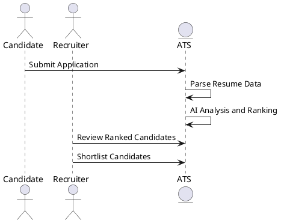
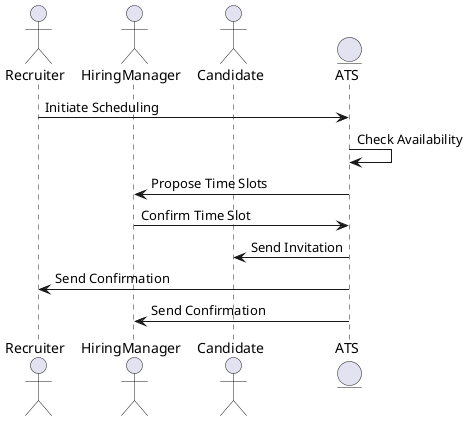
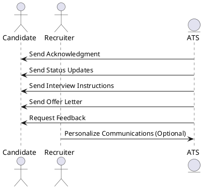
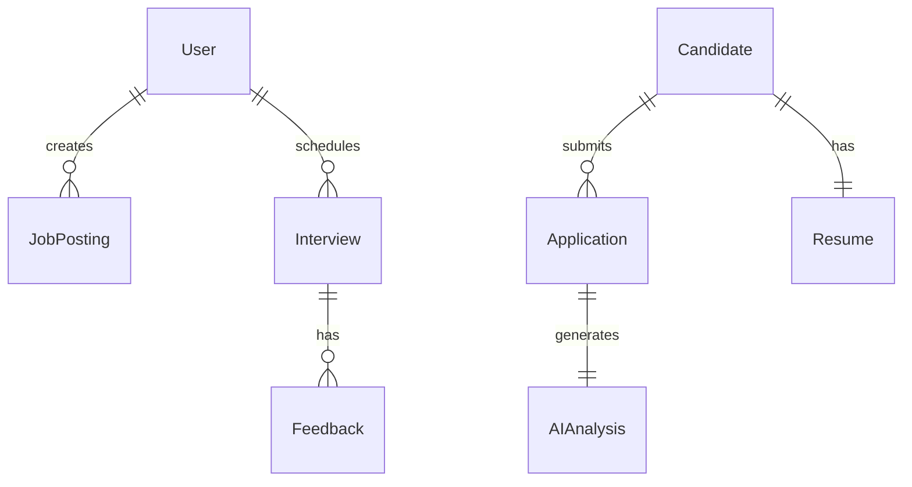
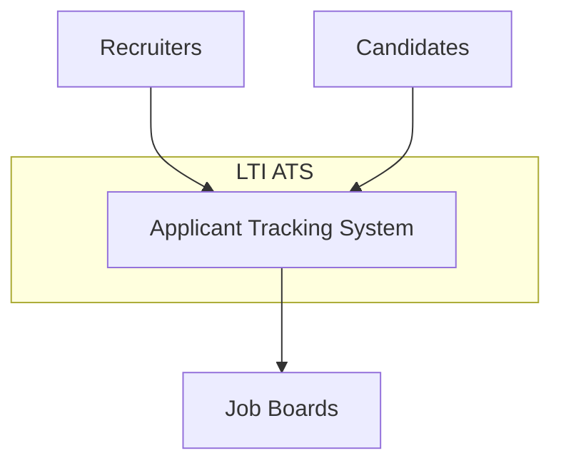
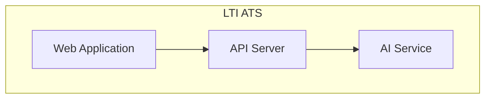

# **LTI Applicant Tracking System (ATS) Documentation**

## **Table of Contents**

- [**LTI Applicant Tracking System (ATS) Documentation**](#lti-applicant-tracking-system-ats-documentation)
  - [**Table of Contents**](#table-of-contents)
  - [**Software Description**](#software-description)
    - [**Added Value and Advantages**](#added-value-and-advantages)
    - [**Main Features**](#main-features)
    - [**Lean Canvas Diagram**](#lean-canvas-diagram)
      - [**Problem**](#problem)
      - [**Solution**](#solution)
      - [**Key Metrics**](#key-metrics)
      - [**Unique Value Proposition**](#unique-value-proposition)
      - [**Unfair Advantage**](#unfair-advantage)
      - [**Customer Segments**](#customer-segments)
      - [**Channels**](#channels)
      - [**Cost Structure**](#cost-structure)
      - [**Revenue Streams**](#revenue-streams)
  - [**Main Use Cases**](#main-use-cases)
    - [**Use Case 1: AI-Powered Candidate Screening**](#use-case-1-ai-powered-candidate-screening)
    - [**Use Case 2: Collaborative Interview Scheduling**](#use-case-2-collaborative-interview-scheduling)
    - [**Use Case 3: Automated Candidate Communication**](#use-case-3-automated-candidate-communication)
  - [**Data Model**](#data-model)
    - [**Relationships Between Entities**](#relationships-between-entities)
  - [**C4 Model Diagrams**](#c4-model-diagrams)
    - [**Level 1: System Context Diagram**](#level-1-system-context-diagram)
    - [**Level 2: Container Diagram**](#level-2-container-diagram)

---

## **Software Description**

LTI is an innovative Applicant Tracking System (ATS) designed specifically for medium-sized businesses. It leverages advanced AI data analysis to streamline the recruitment process, enhance HR efficiency, and foster real-time collaboration between recruiters and hiring managers. By automating routine tasks and providing insightful analytics, LTI empowers organizations to make faster and more informed hiring decisions.

### **Added Value and Advantages**

- **AI-Powered Applicant Screening**: Utilizes machine learning algorithms to analyze resumes and rank candidates based on fit, significantly reducing manual screening time.

- **Real-Time Collaboration Tools**: Offers integrated communication platforms that allow recruiters and hiring managers to share feedback, schedule interviews, and make collective decisions swiftly.

- **Automation of Routine Tasks**: Automates scheduling, follow-ups, and notifications, freeing up HR professionals to focus on strategic activities.

- **User-Friendly Interface**: Designed with simplicity in mind, ensuring quick adoption and minimal training for users.

- **Advanced Analytics and Reporting**: Provides actionable insights through customizable dashboards, helping organizations track key recruitment metrics and optimize their processes.

- **Scalability and Integration**: Easily integrates with existing HR systems and scales with the growing needs of a business.

### **Main Features**

1. **AI Resume Parsing and Candidate Ranking**
2. **Collaborative Workspace for Recruiters and Managers**
3. **Automated Communication and Scheduling**
4. **Customizable Recruitment Pipelines**
5. **Real-Time Analytics and Reporting Dashboards**
6. **Mobile Accessibility**
7. **Integration with Job Boards and Social Platforms**
8. **Compliance and Data Security Features**

### **Lean Canvas Diagram**

#### **Problem**

- Time-consuming manual screening of applicants.
- Lack of efficient collaboration between recruiters and hiring managers.
- Inefficiencies due to repetitive administrative tasks.

#### **Solution**

- Implement AI for initial screening and candidate ranking.
- Provide a platform for real-time communication and collaboration.
- Automate administrative tasks like scheduling and notifications.

#### **Key Metrics**

- Reduction in time-to-fill positions.
- Increase in recruiter and manager productivity.
- User engagement rates within the platform.

#### **Unique Value Proposition**

> **"Accelerate your hiring process with AI-driven insights and seamless collaboration."**

#### **Unfair Advantage**

- Proprietary AI algorithms tailored for medium-sized business recruitment challenges.
- Deep integration capabilities with popular HR tools and platforms.

#### **Customer Segments**

- HR departments of medium-sized businesses across various industries seeking efficiency and modernization.

#### **Channels**

- Direct sales and onboarding.
- Partnerships with HR consultancies and tech providers.
- Online marketing campaigns and webinars.

#### **Cost Structure**

- Development and maintenance of the platform.
- AI infrastructure and data processing costs.
- Marketing, sales, and customer support expenses.

#### **Revenue Streams**

- Subscription-based model with tiered pricing.
- Additional fees for premium features or add-ons.
- Possible integration and customization services.

---

## **Main Use Cases**

### **Use Case 1: AI-Powered Candidate Screening**

### **Use Case 2: Collaborative Interview Scheduling**

### **Use Case 3: Automated Candidate Communication**

---

## **Data Model**

### **Relationships Between Entities**

---

## **C4 Model Diagrams**

### **Level 1: System Context Diagram**

### **Level 2: Container Diagram**

