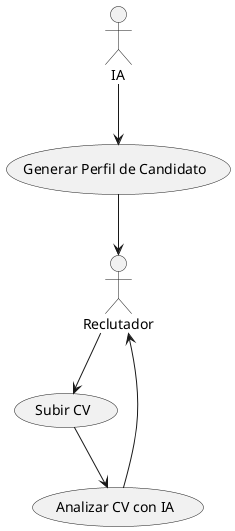
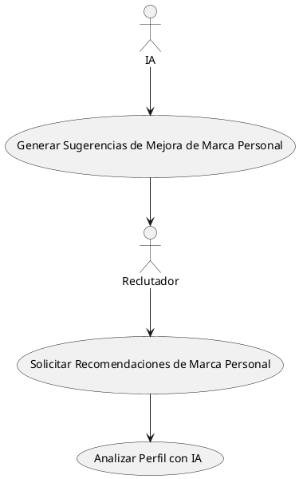
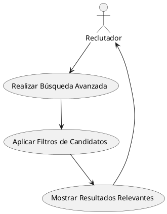
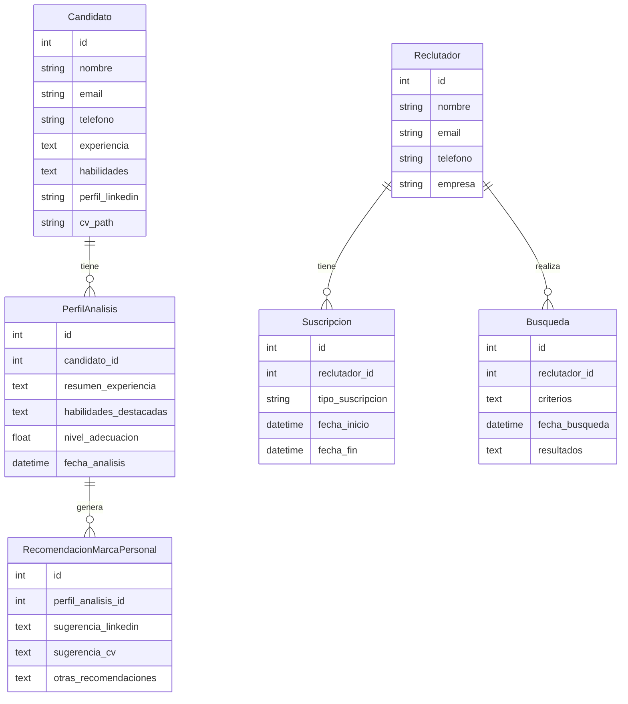
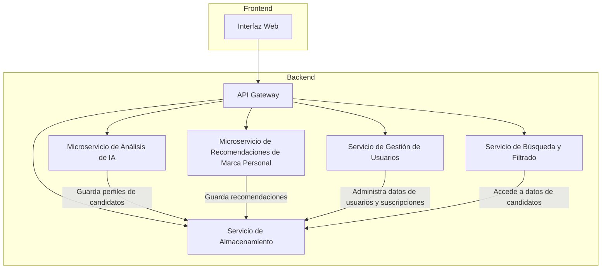
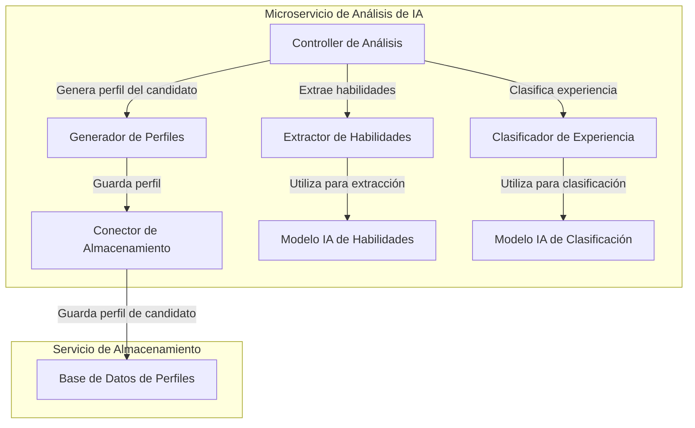

# Descripción breve del software
   Este ATS está diseñado específicamente para consultoras de reclutamiento en el sector TI, integrando IA avanzada para diferenciarse en el mercado. Su valor añadido radica en la capacidad de analizar y mejorar los perfiles de candidatos mediante IA. Esto incluye análisis de CV y recomendaciones personalizadas para optimizar la marca personal de los candidatos, permitiendo a las consultoras ofrecer un servicio más completo y diferenciador a sus clientes.

## 1. Ventajas Competitivas:

**IA para análisis de CV:** Permite detectar habilidades, experiencia, y potencial del candidato de forma automática, mejorando la precisión de las recomendaciones de candidatos para roles específicos.

**Mejoras en marca personal:** Ofrece a los candidatos sugerencias para optimizar su perfil profesional y visibilidad, brindando un valor añadido significativo, especialmente en el nivel de suscripción Premium.

**Modelo de pago por uso:** Acceso flexible y asequible para consultoras, con dos niveles de suscripción (Estandar y Premium) que cubren las diferentes necesidades de cada cliente.


   ```mermaid
flowchart TD
  Problem[Problemas]
  Solution[Solución]
  Key_Metrics[Métricas Clave]
  Unique_Value[Propuesta Única de Valor]
  Unfair_Advantage[Ventaja Injusta]
  Channels[Canales]
  Customer_Segments[Segmentos de Clientes]
  Cost_Structure[Estructura de Costos]
  Revenue_Streams[Flujos de Ingresos]

  Problem --> Solution
  Solution --> Unique_Value
  Key_Metrics --> Channels
  Customer_Segments --> Channels
  Unfair_Advantage --> Unique_Value
  Cost_Structure --> Revenue_Streams

  Problem --> Customer_Segments
  Key_Metrics --> Cost_Structure
  Revenue_Streams --> Solution

  Problem --> Problem_Desc[Identificación de candidatos adecuados, mejora de perfiles]
  Solution --> Solution_Desc[ATS con IA para análisis y recomendaciones personalizadas]
  Key_Metrics --> Metrics[Retención de usuarios, tasa de uso de análisis]
  Unique_Value --> Unique_Value_Desc[Análisis de CV y marca personal basado en IA]
  Unfair_Advantage --> Advantage_Desc[Algoritmo de IA patentado para mejorar perfiles]
  Channels --> DirectSales[Ventas directas a consultoras TI]
  Channels --> Referrals[Referencias y alianzas estratégicas]
  Customer_Segments --> Segment[Consultoras de TI y reclutamiento especializado]
  Cost_Structure --> Structure[Desarrollo, infraestructura de IA, soporte]
  Revenue_Streams --> Streams[Modelo de pago por uso, niveles Estandar y Premium]
   ```
## 2. Casos de Uso: 
### Caso de Uso 1: Análisis de CV con IA
**Descripción:**
El reclutador sube el CV de un candidato al sistema. La IA procesa el documento, extrayendo habilidades clave, experiencia, y tecnologías relevantes. Luego, el sistema genera un perfil detallado del candidato, destacando su adecuación a roles específicos en TI. Esta función está disponible para usuarios con suscripciones Estandar y Premium.




### Caso de Uso 2: Recomendaciones de Marca Personal para Candidatos
**Descripción:** Al analizar el perfil de un candidato, el sistema también genera recomendaciones para mejorar su marca personal, tales como sugerencias para su LinkedIn o mejoras en su CV. Esta función está disponible solo para usuarios con suscripción Premium. Ayuda a los candidatos a destacarse en el mercado laboral y a incrementar sus posibilidades de ser seleccionados.




### Caso de Uso 3: Búsqueda y Filtrado Avanzado de Candidatos
**Descripción:** El reclutador realiza una búsqueda avanzada en la base de datos de candidatos, aplicando filtros específicos como habilidades, experiencia y nivel de adecuación al perfil deseado. Este proceso facilita encontrar candidatos con perfiles especializados de manera rápida y efectiva, optimizando el tiempo del reclutador y aumentando la precisión en las recomendaciones.




## 3. Modelo de Datos:
### Entidades y Atributos
- **Candidato:** Representa a cada candidato en la base de datos.
*Atributos:* id, nombre, email, telefono, experiencia, habilidades, perfil_linkedin, cv_path.

- **PerfilAnalisis:** Contiene el análisis generado por la IA para cada candidato.
*Atributos:* id, candidato_id, resumen_experiencia, habilidades_destacadas, nivel_adecuacion, fecha_analisis.

- **RecomendacionMarcaPersonal:** Representa recomendaciones de mejora de perfil.
*Atributos:* id, perfil_analisis_id, sugerencia_linkedin, sugerencia_cv, otras_recomendaciones

- **Suscripcion:** Almacena la información de la suscripción del reclutador.
*Atributos:* id, reclutador_id, tipo_suscripcion, fecha_inicio, fecha_fin.

- **Reclutador:** Representa a los usuarios (reclutadores) que utilizan el sistema.
*Atributos:* id, nombre, email, telefono, empresa.

- **Busqueda:** Guarda las búsquedas avanzadas realizadas por el reclutador.
*Atributos:* id, reclutador_id, criterios, fecha_busqueda, resultados.

### Relaciones
- **Candidato** tiene una relación de uno a muchos con **PerfilAnalisis:** Un candidato puede tener múltiples análisis de perfil.
- **PerfilAnalisis** tiene una relación de uno a muchos con **RecomendacionMarcaPersonal:** Cada análisis de perfil puede generar múltiples recomendaciones de marca personal.
- **Reclutador** tiene una relación de uno a muchos con **Suscripcion:** Cada reclutador puede tener una o más suscripciones activas o históricas.
- **Reclutador** también tiene una relación de uno a muchos con **Busqueda:** Cada reclutador puede realizar múltiples búsquedas de candidatos.

Diagrama de Modelo de Datos (PlantUML)
Aquí tienes el diagrama de modelo de datos en formato PlantUML:



## 4. Diseño Alto Nivel

Componentes del Sistema
Frontend (Interfaz de Usuario): La interfaz web que usan los reclutadores para interactuar con el ATS. Permite subir CVs, gestionar búsquedas avanzadas, visualizar análisis y recomendaciones, y administrar suscripciones.

API Gateway: Actúa como punto de entrada, gestionando todas las solicitudes provenientes del frontend y redirigiéndolas a los servicios adecuados del backend. También maneja la autenticación y autorizaciones de usuarios.

Microservicio de Análisis de IA: Contiene los algoritmos de inteligencia artificial encargados de analizar los CVs, extraer habilidades y generar el perfil detallado de los candidatos. Incluye capacidades de procesamiento y recomendación basadas en IA.

Microservicio de Recomendaciones de Marca Personal: Este servicio procesa los perfiles y ofrece sugerencias de mejora en la marca personal de los candidatos. Se activa para usuarios con suscripción Premium.

Servicio de Gestión de Usuarios: Se encarga de gestionar los datos de los reclutadores, incluyendo su perfil y suscripciones, y facilita el acceso al sistema.

Servicio de Almacenamiento: Almacena la información estructurada de candidatos, perfiles de análisis, recomendaciones, y búsquedas. También maneja archivos, como los CVs subidos por los reclutadores.

Servicio de Búsqueda y Filtrado: Permite realizar búsquedas avanzadas en la base de datos de candidatos aplicando filtros y criterios específicos.

Diagrama de Diseño de Sistema (PlantUML)
Aquí tienes el diagrama de diseño de sistema de alto nivel en formato PlantUML:



Este diseño modular facilita la escalabilidad, la actualización de cada componente de manera independiente, y el manejo de cargas de trabajo intensivas de IA en el análisis de CVs y recomendaciones.


## 5. Diagrama C4:

### Contexto del Componente: Microservicio de Análisis de IA
Este microservicio recibe los CVs subidos por los reclutadores a través del API Gateway. Una vez recibe un CV, el sistema lo analiza, extrae habilidades clave, experiencia, y otras características relevantes para el perfil TI. Al final, almacena el perfil generado en el Servicio de Almacenamiento para ser accesible por otros servicios.

#### Detalle del Componente
1. **Controller de Análisis:** Gestiona las solicitudes de análisis de CV, interactuando con los subcomponentes de procesamiento.

2. **Extractor de Habilidades:** Extrae habilidades y tecnologías clave mencionadas en el CV, basándose en un modelo entrenado.

3. **Clasificador de Experiencia:** Clasifica la experiencia del candidato según roles TI comunes (por ejemplo, desarrollador frontend, backend, etc.).

4. **Generador de Perfiles:** Ensambla los resultados en un perfil unificado que describe al candidato y sus competencias.

5. **Conector de Almacenamiento:** Interactúa con el Servicio de Almacenamiento para guardar el perfil generado.

Diagrama C4 (Nivel de Componente en PlantUML)
Aquí tienes el diagrama C4 de nivel de componente para el Microservicio de Análisis de IA en formato PlantUML:



### Explicación de los Subcomponentes:
1. **Controller de Análisis:** Punto de entrada que recibe las solicitudes de análisis de CV y coordina los subprocesos de extracción, clasificación y generación de perfil.
2. **Extractor de Habilidades:** Utiliza un modelo de IA entrenado para identificar habilidades técnicas en el CV.
3. **Clasificador de Experiencia:** Determina el tipo y nivel de experiencia del candidato basándose en roles comunes en TI.
4. **Generador de Perfiles:** Compone el perfil final del candidato con los datos procesados.
5. **Conector de Almacenamiento:** Encargado de guardar el perfil generado en la base de datos de perfiles para futuras consultas.

6. Este nivel de detalle permite ver cómo interactúan los componentes dentro del microservicio de Análisis de IA, resaltando la modularidad y la independencia de cada función.

