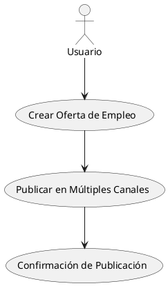
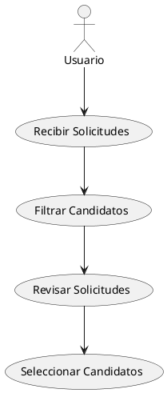
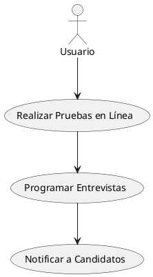

### Investigación De Mercado

### Funcionalidades básicas de un Sistema de Gestión de Candidatos (SGC)

1. **Gestión de ofertas de empleo**: Creación y publicación de ofertas de trabajo en diferentes plataformas.
2. **Seguimiento de candidatos**: Registro y seguimiento del estado de cada candidato a lo largo del proceso de selección.
3. **Base de datos de candidatos**: Almacenamiento y gestión de perfiles de candidatos, incluyendo currículums y documentos relevantes.
4. **Filtrado y búsqueda de candidatos**: Herramientas para filtrar y buscar candidatos según criterios específicos.
5. **Programación de entrevistas**: Funcionalidades para coordinar y programar entrevistas con los candidatos.
6. **Evaluación de candidatos**: Integración de pruebas y evaluaciones en línea para medir habilidades y competencias.
7. **Comunicación con candidatos**: Herramientas para enviar correos electrónicos y notificaciones a los candidatos.
8. **Informes y análisis**: Generación de informes sobre el proceso de reclutamiento y análisis de datos para mejorar la eficiencia.

### Beneficios para el cliente

- **Eficiencia en el proceso de reclutamiento**: Automatización de tareas repetitivas y reducción del tiempo de contratación.
- **Mejora en la calidad de las contrataciones**: Acceso a herramientas de evaluación y filtrado que ayudan a seleccionar a los mejores candidatos.
- **Centralización de la información**: Almacenamiento de todos los datos de candidatos en un solo lugar, facilitando el acceso y la gestión.
- **Mejor experiencia para el candidato**: Comunicación más fluida y procesos más claros para los candidatos.
- **Análisis y mejora continua**: Acceso a datos y métricas que permiten optimizar el proceso de selección.

### Alternativas a un Sistema de Gestión de Candidatos

- **Gestión manual**: Uso de hojas de cálculo y correos electrónicos para gestionar el proceso de selección. Puede ser relevante para pequeñas empresas con pocos procesos de contratación.
- **Agencias de reclutamiento**: Externalizar el proceso de selección a agencias especializadas. Útil cuando se busca ahorrar tiempo o se necesita experiencia especializada.
- **Software de gestión de recursos humanos (HRMS)**: Algunos sistemas HRMS incluyen módulos de reclutamiento que pueden ser suficientes para ciertas empresas.

### Customer Journey en un Sistema de Gestión de Candidatos

1. **Creación de cuenta**: El cliente se registra y configura su cuenta en el SGC.
2. **Configuración inicial**: Personalización del sistema según las necesidades de la empresa (campos de datos, permisos de usuario, etc.).
3. **Publicación de ofertas**: Creación y publicación de ofertas de empleo en diferentes plataformas.
4. **Recepción de aplicaciones**: Los candidatos aplican a las ofertas y sus datos se almacenan en el sistema.
5. **Filtrado y selección**: Uso de herramientas de filtrado para identificar a los candidatos más adecuados.
6. **Evaluación de candidatos**: Realización de pruebas y evaluaciones en línea.
7. **Programación de entrevistas**: Coordinación de entrevistas con los candidatos seleccionados.
8. **Decisión de contratación**: Selección de los candidatos finales y gestión de la oferta de empleo.
9. **Incorporación**: Integración de los nuevos empleados en el sistema de la empresa.

### Sistemas de Gestión de Candidatos Open Source más conocidos

- **OpenCATS**: Un sistema de gestión de candidatos de código abierto que ofrece funcionalidades básicas de reclutamiento.
- **CiviHR**: Aunque es más un sistema de gestión de recursos humanos, incluye funcionalidades de reclutamiento.

### Sistemas de Gestión de Candidatos Comerciales más conocidos

1. **Greenhouse**
   - **Creating Jobs**: Muy intuitivo y flexible.
   - **Jobs Published**: Amplia integración con plataformas de empleo.
   - **Job Applications Received**: Gestión eficiente de aplicaciones.
   - **Applications are Reviewed**: Herramientas avanzadas de revisión.
   - **Online Tests**: Integración con plataformas de evaluación.
   - **Interviews are Scheduled**: Funcionalidades robustas de programación.
   - **Selected Applicants are Hired**: Proceso de contratación bien integrado.

2. **Lever**
   - **Creating Jobs**: Fácil de usar y personalizar.
   - **Jobs Published**: Buenas opciones de publicación.
   - **Job Applications Received**: Flujo de trabajo eficiente.
   - **Applications are Reviewed**: Herramientas colaborativas.
   - **Online Tests**: Integración con herramientas de evaluación.
   - **Interviews are Scheduled**: Programación sencilla.
   - **Selected Applicants are Hired**: Proceso de contratación fluido.

3. **Workable**
   - **Creating Jobs**: Proceso simplificado.
   - **Jobs Published**: Amplia distribución de ofertas.
   - **Job Applications Received**: Gestión centralizada.
   - **Applications are Reviewed**: Herramientas de colaboración.
   - **Online Tests**: Integración con pruebas en línea.
   - **Interviews are Scheduled**: Funcionalidades de programación.
   - **Selected Applicants are Hired**: Proceso de contratación integrado.

**Mejor opción**: La elección depende de las necesidades específicas de la empresa. Greenhouse es ideal para empresas que buscan una solución completa y flexible, mientras que Lever es excelente para equipos que valoran la colaboración. Workable es una buena opción para empresas que buscan simplicidad y eficiencia.

### Lean Canvas para LTI - Sistema ATS

1. **Problema**
   - Procesos de reclutamiento ineficientes y desorganizados.
   - Dificultad para gestionar múltiples canales de publicación de empleos.
   - Falta de herramientas integradas para evaluar y seleccionar candidatos.

2. **Segmento de Clientes**
   - Pequeñas y medianas empresas (PYMES) que buscan optimizar su proceso de reclutamiento.
   - Departamentos de recursos humanos que necesitan una solución centralizada.
   - Startups que requieren un sistema ágil y flexible para la contratación.

3. **Propuesta de Valor**
   - Sistema centralizado que simplifica y automatiza el proceso de reclutamiento.
   - Integración con múltiples plataformas de publicación de empleos.
   - Herramientas de evaluación y programación de entrevistas integradas.

4. **Solución**
   - Plataforma que permite la creación y publicación de empleos en diversos canales.
   - Recepción y gestión eficiente de solicitudes de empleo.
   - Funcionalidades para realizar pruebas en línea y programar entrevistas.
   - Proceso de contratación integrado y simplificado.

5. **Canales**
   - Plataforma web accesible desde cualquier dispositivo.
   - Integración con redes sociales y bolsas de trabajo.
   - Marketing digital y redes sociales para atraer clientes.

6. **Flujo de Ingresos**
   - Suscripción mensual o anual para el uso del sistema.
   - Tarifas adicionales por funcionalidades premium o personalización.

7. **Estructura de Costos**
   - Desarrollo y mantenimiento de la plataforma.
   - Costos de marketing y adquisición de clientes.
   - Soporte al cliente y actualizaciones del sistema.

8. **Métricas Clave**
   - Número de empleos creados y publicados.
   - Tasa de conversión de candidatos a empleados.
   - Tiempo promedio de contratación.
   - Satisfacción del cliente y retención de usuarios.

9. **Ventaja Competitiva**
   - Interfaz intuitiva y fácil de usar.
   - Integración completa con herramientas de evaluación y programación.
   - Flexibilidad para adaptarse a las necesidades específicas de las PYMES y startups.

Este Lean Canvas proporciona una visión clara y concisa de cómo LTI puede desarrollar y posicionar su sistema ATS en el mercado, abordando las necesidades específicas de sus clientes y diferenciándose de la competencia.

### Descripción Breve del Software LTI

LTI es un sistema de gestión de candidatos (ATS) diseñado para optimizar y centralizar el proceso de reclutamiento de pequeñas y medianas empresas. La plataforma permite a los usuarios crear y publicar ofertas de empleo en múltiples canales, gestionar eficientemente las solicitudes recibidas, realizar evaluaciones en línea, programar entrevistas y facilitar la contratación de los candidatos seleccionados.

### Valor Añadido

- **Automatización del Proceso de Reclutamiento**: LTI simplifica y automatiza tareas repetitivas, permitiendo a los equipos de recursos humanos centrarse en la selección de talento.
- **Integración Multicanal**: Publica ofertas de empleo en bolsas de trabajo, redes sociales y sitios web desde una única plataforma, ampliando el alcance y atrayendo a más candidatos.
- **Evaluación y Selección Eficiente**: Herramientas integradas para realizar pruebas en línea y programar entrevistas, mejorando la calidad de las contrataciones.

### Ventajas Competitivas

- **Interfaz Intuitiva**: Diseñada para ser fácil de usar, reduciendo la curva de aprendizaje y aumentando la adopción por parte de los usuarios.
- **Flexibilidad y Personalización**: Adaptable a las necesidades específicas de cada empresa, permitiendo personalizar flujos de trabajo y funcionalidades.
- **Soporte Integral**: Ofrece soporte al cliente y actualizaciones constantes para asegurar que el sistema evoluciona con las necesidades del mercado.

LTI se posiciona como una solución integral y accesible para empresas que buscan mejorar su proceso de reclutamiento, ofreciendo una experiencia de usuario superior y funcionalidades avanzadas que facilitan la gestión del talento.

### Caso de Uso 1: Creación y Publicación de Ofertas de Empleo

**Descripción**: Este caso de uso permite a los usuarios crear ofertas de empleo y publicarlas en múltiples plataformas, como bolsas de trabajo, redes sociales y el sitio web de la empresa.

**Diagrama de Caso de Uso**:

```plaintext
+-------------------+
|   Usuario (HR)    |
+-------------------+
         |
         v
+-------------------+
| Crear Oferta de   |
| Empleo            |
+-------------------+
         |
         v
+-------------------+
| Publicar en       |
| Múltiples Canales |
+-------------------+
         |
         v
+-------------------+
| Confirmación de   |
| Publicación       |
+-------------------+
```

### Caso de Uso 2: Gestión y Revisión de Solicitudes

**Descripción**: Este caso de uso permite a los usuarios gestionar las solicitudes de empleo recibidas, filtrarlas y revisarlas para identificar a los candidatos más adecuados.

**Diagrama de Caso de Uso**:

```plaintext
+-------------------+
|   Usuario (HR)    |
+-------------------+
         |
         v
+-------------------+
| Recibir Solicitudes|
+-------------------+
         |
         v
+-------------------+
| Filtrar Candidatos|
+-------------------+
         |
         v
+-------------------+
| Revisar Solicitudes|
+-------------------+
         |
         v
+-------------------+
| Seleccionar       |
| Candidatos        |
+-------------------+
```

### Caso de Uso 3: Evaluación y Programación de Entrevistas

**Descripción**: Este caso de uso permite a los usuarios realizar evaluaciones en línea y programar entrevistas con los candidatos seleccionados.

**Diagrama de Caso de Uso**:

```plaintext
+-------------------+
|   Usuario (HR)    |
+-------------------+
         |
         v
+-------------------+
| Realizar Pruebas  |
| en Línea          |
+-------------------+
         |
         v
+-------------------+
| Programar         |
| Entrevistas       |
+-------------------+
         |
         v
+-------------------+
| Notificar a       |
| Candidatos        |
+-------------------+
```

Estos diagramas de casos de uso ilustran los pasos principales que los usuarios de LTI seguirán para gestionar el proceso de reclutamiento, desde la creación de ofertas de empleo hasta la evaluación y programación de entrevistas.


Para un sistema de gestión de candidatos (ATS) como LTI, el modelo de datos debe reflejar las entidades clave involucradas en el proceso de reclutamiento. A continuación, se presenta un modelo de datos simplificado con entidades, atributos y relaciones:

### Entidades y Atributos

1. **Empleo**
   - `id` (int, PK)
   - `titulo` (string)
   - `descripcion` (text)
   - `fecha_publicacion` (date)
   - `estado` (string)
   - `ubicacion` (string)

2. **Candidato**
   - `id` (int, PK)
   - `nombre` (string)
   - `apellido` (string)
   - `email` (string)
   - `telefono` (string)
   - `curriculum` (blob)
   - `estado` (string)

3. **Solicitud**
   - `id` (int, PK)
   - `fecha_solicitud` (date)
   - `estado` (string)
   - `candidato_id` (int, FK)
   - `empleo_id` (int, FK)

4. **Prueba**
   - `id` (int, PK)
   - `tipo` (string)
   - `fecha` (date)
   - `resultado` (string)
   - `candidato_id` (int, FK)

5. **Entrevista**
   - `id` (int, PK)
   - `fecha` (datetime)
   - `ubicacion` (string)
   - `estado` (string)
   - `candidato_id` (int, FK)
   - `empleo_id` (int, FK)

6. **Usuario (HR)**
   - `id` (int, PK)
   - `nombre` (string)
   - `email` (string)
   - `rol` (string)

### Relaciones

- **Empleo** tiene muchas **Solicitudes**.
- **Candidato** puede tener muchas **Solicitudes**.
- **Solicitud** pertenece a un **Candidato** y un **Empleo**.
- **Candidato** puede tener muchas **Pruebas**.
- **Candidato** puede tener muchas **Entrevistas**.
- **Entrevista** está asociada a un **Candidato** y un **Empleo**.
- **Usuario (HR)** puede crear y gestionar **Empleos**, **Solicitudes**, **Pruebas**, y **Entrevistas**.

Este modelo de datos proporciona una estructura básica para gestionar la información necesaria en un sistema ATS, permitiendo la gestión de empleos, candidatos, solicitudes, pruebas y entrevistas.


### Diseño del Sistema a Alto Nivel

El diseño del sistema para un ATS como LTI debe considerar los componentes principales que interactúan para ofrecer las funcionalidades requeridas. A continuación, se describe un diseño a alto nivel, seguido de un diagrama que ilustra la arquitectura del sistema.

#### Componentes Principales

1. **Interfaz de Usuario (UI)**
   - **Portal de Administración**: Interfaz web para que los usuarios de recursos humanos gestionen empleos, candidatos, solicitudes, pruebas y entrevistas.
   - **Portal de Candidatos**: Interfaz donde los candidatos pueden aplicar a empleos, realizar pruebas y recibir notificaciones.

2. **Backend**
   - **API RESTful**: Proporciona servicios para la gestión de datos y lógica de negocio, permitiendo la comunicación entre la UI y la base de datos.
   - **Módulo de Autenticación y Autorización**: Gestiona el acceso seguro al sistema, asegurando que solo usuarios autorizados puedan realizar acciones específicas.

3. **Base de Datos**
   - **Gestión de Datos**: Almacena información sobre empleos, candidatos, solicitudes, pruebas y entrevistas.
   - **Relaciones y Consultas**: Facilita la recuperación y manipulación de datos a través de consultas optimizadas.

4. **Integraciones Externas**
   - **Plataformas de Empleo**: Integración con bolsas de trabajo y redes sociales para la publicación de ofertas.
   - **Herramientas de Evaluación**: Integración con plataformas de pruebas en línea para evaluar a los candidatos.

5. **Servicios de Notificación**
   - **Correo Electrónico y Mensajería**: Envío de notificaciones a candidatos y usuarios de recursos humanos sobre el estado de las solicitudes y entrevistas.

#### Diagrama de Arquitectura del Sistema

```plaintext
+-------------------+        +-------------------+
|   Portal de       |        |   Portal de       |
|   Administración  |        |   Candidatos      |
+-------------------+        +-------------------+
         |                           |
         |                           |
         v                           v
+---------------------------------------------+
|                 API RESTful                 |
+---------------------------------------------+
         |                           |
         |                           |
         v                           v
+-------------------+        +-------------------+
|   Módulo de       |        |   Servicios de    |
|   Autenticación   |        |   Notificación    |
+-------------------+        +-------------------+
         |                           |
         |                           |
         v                           v
+---------------------------------------------+
|                 Base de Datos               |
+---------------------------------------------+
         |
         v
+---------------------------------------------+
|            Integraciones Externas           |
+---------------------------------------------+
```

### Explicación del Diagrama

- **Portal de Administración y Portal de Candidatos**: Interfaces de usuario que interactúan con la API para realizar operaciones de gestión y aplicación.
- **API RESTful**: Actúa como intermediario entre las interfaces de usuario y la base de datos, manejando la lógica de negocio.
- **Módulo de Autenticación**: Asegura que solo los usuarios autorizados puedan acceder a ciertas funcionalidades.
- **Servicios de Notificación**: Gestiona el envío de correos electrónicos y mensajes a los usuarios.
- **Base de Datos**: Almacena toda la información relevante del sistema.
- **Integraciones Externas**: Permite la conexión con plataformas de empleo y herramientas de evaluación para ampliar las capacidades del sistema.

Este diseño a alto nivel proporciona una visión clara de cómo los diferentes componentes del sistema ATS interactúan para ofrecer una solución completa y eficiente para la gestión de candidatos.


### Prompt para Diagrama C4 en DiagramGPT

```
# Diagrama C4 para el Sistema ATS de LTI

## Contexto
El sistema ATS de LTI es una plataforma que gestiona el proceso de reclutamiento, incluyendo la creación de empleos, gestión de candidatos, y programación de entrevistas.

## Contenedor
El componente principal a detallar es el **API RESTful**, que actúa como intermediario entre las interfaces de usuario y la base de datos.

## Diagrama de Contenedor
- **API RESTful**
  - Descripción: Proporciona servicios para la gestión de datos y lógica de negocio.
  - Tecnologías: Node.js, Express
  - Interacciones:
    - **Portal de Administración**: Envía solicitudes para gestionar empleos y candidatos.
    - **Portal de Candidatos**: Envía solicitudes para aplicar a empleos y recibir notificaciones.
    - **Base de Datos**: Realiza operaciones CRUD sobre las entidades del sistema.
    - **Servicios de Notificación**: Envía notificaciones a través de correos electrónicos y mensajes.
    - **Módulo de Autenticación**: Verifica y autoriza las solicitudes de los usuarios.

## Diagrama de Componente
- **Controlador de Empleos**
  - Función: Gestiona las operaciones relacionadas con los empleos.
  - Interacciones: Interactúa con el servicio de empleos para CRUD.

- **Controlador de Candidatos**
  - Función: Gestiona las operaciones relacionadas con los candidatos.
  - Interacciones: Interactúa con el servicio de candidatos para CRUD.

- **Servicio de Empleos**
  - Función: Lógica de negocio para la gestión de empleos.
  - Interacciones: Accede a la base de datos para operaciones de empleos.

- **Servicio de Candidatos**
  - Función: Lógica de negocio para la gestión de candidatos.
  - Interacciones: Accede a la base de datos para operaciones de candidatos.

- **Middleware de Autenticación**
  - Función: Verifica las credenciales de los usuarios antes de procesar las solicitudes.

## Diagrama de Código
- **Ejemplo de Endpoint**
  - GET /api/empleos: Devuelve una lista de empleos.
  - POST /api/candidatos: Crea un nuevo candidato.

# Generar el diagrama C4 en DiagramGPT
```

Aquí tienes el código en PlantUML para los diagramas de caso de uso que describen los tres casos principales del sistema ATS de LTI:







### Explicación

- **Actores**: El actor principal es el usuario de recursos humanos (HR) que interactúa con el sistema.
- **Casos de Uso**: Cada diagrama representa un conjunto de acciones que el usuario puede realizar, como crear y publicar ofertas de empleo, gestionar solicitudes, y programar entrevistas.
- **Relaciones**: Las flechas indican el flujo de acciones entre los casos de uso.