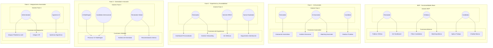
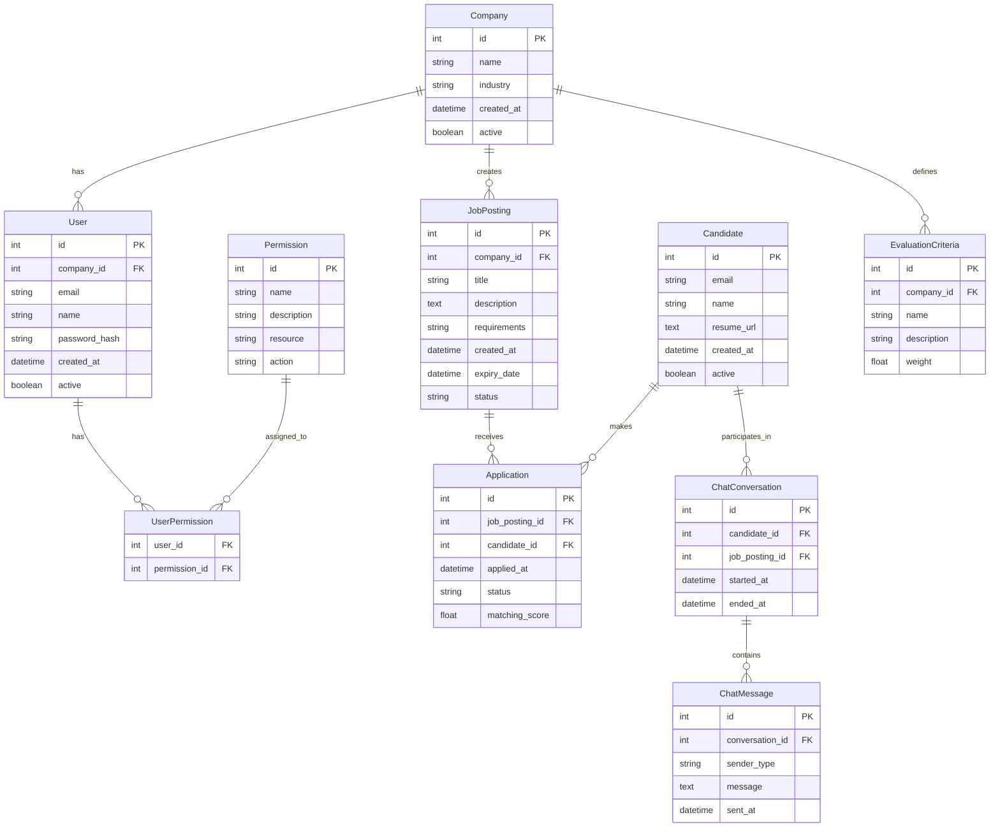
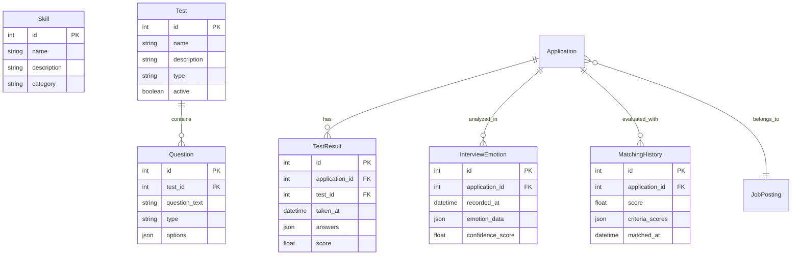
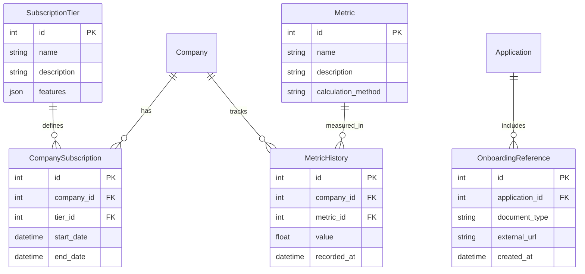
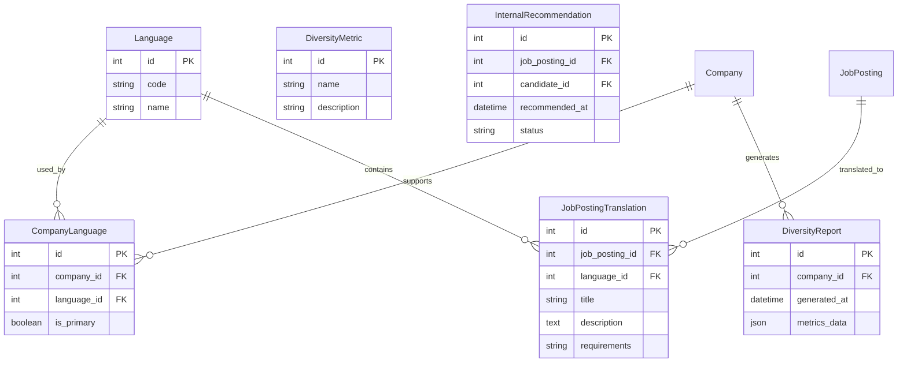
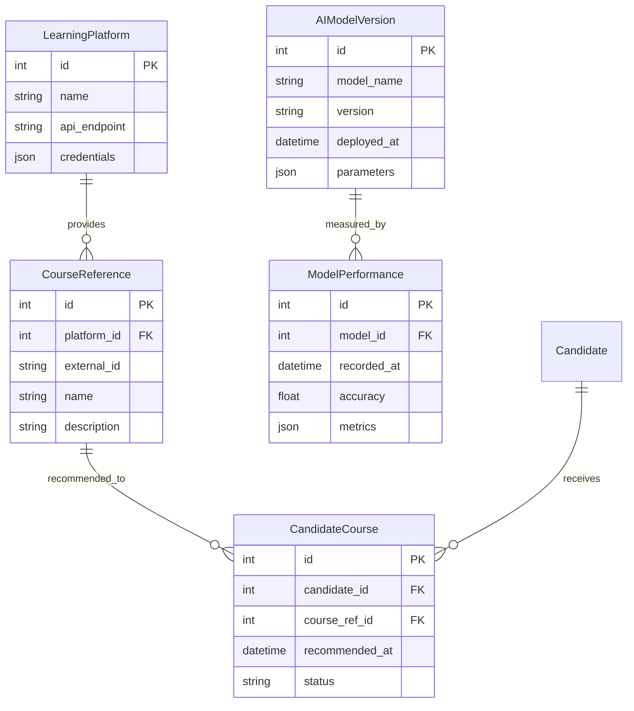

# PROMPT
Eres un business analist  y me darás un resumen explicandome que significa un sistema ATS

# CHATGPT
Un **sistema ATS** (Applicant Tracking System) es una herramienta de software utilizada principalmente por departamentos de Recursos Humanos y reclutadores para gestionar y optimizar el proceso de selección de personal. Su principal función es **facilitar la administración de candidatos** que aplican a una posición en una empresa. Este sistema **automatiza y centraliza** todas las actividades relacionadas con la selección de talento, desde la publicación de ofertas de empleo hasta la organización y análisis de los perfiles de los postulantes.

### Principales funciones de un sistema ATS:

1. **Recopilación y Organización de Candidatos**: Los ATS permiten recoger aplicaciones de múltiples fuentes (portales de empleo, redes sociales, sitios web corporativos) y organizarlas en una sola base de datos. Esto facilita el acceso a los perfiles de los candidatos.

2. **Filtrado de Candidatos**: Los ATS pueden realizar filtrados automáticos, descartando aquellos candidatos que no cumplan con ciertos requisitos básicos del puesto (como experiencia o habilidades específicas). Esto se hace mediante palabras clave y criterios predefinidos, ahorrando tiempo a los reclutadores.

3. **Automatización de Comunicaciones**: Permiten enviar correos automáticos a los candidatos en diferentes etapas del proceso, lo cual agiliza la comunicación y mantiene informados a los aplicantes sobre el estado de su aplicación.

4. **Programación de Entrevistas**: Muchos sistemas ATS tienen integraciones de calendario, lo cual facilita coordinar entrevistas con los candidatos y los entrevistadores, reduciendo el tiempo de gestión manual.

5. **Reportes y Análisis**: Los ATS pueden generar reportes sobre el rendimiento del proceso de selección, el tiempo que tarda cada etapa, el número de candidatos descartados, y otras métricas que ayudan a identificar mejoras en el proceso.

### Beneficios de un sistema ATS

- **Eficiencia**: Reduce significativamente el tiempo necesario para gestionar grandes volúmenes de aplicaciones.
- **Mejora en la Calidad de Contratación**: Al centralizar y organizar la información, permite una mejor evaluación de los candidatos.
- **Cumplimiento Normativo**: Facilita el cumplimiento de regulaciones relacionadas con el almacenamiento de datos y la equidad en los procesos de selección.
- **Experiencia del Candidato**: La automatización de comunicaciones y seguimiento puede mejorar la percepción de los candidatos sobre la empresa.

En resumen, un sistema ATS es una herramienta fundamental para optimizar el proceso de reclutamiento y selección, ahorrando tiempo, facilitando el análisis de perfiles, y mejorando tanto la eficiencia interna del equipo de Recursos Humanos como la experiencia de los candidatos.

# PROMPT

mi objetivo es crear un sistema ATS desde cero que pueda incorporar nuevas funcionalidades y mejorar las funcionalidades que ofrecen todos los sistemas ATS apoyandome en la IA, con esto busco sobresalir sobre la competencia y obtener una buena cantidad de clientes.
Como un business analist experto que eres me darás una lluvia de ideas para ir consolidando la idea de negocio para el sistema, deberás explicarme de forma breve el porqué de cada idea. 

# CHATGPT
¡Excelente! Crear un ATS desde cero con capacidades avanzadas apoyadas en IA es una gran idea y puede ser un diferenciador fuerte en el mercado. Aquí tienes una serie de ideas para consolidar este sistema ATS innovador:

### 1. **Análisis predictivo para la selección de candidatos**
   - **Descripción**: Utiliza IA para predecir el ajuste de un candidato en la empresa y en el rol específico basándose en datos históricos de otros empleados y el perfil cultural de la empresa.
   - **Beneficio**: Permite tomar decisiones de contratación más informadas y reduce la rotación, atrayendo clientes interesados en mejorar su retención de talento.

### 2. **Procesamiento de lenguaje natural (NLP) para entender CVs y cartas de presentación**
   - **Descripción**: Implementa NLP para leer y analizar CVs y cartas de presentación de manera inteligente, extrayendo información clave de diferentes formatos y lenguajes.
   - **Beneficio**: Elimina la dependencia de formatos específicos de CV y permite un análisis más profundo de las competencias y experiencias.

### 3. **Matching avanzado basado en habilidades y experiencia** 
   - **Descripción**: Utiliza algoritmos de matching que relacionen las habilidades y experiencias de los candidatos con los requisitos del puesto en lugar de solo palabras clave.
   - **Beneficio**: Aumenta la precisión en la selección y reduce falsos positivos, evitando que candidatos no calificados avancen en el proceso.

### 4. **Chatbot de IA para la interacción con candidatos**
   - **Descripción**: Desarrolla un chatbot que responda preguntas de los candidatos y los guíe en el proceso de aplicación de manera personalizada y en tiempo real.
   - **Beneficio**: Mejora la experiencia del candidato y reduce la carga de comunicación en el equipo de RRHH.

### 5. **Sistema de recomendaciones de candidatos internos**
   - **Descripción**: Permite que los empleados actuales puedan ser considerados automáticamente para vacantes abiertas, basándose en sus habilidades, desempeño y aspiraciones.
   - **Beneficio**: Fomenta la movilidad interna y retiene talento clave, mejorando la percepción del ATS para empresas centradas en el desarrollo de su personal.

### 6. **Evaluación automatizada de habilidades técnicas y pruebas psicológicas**
   - **Descripción**: Integra pruebas técnicas y psicológicas automáticas en el ATS, con análisis automatizados que detecten habilidades clave y el ajuste cultural del candidato.
   - **Beneficio**: Reduce la necesidad de evaluaciones externas y proporciona información objetiva para la toma de decisiones, atrayendo clientes interesados en evaluaciones rápidas y precisas.

### 7. **Seguimiento del mercado laboral y análisis de tendencias**
   - **Descripción**: Añade un módulo que recopile datos del mercado laboral para informar a los reclutadores sobre tendencias salariales, demanda de habilidades y comparación de beneficios.
   - **Beneficio**: Ofrece valor añadido para empresas en busca de insights del mercado, ayudándoles a ajustar sus ofertas para ser más competitivas.

### 8. **Dashboard personalizado y KPI de contratación**
   - **Descripción**: Proporciona un dashboard interactivo con KPIs clave personalizables para cada usuario (ejemplo: tiempo para contratar, calidad de los candidatos, fuentes más efectivas).
   - **Beneficio**: Permite a los gerentes de RRHH tener una visión clara del rendimiento de su proceso de selección y ajustar en función de los datos.

### 9. **Capacidades multilingües y sensibilidad cultural**
   - **Descripción**: Desarrolla un sistema que analice y evalúe candidatos de distintas regiones e idiomas, y tenga en cuenta diferencias culturales en la interpretación de los CVs.
   - **Beneficio**: Atrae empresas globales o en expansión internacional al ofrecer una solución ATS que respete y entienda las diversidades culturales.

### 10. **Funcionalidad de onboarding y seguimiento post-contratación**
   - **Descripción**: Integra un módulo de onboarding que guíe a los nuevos empleados durante sus primeros días, y un sistema de seguimiento de satisfacción y ajuste.
   - **Beneficio**: Brinda valor agregado a las empresas que buscan mejorar la experiencia de sus nuevos empleados, lo cual puede ser un factor clave de decisión en la elección del ATS.

### 11. **Integración con plataformas de aprendizaje y desarrollo (L&D)**
   - **Descripción**: Facilita la conexión con sistemas de capacitación para que los reclutadores puedan recomendar cursos o programas de desarrollo a los candidatos internos y externos.
   - **Beneficio**: Ofrece una funcionalidad extra para empresas que valoran el crecimiento profesional, integrando el ATS en un ecosistema de desarrollo continuo.

### 12. **Análisis de emociones y comportamiento durante entrevistas**
   - **Descripción**: Implementa un sistema que analice el tono, el lenguaje corporal y las emociones de los candidatos durante entrevistas virtuales.
   - **Beneficio**: Ofrece un nivel de análisis profundo que ayuda a detectar rasgos de personalidad y ajuste cultural que podrían no aparecer en el CV.

### 13. **Sistema de feedback colaborativo**
   - **Descripción**: Facilita que los diferentes miembros del equipo de reclutamiento y los gerentes puedan dejar feedback colaborativo en tiempo real sobre los candidatos.
   - **Beneficio**: Mejora la comunicación interna y hace que la toma de decisiones sea más transparente y rápida.

### 14. **Análisis de diversidad e inclusión en el proceso de selección**
   - **Descripción**: Genera informes sobre el nivel de diversidad en cada etapa del proceso de selección y ofrece recomendaciones para mejorar la inclusión.
   - **Beneficio**: Atrae a empresas con políticas de diversidad e inclusión que buscan soluciones para medir y mejorar su proceso de selección en estas áreas.

### 15. **Mobile-first y adaptabilidad a redes sociales**
   - **Descripción**: Crea un sistema ATS móvil y adaptable para integrarse fácilmente con redes sociales y aplicaciones de mensajería.
   - **Beneficio**: Facilita el uso del ATS en cualquier dispositivo y atrae talento joven o que se encuentra en plataformas como LinkedIn o Instagram.

Cada una de estas ideas tiene el potencial de darle a tu ATS una ventaja competitiva en el mercado, integrando funcionalidades avanzadas y diferenciadoras que van más allá de las capacidades tradicionales de los sistemas ATS actuales.

# PROMPT
Me gustan todas las ideas que me acabas de dar.
## Objetivo: Crear un documento en formato markdown el cuál contenga la siguiente información separada por indices: 
- la visión y la idea central del negocio
- Beneficios y diferencial con la competencia
-  Evalúar la propuesta de valor y establecer la viabilidad del producto.

Si tienes dudas debes preguntarme y resolverlas antes de dar una respuesta

# CHATGPT
Gracias por los detalles. Antes de crear el documento en formato Markdown, quisiera aclarar algunos puntos para asegurar que el contenido refleje con precisión la visión del proyecto y se ajuste a tus expectativas:

1. **Visión y idea central del negocio**:  
   - ¿Cómo defines la visión a largo plazo? Por ejemplo, ¿sería algo como "convertirse en el sistema ATS líder que redefine la experiencia de selección mediante IA"?
   - ¿Quieres que la "idea central del negocio" incluya una descripción de los objetivos estratégicos a mediano y largo plazo (como expansión geográfica o integraciones con otras tecnologías)?

2. **Beneficios y diferencial con la competencia**:
   - ¿Hay competidores clave a los que quieres que compare el ATS en términos de funcionalidades o características específicas?
   - ¿Deseas un enfoque general sobre los beneficios o prefieres que se desglosen en categorías (por ejemplo, eficiencia, experiencia del usuario, análisis avanzado)?

3. **Evaluación de la propuesta de valor y viabilidad del producto**:
   - ¿Tienes alguna métrica o indicador clave de éxito que quieras incluir en la evaluación de viabilidad, como retención de clientes, crecimiento proyectado o integración de IA?
   - ¿Hay algún aspecto específico de la propuesta de valor (como la personalización o escalabilidad) en el que quieras un enfoque más detallado?

Con estas respuestas podré construir un documento más ajustado a lo que estás visualizando.

# PROMPT 
1. Si convertirme en un sistema ATS líder mendiante la IA.  Si incluir la descripción a mediano y largo plazo
2. usa supuestos de las mejores ATS del mercado colombiano, un enfoque general
3. retención de cliente, crecimiento proyectado e integración de la IA. hacer enfoque en la escalabilidad

Si tienes dudas debes preguntarme y resolverlas antes de dar una respuesta

# CHATGPT
GENERA MERMAID 

Si deseas ajustar alguna sección o añadir detalles específicos, ¡házmelo saber!

# PROMPT 

**Quien eres**: un Product Manager Senior
**Obetivo**: Generar en un documento formato mardown con el MVP y las fases del sistema, debe ser pensado en que se pueda escalar la solución haciendo productivo el MVP y cada fase en tiempos preferiblemente cortos.

# CHAGPT
GENERA MERMAID

Este plan permitirá que el sistema ATS tenga entregables en tiempos cortos y sea funcional desde el MVP, maximizando el valor para los primeros usuarios y permitiendo una mejora continua en cada fase.

# PROMPT
**Quien eres**:  un arquitecto de software experimentado
**Objetivo**:  Crear la arquitectura con la cuál se diseñara el sistema, teniendo un claro enfoque en la escalabilidad y mantenibilidad del sistema.
**Caracteristicas**: - Frontend con Nuxt3 
- Usar BFF quién será el encargado de gestionar las peticiones del frontend a los microservicios
- Usar microservicios
- Usar los mejores servicios de aws
- Base de datos para cada microservicio
Debes considerar las mejores caracteristicas y mejores prácticas para que sea un sistema escalable, cualquier duda que tengas debes resolverlas antes de dar una respuesta

# CHATGPT 
Gracias por el contexto detallado. Antes de pasar a crear la arquitectura, quisiera aclarar algunos puntos clave para garantizar que el diseño se alinee con tus necesidades:

1. **Escalabilidad de Microservicios**:  
   - ¿Existen servicios o módulos específicos que deseas priorizar en cuanto a escalabilidad? Por ejemplo, funcionalidades como el procesamiento de aplicaciones, filtrado de candidatos con IA o los módulos de chatbots, que suelen requerir más capacidad.

2. **Manejo de Datos en Microservicios**:  
   - ¿Tienes alguna preferencia respecto al modelo de base de datos por microservicio (relacional vs. no relacional)? Esto puede influir en la elección para servicios intensivos en datos o que dependan de consultas complejas.

3. **Requerimientos de IA**:
   - Para la integración de IA, ¿planeas implementar tus propios modelos o prefieres usar servicios de AWS como Amazon SageMaker? Esto influirá en cómo orquestar los recursos de IA y optimizar la escalabilidad.

4. **Entorno Multiusuario y Seguridad**:
   - ¿Quieres integrar un sistema de autenticación y autorización con alta granularidad (e.g., Amazon Cognito con permisos en varios niveles de usuarios)? Esto puede condicionar la arquitectura del BFF y las interacciones de microservicios.

Con esta información, podré diseñar una arquitectura detallada y alineada con tus objetivos.

# PROMPT
1. las que consideres priorizar con tu experiencia
2. relacional
3. sevicios de aws
4. usar amazon cognito

# CHATGPT
Con esta información en mente, aquí tienes un diseño arquitectónico detallado para tu sistema ATS con un enfoque en escalabilidad y mantenibilidad. La arquitectura se compone de microservicios desacoplados y aprovecha las mejores prácticas de AWS para lograr una infraestructura flexible y segura.

GENERA MERMAID

# PROMPT
**Quien eres**: Eres un analista de software experto
**Contexto**: puedes acceder a todo el contexto del proyecto en el documento adjunto
**Objetivo**:  crear un diagrama de flujo con los casos de uso del mvp y cada fase del proyecto organizándolo por actores principales y sus interacciones.
**Output**:  DiagramFormato mermaid

# CLOUD
Te ayudaré a crear diagramas de casos de uso separados para el MVP y cada fase del desarrollo, basándome en el roadmap del documento.


He creado un diagrama que muestra los casos de uso divididos por fases. Permíteme detallar cada fase:

# Detalles de Casos de Uso por Fase

## MVP - Funcionalidades Base
**Actores Principales:**
- Reclutador
- Candidato
- IA Básica

**Casos de Uso:**
1. **Gestión de Ofertas**
   - Publicar ofertas de trabajo
   - Distribuir en plataformas
   - Ver dashboard básico

2. **Interacción Candidato**
   - Aplicar a trabajos
   - Interactuar con chatbot básico
   - Recibir comunicaciones automáticas

3. **Filtrado Básico**
   - Filtrado automático de CVs
   - Matching básico de perfiles
   - Seguimiento de estados

## Fase 1 - IA Avanzada
**Actores Principales:**
- Reclutador
- IA Avanzada
- Candidato

**Casos de Uso:**
1. **Evaluación Avanzada**
   - Realizar tests automáticos
   - Analizar resultados con IA
   - Generar reportes de competencias

2. **Análisis Comportamental**
   - Analizar emociones en entrevistas
   - Evaluar comportamiento
   - Generar insights

## Fase 2 - Experiencia y Escalabilidad
**Actores Principales:**
- Reclutador
- Gerente RRHH
- Nuevo Empleado

**Casos de Uso:**
1. **Gestión Personalizada**
   - Personalizar dashboard
   - Configurar KPIs
   - Gestionar reportes

2. **Onboarding**
   - Gestionar proceso de onboarding
   - Seguimiento de satisfacción
   - Automatizar documentación

## Fase 3 - Diversidad e Inclusión
**Actores Principales:**
- Reclutador Global
- IA Multilingüe
- Candidato Internacional

**Casos de Uso:**
1. **Gestión Multilingüe**
   - Procesar CVs en múltiples idiomas
   - Adaptar evaluaciones culturalmente
   - Gestionar comunicaciones multilingües

2. **Análisis de Diversidad**
   - Monitorear métricas de diversidad
   - Generar recomendaciones
   - Seguimiento de objetivos

## Fase 4 - Integraciones Avanzadas
**Actores Principales:**
- Administrador de Sistema
- Ingeniero IA

**Casos de Uso:**
1. **Gestión de Integraciones**
   - Integrar plataformas de aprendizaje
   - Configurar evaluaciones VR
   - Optimizar algoritmos IA

2. **Mejora Continua**
   - Actualizar modelos de IA
   - Implementar nuevas tecnologías
   - Mantener integraciones


# PROMPT 

**Quien eres**: un experto en base de datos
**Contexto**: lo encuentras en el archivo que adjunte
**Objetivo**: tienes la responsabilidad de diseár la base de datos en formato mermaid
**Caracteristicas**: cubrir entidades, atributos (nombre y tipo) y relaciones, debes alinearte con la arquitectura planeada en el contexto y entregarla por las fases correspondientes
Antes de dar una respuesta deberás resolver todas tus dudas

# CLOUD
Como experto en bases de datos, analizaré el documento para diseñar una base de datos que soporte el sistema ATS descrito. Antes de proceder, tengo algunas preguntas importantes para asegurar un diseño óptimo:

1. ¿Debería incluir tablas para manejar la configuración multinivel mencionada en la Fase 2 (diferentes configuraciones para PYMES vs grandes corporaciones)?

2. En relación al chatbot mencionado en el MVP, ¿necesitamos almacenar el historial de conversaciones para entrenamiento futuro del modelo de IA?

3. Para el análisis de emociones en entrevistas virtuales (Fase 1), ¿se requiere almacenar los datos crudos del análisis facial/voz o solo los resultados procesados?

4. En cuanto al sistema de evaluación automática de habilidades (Fase 1), ¿se necesita almacenar las preguntas/respuestas de los tests o solo los resultados finales?

5. Para el módulo de diversidad e inclusión (Fase 3), ¿qué métricas específicas necesitan ser almacenadas para el seguimiento de objetivos?

6. Respecto al onboarding (Fase 2), ¿se requiere almacenar documentos (contratos, guías, etc.) en la base de datos o solo referencias a documentos en un sistema externo?

7. Para las integraciones con plataformas de aprendizaje (Fase 4), ¿necesitamos almacenar el progreso/resultados de los cursos o solo las referencias a cursos externos?

Estas respuestas me ayudarán a diseñar un esquema de base de datos más preciso y alineado con los requerimientos del sistema. ¿Podrías proporcionar clarificación sobre estos puntos?

# PROMPT 
Antes de dar una respuesta deberás resolver todas tus dudas
1. si
2. si
3. resultados procesados
4. preguntas y respuestas
5. las básicas que consideres
6. referencia a un sistema externo
7. solo referencias a cursos externos

# CLOUD
Gracias por las aclaraciones. Tengo algunas preguntas adicionales para asegurar un diseño completo y preciso:

1. Respecto a la publicación de ofertas en múltiples plataformas (MVP):
   - ¿Necesitamos guardar el estado de publicación en cada plataforma?
   - ¿Se requiere almacenar estadísticas de efectividad por plataforma?

2. Sobre el análisis predictivo de ajuste (MVP):
   - ¿Los criterios de evaluación son configurables por empresa?
   - ¿Se debe mantener un histórico de las predicciones realizadas?

3. Para el sistema de matching avanzado (Fase 1):
   - ¿Los pesos de los criterios de matching son configurables por empresa?
   - ¿Se requiere almacenar el histórico de matches exitosos para mejorar el algoritmo?

4. En cuanto al dashboard personalizable (Fase 2):
   - ¿Cada usuario puede tener su propia configuración de dashboard?
   - ¿Se necesita mantener un histórico de las métricas para análisis temporal?

5. Sobre el procesamiento multilingüe (Fase 3):
   - ¿Cada empresa puede configurar sus idiomas soportados?
   - ¿Se necesita almacenar las traducciones de las ofertas de trabajo?

Estas respuestas me ayudarán a definir mejor las estructuras de datos necesarias para cada fase. ¿Podrías aclarar estos puntos?

# PROMT

Antes de dar una respuesta deberás resolver todas tus dudas
1. no / no
2. si / no
3. si / si
4. no / si
5. si / si

# CLOUD 
Gracias por estas aclaraciones adicionales. Tengo algunas últimas preguntas para asegurar un diseño robusto:

1. Respecto a los permisos y roles:
   - ¿Se necesitan roles personalizados por empresa además de los básicos (reclutador, gerente RRHH, administrador)?
   - ¿Los permisos deben ser configurables a nivel de función específica?

2. Sobre el seguimiento de candidatos:
   - ¿Se debe mantener un historial completo de todos los estados por los que pasa un candidato?
   - ¿Cada empresa puede definir sus propias etapas del proceso de selección?

3. Para la gestión de evaluaciones:
   - ¿Una evaluación puede ser reutilizada para diferentes posiciones?
   - ¿Las empresas pueden crear sus propias plantillas de evaluación?

4. Respecto al sistema de recomendación de candidatos internos (Fase 3):
   - ¿Se debe mantener un histórico de todas las recomendaciones realizadas?
   - ¿Las habilidades y competencias deben tener niveles o solo ser binarias (tiene/no tiene)?

5. En cuanto a la configuración multinivel:
   - ¿Cada nivel de suscripción tiene acceso a diferentes funcionalidades?
   - ¿Se debe mantener un histórico de cambios de nivel por empresa?

¿Podrías aclarar estos últimos puntos para proceder con el diseño detallado?

# PROMT

Antes de dar una respuesta deberás resolver todas tus dudas
1. no / si
2.  si / no
3. si / no
4. si / binarias
5. si / no

# CLOUD

Con todas las dudas resueltas, procederé a diseñar el modelo de datos por fases. Empezaré con el MVP y luego iré agregando las estructuras necesarias para cada fase subsecuente.












Este diseño de base de datos:

1. Está organizado por fases según el roadmap
2. Incluye todas las funcionalidades requeridas
3. Soporta las configuraciones multinivel
4. Permite el almacenamiento de conversaciones del chatbot
5. Maneja evaluaciones y sus resultados
6. Soporta múltiples idiomas
7. Incluye métricas de diversidad
8. Mantiene referencias a sistemas externos
9. Permite seguimiento de recomendaciones y matches

¿Necesitas que explique algún aspecto específico del diseño o que realice algún ajuste?

# PROMT
ahora eres un experto creando diagramas C4 y tendras como objetivo crear un Diagrama C4 que llegue en profundidad al MVP, el contexto lo obtendras en el archivo adjunto.


# CLOUD
Analizaré el documento y crearé los diagramas C4 para el MVP del sistema ATS, comenzando desde el nivel de contexto hasta llegar al detalle de los componentes principales.


```mermaid
%% Nivel 1: Diagrama de Contexto
graph TB
    subgraph Sistema ATS
        ATS["Sistema ATS\n[Software System]\nSistema de gestión de reclutamiento\nbasado en IA"]
    end
    
    Recruiter["Reclutador\n[Person]\nUsuario principal del sistema"]
    Candidate["Candidato\n[Person]\nAplica a posiciones"]
    HRManager["Gerente RRHH\n[Person]\nGestiona procesos de selección"]
    
    JobBoards["Portales de Empleo\n[Software System]\nPlataformas externas de empleo"]
    SocialMedia["Redes Sociales\n[Software System]\nPlataformas de difusión"]
    
    Recruiter -->|"Gestiona procesos\nde selección"| ATS
    Candidate -->|"Aplica y interactúa"| ATS
    HRManager -->|"Supervisa y configura"| ATS
    ATS -->|"Publica ofertas"| JobBoards
    ATS -->|"Distribuye contenido"| SocialMedia

%% Nivel 2: Diagrama de Contenedores
graph TB
    subgraph "Sistema ATS [Software System]"
        WebApp["Aplicación Web\n[Container: React/TypeScript]\nInterfaz principal del sistema"]
        MobileApp["Aplicación Móvil\n[Container: React Native]\nAcceso móvil al sistema"]
        
        APIGateway["API Gateway\n[Container: Node.js]\nGestión de APIs y autenticación"]
        
        CoreServices["Servicios Core\n[Container: Node.js/Express]\nLógica de negocio principal"]
        
        AIEngine["Motor IA\n[Container: Python]\nAnálisis y procesamiento IA"]
        
        Database["Base de Datos\n[Container: PostgreSQL]\nAlmacenamiento principal"]
        
        ChatbotService["Servicio Chatbot\n[Container: Python]\nInteracción automatizada"]
    end
    
    WebApp -->|"API calls"| APIGateway
    MobileApp -->|"API calls"| APIGateway
    APIGateway -->|"Routes"| CoreServices
    CoreServices -->|"Queries/Updates"| Database
    CoreServices -->|"Solicita análisis"| AIEngine
    CoreServices -->|"Gestiona conversaciones"| ChatbotService
    
%% Nivel 3: Diagrama de Componentes (MVP)
graph TB
    subgraph "Servicios Core [Container]"
        JobManager["Gestor de Ofertas\n[Component]\nGestión de publicaciones"]
        CandidateManager["Gestor de Candidatos\n[Component]\nGestión de aplicantes"]
        RecruitmentFlow["Flujo de Reclutamiento\n[Component]\nGestión del proceso"]
        Analytics["Análisis y Reportes\n[Component]\nMétricas y KPIs"]
        
        AIIntegration["Integración IA\n[Component]\nConexión con servicios IA"]
        CommunicationManager["Gestor de Comunicaciones\n[Component]\nNotificaciones y mensajes"]
    end
    
    JobManager -->|"Datos de ofertas"| Database
    CandidateManager -->|"Perfiles y estados"| Database
    RecruitmentFlow -->|"Estados del proceso"| Database
    Analytics -->|"Consultas"| Database
    
    AIIntegration -->|"Solicitudes"| AIEngine
    CommunicationManager -->|"Mensajes"| ChatbotService

```

He creado un diagrama C4 completo que muestra los tres primeros niveles de la arquitectura del sistema ATS, enfocándome en el MVP. Expliquemos cada nivel:

1. **Nivel 1 - Diagrama de Contexto:**
   - Muestra los actores principales (Reclutador, Candidato, Gerente RRHH)
   - Sistemas externos (Portales de Empleo, Redes Sociales)
   - El sistema ATS como núcleo

2. **Nivel 2 - Diagrama de Contenedores:**
   - Aplicación Web y Móvil para acceso al sistema
   - API Gateway para gestión de servicios
   - Servicios Core para la lógica de negocio
   - Motor IA para análisis y procesamiento
   - Base de datos PostgreSQL
   - Servicio de Chatbot

3. **Nivel 3 - Diagrama de Componentes (MVP):**
   - Gestor de Ofertas
   - Gestor de Candidatos
   - Flujo de Reclutamiento
   - Análisis y Reportes
   - Integración IA
   - Gestor de Comunicaciones

Los componentes mostrados corresponden específicamente a las funcionalidades del MVP mencionadas en el documento:
- Dashboard centralizado
- Filtrado automático
- Publicación de ofertas
- Chatbot inicial
- Análisis predictivo básico

¿Te gustaría que profundice en algún nivel específico o que agregue más detalles sobre algún componente en particular?