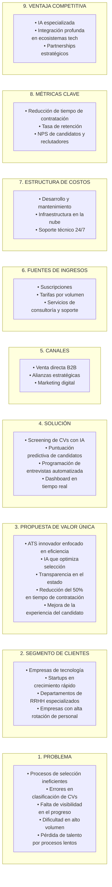
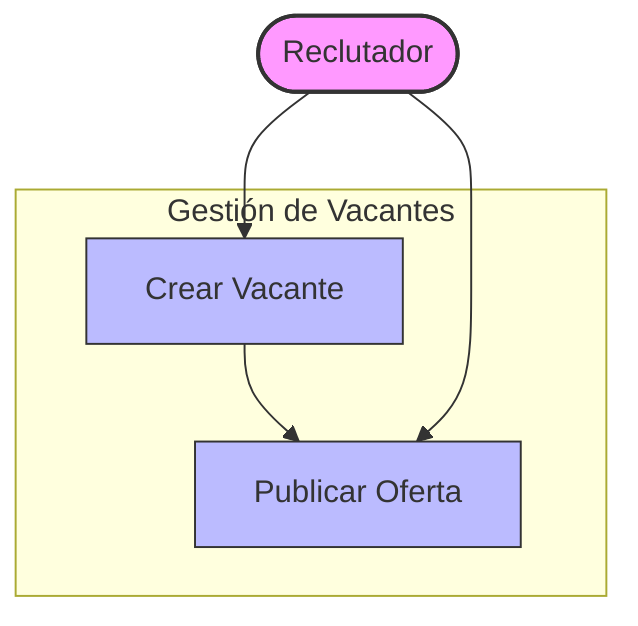
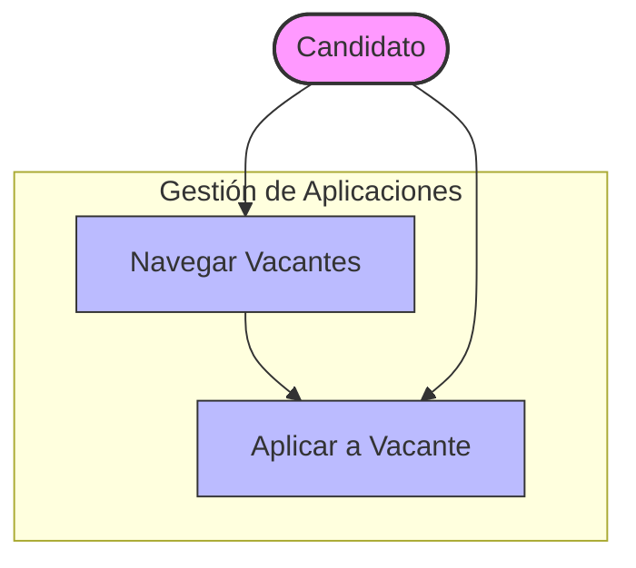
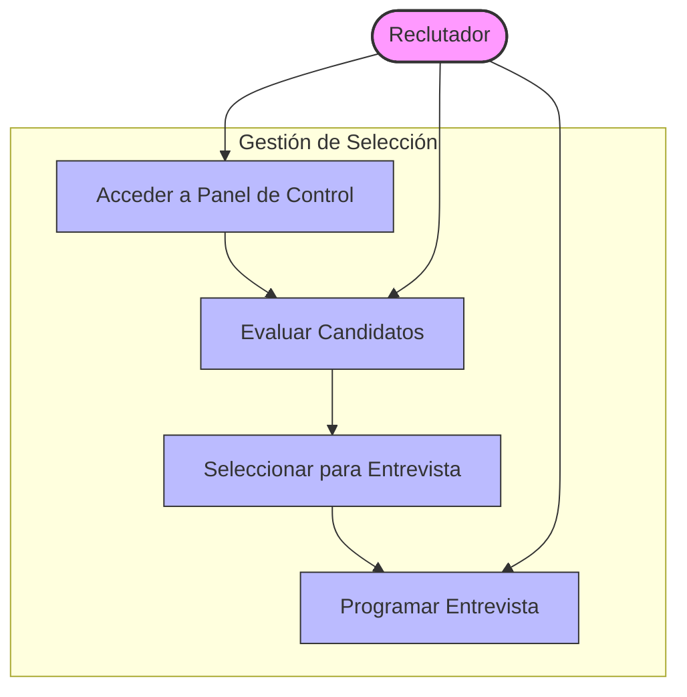
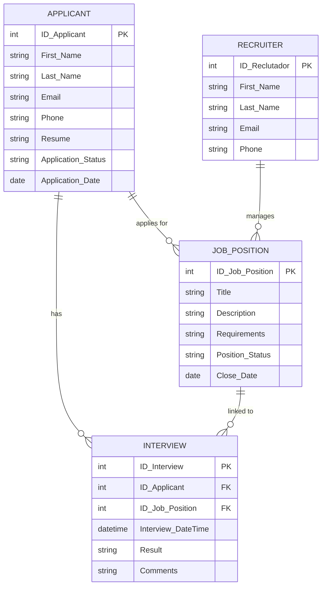
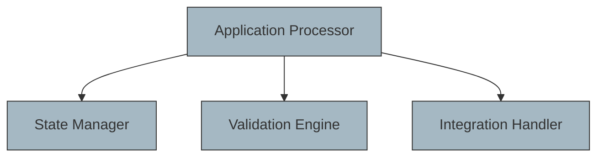

Debido a la extensión de la conversación, procederé a dividir la respuesta en varias secciones, cada una organizada en partes para facilitar la comprensión. Esto garantizará que todo el contenido esté estructurado y sea fácil de seguir.

---

# Conversación Completa (Parte 1)

## Índice de Contenidos

1. [Introducción y Objetivos](#tema-1)
2. [Descripción del ATS, Valor Añadido y Ventajas Competitivas](#tema-2)
3. [Funciones Principales del ATS](#tema-3)
4. [Diagrama Lean Canvas](#tema-4)
5. [Casos de Uso](#tema-5)
6. [Modelo de Datos](#tema-6)
7. [Diseño del Sistema a Alto Nivel](#tema-7)
8. [Diagrama C4 - Applicant Tracking Service](#tema-8)
9. [Resumen del Chat](#tema-9)

---

## Tema 1: Introducción y Objetivos

### Interacción 1
**Usuario**: 
Eres un experto en producto, con experiencia en ATS (Applicant-Tracking System), el objetivo es diseñar la primera versión del sistema, se debe diseñar y documentar un sistema de software siguiendo las fases de investigación y análisis, casos de uso, modelado de datos, y diseño de alto nivel. Entregando los siguientes artefactos:

- Descripción breve del software LTI, valor añadido y ventajas competitivas.
- Explicación de las funciones principales. 
- Añadir un diagrama Lean Canvas para entender el modelo de negocio (entregar los "diagramas como código" (diagrams as code o DaC por sus siglas en inglés)
- Descripción de los 3 casos de uso principales, con el diagrama asociado a cada uno
- Modelo de datos que cubra entidades, atributos (nombre y tipo) y relaciones
- Diseño del sistema a alto nivel, tanto explicado como diagrama adjunto
- Diagrama C4 que llegue en profundidad a uno de los componentes del sistema, el que prefieras

¿Y qué sistema? El de LTI.

LTI es una startup que quiere desarrollar el **ATS (Applicant-Tracking System)** del futuro. Si no sabes lo que es un ATS, aquí una imagen, que vale más que 1000 palabras:


Todavía no hay nada creado, así que toca ponerse el gorro de product manager y **definir esas funcionalidades clave que harán brillar a LTI** por encima de los competidores: aumentar la eficiencia para los departamentos de HR, mejorar la colaboración en tiempo real entre reclutadores y managers, automatizaciones, asistencia de IA en diversas tareas...es el momento de hacer brainstorming, investigar cuáles pueden ser las claves del éxito, y dejarlo plasmado para el resto del equipo.

Por ahora realiza las preguntas necesarias para poder dar inicio a cada uno de los puntos.

**IA**:  
Para iniciar el diseño de este ATS para LTI, tengo algunas preguntas que me ayudarán a definir el sistema de forma más precisa y alineada con los objetivos de LTI:

1. **Información sobre el mercado y visión de LTI**:
   - ¿Cuál es la misión de LTI en el mercado de ATS?
   - ¿Cuál es la visión de LTI en términos de mejora de los procesos de reclutamiento?

2. **Perfil del cliente y segmento objetivo**:
   - ¿Cuál es el perfil de las empresas que serán nuestros clientes principales (industria, tamaño, necesidades específicas)?
   - ¿Qué ventaja competitiva espera LTI ofrecer para destacarse en el mercado?

3. **Funciones clave esperadas**:
   - ¿Cuáles son las funcionalidades obligatorias que LTI desea que su sistema ATS incluya desde el inicio?
   - ¿Qué nivel de automatización y uso de IA se espera en el proceso de reclutamiento?
   - ¿Se busca una experiencia colaborativa en tiempo real entre reclutadores y gerentes de contratación? ¿Cómo se espera que funcione esa colaboración?

4. **Diagrama Lean Canvas**:
   - ¿LTI tiene ya una idea de los segmentos de usuarios específicos, problemas y soluciones principales que resolverá el ATS, o este análisis se hará desde cero?

5. **Casos de uso principales**:
   - ¿Cuáles son las interacciones más críticas que anticipan entre los diferentes usuarios del sistema (reclutadores, candidatos, gerentes)?
   - ¿Qué flujos específicos del proceso de contratación consideran como prioritarios en esta primera versión?

6. **Modelado de datos**:
   - ¿Tienen preferencia en los tipos de entidades que quieren modelar (por ejemplo, candidatos, vacantes, entrevistas, evaluaciones)?
   - ¿Desean que el sistema de datos cumpla con algún estándar específico de interoperabilidad?

7. **Diseño del sistema a alto nivel y diagrama C4**:
   - ¿Cuál es el nivel de escalabilidad y rendimiento que esperan en el sistema?
   - ¿Existen ya preferencias tecnológicas o arquitectónicas (por ejemplo, microservicios en la nube, bases de datos específicas, etc.)?
   - ¿Hay alguna preocupación o requerimiento especial en cuanto a seguridad y privacidad de los datos que deba integrarse en el diseño?

Estas preguntas nos ayudarán a definir los requisitos clave y a estructurar los diferentes componentes del sistema de forma precisa. Una vez tenga respuestas a estas preguntas, puedo comenzar a trabajar en cada uno de los puntos.

---

### Interacción 2
**Usuario**:  
Aquí tienes un análisis completo de cada pregunta para ayudar en la estructuración del ATS de LTI:

*(El usuario proporciona un análisis detallado de cada respuesta, incluyendo información de mercado, perfil de cliente, funciones clave esperadas, prioridades en el Lean Canvas, flujos críticos de casos de uso, y modelado de datos en cuanto a interoperabilidad y preferencias tecnológicas)*

---

**IA**:  
Gracias por la información detallada. A partir de esto, puedo comenzar a estructurar cada uno de los puntos solicitados. Aquí te propongo un plan para avanzar de forma secuencial:

1. **Descripción breve del software LTI, valor añadido y ventajas competitivas**.
2. **Explicación de las funciones principales.**
3. **Diagrama Lean Canvas**.
4. **Casos de uso principales con sus diagramas.**
5. **Modelo de datos.**
6. **Diseño del sistema a alto nivel.**
7. **Diagrama C4 en profundidad para uno de los componentes.**

¿Te parece bien este enfoque? Una vez lo confirmes, puedo proceder con el primer punto.

---

### Interacción 3
**Usuario**:  
De acuerdo, podemos proceder con ese orden. Adelante con el primer punto.

---

## Tema 2: Descripción del ATS, Valor Añadido y Ventajas Competitivas

### Interacción 4
**IA**:  
### 1. Descripción Breve del Software LTI, Valor Añadido y Ventajas Competitivas

**Descripción de LTI**  
LTI es una startup orientada a revolucionar el proceso de reclutamiento mediante un ATS (Applicant Tracking System) de nueva generación. Su plataforma se enfoca en la automatización avanzada y la colaboración optimizada para facilitar la atracción y selección de talento especializado en medianas y grandes empresas, así como en startups de crecimiento rápido.

**Misión de LTI**  
Transformar el ámbito del reclutamiento mediante un sistema ATS accesible y eficiente, eliminando complejidades y brindando herramientas que permitan a los equipos de recursos humanos identificar, atraer y contratar a los mejores candidatos de forma ágil.

**Visión de LTI**  
Convertirse en líder en soluciones de reclutamiento integrando tecnología avanzada, accesibilidad y transparencia, mejorando la experiencia tanto de los candidatos como de los reclutadores y convirtiendo el proceso en un motor de crecimiento.

**Ventaja Competitiva**  
1. **Automatización avanzada**: Clasificación automática de CVs, programación de entrevistas y recomendaciones predictivas.
2. **Experiencia de usuario optimizada**: Interfaz intuitiva y colaboración en tiempo real entre reclutadores y managers.
3. **Cumplimiento normativo y seguridad**: Diseño conforme a GDPR y CCPA para facilitar la adopción en diversos sectores regulados.

**Valor Añadido**  
Al integrar tecnología avanzada y un diseño centrado en el usuario, LTI facilita la contratación de talento de alta calidad, reduce la carga administrativa de recursos humanos y permite que las empresas se concentren en la experiencia humana y la toma de decisiones estratégicas.

¿Este punto cumple con tus expectativas? Si es así, puedo continuar con el siguiente.

---

### Interacción 5
**Usuario**:  
Adelante.

---

## Tema 3: Funciones Principales del ATS

### Interacción 6
**IA**:  
### 2. Funciones Principales del ATS de LTI

**1. Seguimiento de Candidatos**
   - **Vista de Proceso en Pipeline**: Visualización de cada etapa en el proceso de selección.
   - **Análisis en Tiempo Real**: Reportes sobre el progreso de los candidatos.
   - **Automatización de Actualización de Estado**: Actualización automática y notificaciones.

**2. Gestión de Vacantes**
   - **Integración con Bolsas de Trabajo**: Publicación automática en plataformas externas.
   - **Control de Requisitos y Evaluación Inicial**: Filtrado inicial de candidatos mediante IA.
   - **Análisis de Métricas por Vacante**: Visualización en tiempo real de métricas como número de aplicaciones y tiempo promedio de contratación.

**3. Panel de Control y Reportes**
   - **KPI de Reclutamiento en Tiempo Real**: Métricas clave del proceso de selección.
   - **Reportes Personalizables**: Configuración para analizar tendencias.
   - **Comparación Histórica de Procesos**: Identificación de patrones y áreas de mejora.

**4. Clasificación de CVs y Recomendación de Candidatos (IA)**
   - **Clasificación Automática de CVs**: Filtrado de candidatos usando IA.
   - **Recomendación de Candidatos**: IA que sugiere candidatos destacados.
   - **Historial y Comentarios**: Registro de notas sobre cada candidato.

**5. Programación Automatizada de Entrevistas**
   - **Sincronización con Calendarios**: Integración con Google Calendar y Outlook.
   - **Automatización de Invitaciones y Recordatorios**: Reducción de cancelaciones y mejora de la puntualidad.
   - **Gestión Centralizada de Entrevistas**: Opciones de reprogramación.

**6. Colaboración en Tiempo Real**
   - **Chat en Tiempo Real**: Comunicación inmediata entre reclutadores y managers.
   - **Comentarios y Notas en Perfiles de Candidatos**: Evaluaciones centralizadas.
   - **Menciones y Notificaciones**: Actualizaciones instantáneas para el equipo.

¿Está claro el alcance de las funcionalidades principales? Si está todo en orden, procederé con el diagrama Lean Canvas.

---

### Interacción 7
**Usuario**:  
De acuerdo, puedes continuar con el siguiente punto.

---

## Tema 4: Diagrama Lean Canvas

### Interacción 8
**IA**:  
### 3. Diagrama Lean Canvas

A continuación se muestra el diagrama Lean Canvas del ATS de LTI, seguido de una explicación detallada de cada sección.



Con este diagrama, se busca proporcionar una visión general de los elementos clave del modelo de negocio de LTI. ¿Está en línea con lo que necesitas?

---

### Interacción 9
**Usuario**:  
Perfecto, así está bien, puedes continuar con el siguiente punto.

---

## Tema 5: Casos de Uso

### Interacción 10
**IA**:  
### 4. Casos de Uso

Cada caso de uso incluye un diagrama en Mermaid, junto con una descripción completa del flujo y los actores involucrados.

### Caso de Uso 1: Creación de Vacante

**Descripción del Flujo**
- **Actor Principal**: Reclutador.
- **Flujo Principal**: El reclutador inicia sesión, crea una vacante, completa los detalles y publica la oferta.
- **Relación**: Reclutador -> Crear Vacante -> Publicar Oferta.



### Caso de Uso 2: Aplicación de Candidato

**Descripción del Flujo**
- **Actor Principal**: Candidato.
- **Flujo Principal**: El candidato navega las vacantes, selecciona una, completa su perfil y aplica.
- **Relación**: Candidato -> Navegar Vacantes -> Aplicar.



### Caso de Uso 3: Proceso de Selección

**Descripción del Flujo**
- **Actor Principal**: Reclutador.
- **Flujo Principal**: El reclutador evalúa candidatos, selecciona para entrevistas y programa entrevistas.
- **Relación**: Reclutador -> Evaluar Candidatos -> Seleccionar para Entrevista -> Programar Entrevista.



¿Te gustaría hacer alguna revisión de los casos de uso antes de continuar con el modelo de datos?

---

### Interacción 11
**Usuario**:  
Así está bien, puedes continuar con el siguiente.

---

## Tema 6: Modelo de Datos

### Interacción 12
**IA**:  
### 5. Modelo de Datos

**Descripción del Modelo de Datos**: Cada entidad representa un componente clave del proceso de reclutamiento, con relaciones que permiten la trazabilidad de candidatos, vacantes, reclutadores y entrevistas.



¿Está en orden el modelo de datos o necesitas que revise algún aspecto adicional antes de pasar al diseño del sistema a alto nivel?

---

### Interacción 13
**Usuario**:  
Está perfecto, puedes continuar con el siguiente punto.

---

# Conversación Completa (Parte 3)

## Tema 7: Diseño del Sistema a Alto Nivel

### Interacción 14
**IA**:  
### 6. Diseño del Sistema a Alto Nivel

**Descripción General del Sistema**:  
El ATS de LTI utiliza una arquitectura de microservicios en AWS, que proporciona escalabilidad, rendimiento y seguridad. Cada microservicio opera de manera independiente y gestiona sus propias bases de datos y servicios en AWS para cumplir su función de manera óptima.

### Componentes Principales del Sistema

1. **Usuarios**:
   - **Candidato**, **Reclutador** y **Administrador** son los tres tipos principales de usuarios que interactúan con el sistema a través del **User Management Service** para autenticación y autorización.

2. **Microservicios**:
   - **User Management Service**: Gestiona la autenticación con Amazon Cognito, asegurando control de acceso.
   - **Job Management Service**: Utiliza AWS Lambda y DynamoDB para la creación y gestión de vacantes.
   - **Applicant Tracking Service**: Implementado en ECS Fargate y con almacenamiento en Amazon RDS, controla el flujo de los candidatos.
   - **Interview Scheduling Service**: Usa Amazon EventBridge para coordinar entrevistas y Amazon SNS para notificaciones.
   - **Recommendation Service**: Emplea Amazon SageMaker para sugerencias de candidatos basadas en IA.
   - **Notification Service**: Usa Amazon SNS y SES para enviar notificaciones, y almacena registros en Amazon S3.

3. **Bases de Datos**:
   - **CognitoDB**: Amazon Cognito para gestión de usuarios.
   - **JobDB**: DynamoDB para datos de vacantes.
   - **ApplicantDB**: Amazon RDS para datos de candidatos.
   - **NotificationLogs**: S3 para almacenar logs de notificaciones.

4. **Seguridad y Logging**:
   - **CloudTrail**: Auditoría de accesos y cambios.
   - **CloudWatch**: Monitoreo y logging de eventos críticos.

### Diagrama del Sistema a Alto Nivel

**Prompt para DiagramGPT**:

```markdown
**Instrucciones para DiagramGPT**: Crea un diagrama de arquitectura de microservicios en AWS para el ATS de LTI, asegurando que cada componente esté claramente diferenciado y conectado según las especificaciones de diseño. Sigue las especificaciones a continuación para recrear de manera precisa el diseño del sistema a alto nivel.

### Especificaciones del Diagrama

1. **Usuarios**:
   - Tres tipos de usuarios: **Candidato**, **Reclutador**, y **Administrador**. Conéctalos al **User Management Service** para autenticación y autorización usando **Amazon Cognito**.

2. **Microservicios Principales**:
   - **User Management Service**: Encargado de la autenticación, utiliza Amazon Cognito para la autenticación y control de permisos.
   - **Job Management Service**: Implementado con AWS Lambda y DynamoDB, permite la creación y gestión de vacantes.
   - **Applicant Tracking Service**: Implementado en ECS Fargate y usa Amazon RDS para gestionar el estado de los candidatos en el proceso de selección.
   - **Interview Scheduling Service**: Usa Amazon EventBridge para coordinar entrevistas y Amazon SNS para enviar notificaciones.
   - **Recommendation Service**: Emplea Amazon SageMaker para sugerir candidatos calificados.
   - **Notification Service**: Centraliza el envío de notificaciones usando Amazon SNS para SMS y Amazon SES para correos, y almacena logs en Amazon S3.

3. **Bases de Datos**:
   - **Amazon Cognito** para User Management,
   - **DynamoDB** para Job Management,
   - **RDS** para Applicant Tracking, y
   - **S3** para los logs del Notification Service.

4. **Seguridad y Logging**:
   - Usa AWS CloudTrail para auditoría de accesos y cambios.
   - Monitoreo en Amazon CloudWatch para alertas y logging.

### Relaciones entre los Componentes
   - Los usuarios interactúan con el **User Management Service** para autenticación.
   - **User Management Service** se conecta a **Job Management Service**, **Applicant Tracking Service**, y **Interview Scheduling Service**.
   - **Job Management Service** se enlaza con **Applicant Tracking Service** para obtener y gestionar vacantes.
   - **Applicant Tracking Service** interactúa con **Interview Scheduling Service** y **Recommendation Service**.
   - **Interview Scheduling Service** y **Notification Service** se coordinan para enviar notificaciones de entrevistas.
   - **Recommendation Service** se conecta a **Notification Service** para actualizaciones y recomendaciones en el proceso de selección.

**Organización del Diagrama**:
   - Coloca los usuarios a la izquierda, conectados al **User Management Service**.
   - Organiza los microservicios en una columna central.
   - Ubica las bases de datos a la derecha, diferenciando visualmente cada una según su servicio.
   - Conecta **CloudTrail** y **CloudWatch** a todos los servicios para seguridad y logging.
```

---

### Interacción 15
**Usuario**:  
Perfecto, ahora genera el diagrama Lean Canvas del ATS de LTI utilizando la sintaxis de Mermaid. Asegúrate de incluir comentarios detallados y cualquier información relevante que ayude a comprender el diagrama, tanto en el código como en la representación visual. Esto incluirá explicaciones sobre cada sección y su propósito dentro del contexto del ATS.

---

**IA**:  


---

### Interacción 16
**Usuario**:  
Perfecto, podemos continuar con el siguiente punto.

---

## Tema 8: Diagrama C4 - Applicant Tracking Service

### Interacción 17
**IA**:  
### 7. Diagrama C4 - Applicant Tracking Service

El diagrama C4 para el **Applicant Tracking Service** del ATS de LTI está estructurado en tres niveles: **Contexto (Nivel 1)**, **Contenedor (Nivel 2)** y **Componente (Nivel 3)**, para mostrar sus interacciones, estructura y subcomponentes. Cada nivel incluye el prompt correspondiente para replicar el diagrama en DiagramGPT.

---

#### Nivel 1: Contexto

**Descripción**:  
Este diagrama de contexto muestra cómo el **Applicant Tracking Service** interactúa con otros servicios y usuarios en el sistema. Los usuarios pueden revisar y gestionar candidatos, y el servicio se conecta con componentes internos para coordinar información de vacantes, entrevistas y recomendaciones.

```mermaid
flowchart TB
    classDef user fill:#f9f,stroke:#333,stroke-width:2px
    classDef service fill:#bbf,stroke:#333,stroke-width:1px

    Recruiter[Reclutador]:::user
    HiringManager[Gerente de Contratación]:::user

    ApplicantTrackingService[Applicant Tracking Service]:::service
    JobManagementService[Job Management Service]:::service
    InterviewSchedulingService[Interview Scheduling Service]:::service
    RecommendationService[Recommendation Service]:::service
    NotificationService[Notification Service]:::service

    Recruiter --> ApplicantTrackingService
    HiringManager --> ApplicantTrackingService

    ApplicantTrackingService --> JobManagementService
    ApplicantTrackingService --> InterviewSchedulingService
    ApplicantTrackingService --> RecommendationService
    ApplicantTrackingService --> NotificationService
``

`

**Prompt para DiagramGPT**:

```markdown
**Instrucciones para DiagramGPT**: Genera un diagrama de contexto de alto nivel para el **Applicant Tracking Service** del ATS de LTI. Sigue las especificaciones para que todos los componentes y relaciones estén correctamente organizados.

### Especificaciones del Diagrama de Contexto (Nivel 1)

1. **Usuarios Externos**:
   - **Reclutador** y **Gerente de Contratación** interactúan con el Applicant Tracking Service para revisar y gestionar el progreso de los candidatos.

2. **Servicios Externos**:
   - **Job Management Service**: Proporciona información sobre las vacantes.
   - **Interview Scheduling Service**: Coordina entrevistas para los candidatos seleccionados.
   - **Recommendation Service**: Utiliza datos del Applicant Tracking Service para recomendar candidatos adecuados.
   - **Notification Service**: Envía actualizaciones de estado a los candidatos y reclutadores según la información del Applicant Tracking Service.

### Relaciones entre Componentes
   - Los usuarios externos (Reclutador y Gerente de Contratación) interactúan directamente con el Applicant Tracking Service.
   - **Applicant Tracking Service** se conecta a **Job Management Service**, **Interview Scheduling Service**, **Recommendation Service**, y **Notification Service** para obtener información y gestionar el flujo de los candidatos.

**Organización del Diagrama**:
   - Coloca los usuarios a la izquierda, el **Applicant Tracking Service** en el centro, y los servicios externos a la derecha.
   - Usa flechas para mostrar el flujo de información entre los usuarios y el servicio de seguimiento de candidatos.
```

---

#### Nivel 2: Contenedor

**Descripción**:  
Este nivel muestra los contenedores internos del **Applicant Tracking Service** y sus conexiones con la base de datos.

```mermaid
flowchart TB
    classDef service fill:#bbf,stroke:#333,stroke-width:1px
    classDef database fill:#f8e0e0,stroke:#333,stroke-width:1px

    ApplicantTrackingService[Applicant Tracking Service]:::service

    subgraph ApplicantTrackingService
        ApplicationProcessor[Application Processor]:::service
        InterviewCoordinator[Interview Coordinator]:::service
        RecommendationConnector[Recommendation Engine Connector]:::service
        NotificationDispatcher[Notification Dispatcher]:::service
    end

    ApplicantDB[RDS (Applicant Data)]:::database

    ApplicationProcessor --> ApplicantDB
    InterviewCoordinator --> ApplicantDB
    RecommendationConnector --> ApplicantDB
    NotificationDispatcher --> ApplicantDB
```

**Prompt para DiagramGPT**:

```markdown
**Instrucciones para DiagramGPT**: Crea un diagrama a nivel de contenedor para el **Applicant Tracking Service** del ATS de LTI, mostrando sus subcomponentes y sus conexiones con la base de datos.

### Especificaciones del Diagrama de Contenedor (Nivel 2)

1. **Applicant Tracking Service**: Implementado en contenedores en ECS Fargate para escalabilidad. Incluye los siguientes contenedores:
   - **Application Processor**: Gestiona las aplicaciones de candidatos y su estado en el proceso de selección.
   - **Interview Coordinator**: Coordina las entrevistas programadas, interactuando con el Interview Scheduling Service.
   - **Recommendation Engine Connector**: Se comunica con el Recommendation Service para sugerir candidatos destacados.
   - **Notification Dispatcher**: Enlaza con el Notification Service para enviar actualizaciones a los candidatos.

2. **Base de Datos**:
   - **ApplicantDB**: Base de datos en Amazon RDS que almacena la información de los candidatos y sus aplicaciones.

### Relaciones entre Contenedores y Base de Datos
   - Cada subcomponente del Applicant Tracking Service se conecta a **ApplicantDB** para leer y actualizar información de los candidatos.
   - **Interview Coordinator** y **Notification Dispatcher** se conectan a los servicios externos para coordinar entrevistas y notificaciones.

**Organización del Diagrama**:
   - Coloca el **Applicant Tracking Service** como un contenedor principal, desglosado en sus subcomponentes.
   - Ubica **ApplicantDB** a la derecha, mostrando las conexiones con cada contenedor.
   - Usa flechas para ilustrar el flujo de información entre los contenedores y la base de datos.
```

---

### Nivel 3: Componente

**Descripción**:  
Este nivel muestra los componentes internos de **Application Processor**, que administra el procesamiento de candidatos.



**Prompt para DiagramGPT**:

```markdown
**Instrucciones para DiagramGPT**: Genera un diagrama a nivel de componentes para el **Application Processor** del **Applicant Tracking Service** en el ATS de LTI. Asegúrate de incluir todos los subcomponentes y sus relaciones.

### Especificaciones del Diagrama de Componente (Nivel 3)

1. **Application Processor**: Compuesto por los siguientes subcomponentes:
   - **State Manager**: Actualiza y mantiene el estado de cada aplicación en el proceso de selección.
   - **Validation Engine**: Verifica que los datos de los candidatos cumplan con los requisitos mínimos.
   - **Integration Handler**: Se comunica con servicios externos (como el Job Management Service) para obtener información de las vacantes y validar los datos del candidato.

### Relaciones entre Subcomponentes
   - **State Manager** recibe actualizaciones de **Validation Engine** para actualizar el estado de cada candidato.
   - **Integration Handler** se conecta con **State Manager** para confirmar que los candidatos cumplan los requisitos de cada vacante.

**Organización del Diagrama**:
   - Coloca **Application Processor** en el centro como contenedor principal.
   - Ubica los subcomponentes **State Manager**, **Validation Engine**, y **Integration Handler** alrededor, conectándolos con flechas para ilustrar el flujo de datos.
```

---

## Tema 9: Resumen del Chat

### Interacción 18
**Usuario**:  
Proporciona un resumen de este chat, incluyendo:

1. **Conteo de interacciones**:
   - Indica el número total de preguntas realizadas por mí y el número total de respuestas proporcionadas por la IA, excluyendo este último prompt.

2. **Resumen general**:
   - Ofrece un breve resumen de los temas y objetivos abordados durante el chat, destacando los puntos principales trabajados.

Entrega esta información en un formato claro y conciso, facilitando una visión general de la conversación.

---

**IA**:  
**Resumen del Chat**

### 1. Conteo de Interacciones

- **Total de preguntas realizadas por el usuario**: 17
- **Total de respuestas proporcionadas por la IA**: 17

### 2. Resumen General

En esta conversación, el usuario solicitó la creación y documentación de un sistema ATS (Applicant Tracking System) para LTI, siguiendo un enfoque detallado y estructurado. Los puntos clave abordados incluyen:

1. **Definición y Valor Añadido**: Se discutió la misión y visión de LTI en el mercado de ATS, así como sus ventajas competitivas, destacando la automatización avanzada y la experiencia de usuario optimizada.

2. **Funciones Principales**: Se identificaron funcionalidades esenciales, como el seguimiento de candidatos, gestión de vacantes, panel de control con reportes, clasificación de CVs mediante IA, programación automatizada de entrevistas y herramientas de colaboración en tiempo real.

3. **Diagrama Lean Canvas**: Se presentó un Lean Canvas en formato Mermaid, ilustrando los elementos del modelo de negocio de LTI, como los problemas a resolver, segmentos de clientes y propuestas de valor.

4. **Casos de Uso**: Se describieron y diagramaron los tres casos de uso principales (creación de vacante, aplicación de candidato y proceso de selección), incluyendo actores y flujos.

5. **Modelo de Datos**: Se generó un modelo de datos en Mermaid, detallando las entidades clave como candidatos, vacantes, reclutadores y entrevistas, junto con sus atributos y relaciones.

6. **Diseño del Sistema a Alto Nivel**: Se definió una arquitectura de microservicios en AWS, con componentes y servicios esenciales, bases de datos, y elementos de seguridad y logging. También se proporcionó un prompt para reproducir este diagrama en DiagramGPT.

7. **Diagrama C4**: Se desarrolló un diagrama C4 para el Applicant Tracking Service, estructurado en tres niveles (Contexto, Contenedor y Componente), mostrando sus interacciones y subcomponentes.

Cada punto se trabajó de forma individual, y se revisaron y validaron los resultados antes de avanzar al siguiente. El chat concluyó con la entrega de un documento final en formato Markdown, detallando todos los elementos discutidos.